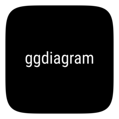
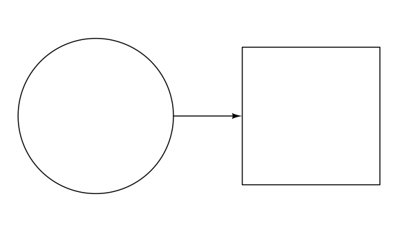

# ggdiagram <a href="https://wjschne.github.io/ggdiagram/"></a>

<!-- badges: start -->

[](https://lifecycle.r-lib.org/articles/stages.html#stable)
[](https://CRAN.R-project.org/package=ggdiagram)
[](https://wjschne.r-universe.dev/ggdiagram)
<!-- badges: end -->

The ggdiagram package takes an object-oriented approach to making
diagrams and plots the results using
[ggplot2](https://ggplot2.tidyverse.org/).

My motivation in making ggdiagram was to find a way to approach the
functionality of [TikZ](https://tikz.dev/) but with the flexibility and
convenience of R. The ggdiagram package is built atop
[S7](https://rconsortium.github.io/S7/) and is integrated with
[ggplot2](https://ggplot2.tidyverse.org/), making heavy use of
[ggtext](https://wilkelab.org/ggtext/),
[ggforce](https://ggforce.data-imaginist.com/), and
[ggarrow](https://teunbrand.github.io/ggarrow/).

The ggdiagram package is not a replacement for the standard ggplot2
functions. The underlying *grammar* of ggplot2 is well designed for
visualizing data. The ggdiagram functions are best suited for creating a
small number of visual objects that interrelate. If anything, they can
be thought of as extensions of `ggplot2::annotate`.

## Installation

To install the published version from CRAN:

``` r
install.packages("ggdiagram")
```

You can install the development version of ggdiagram from R-universe
like so:

``` r
install.packages("ggdiagram", repos = "https://wjschne.r-universe.dev")
```

## Example

In <a href="#fig-example" class="quarto-xref">Figure 1</a>, we create a
circle object with `ob_circle` and a rectangle object with
`ob_rectangle`, placing the rectangle such that there is .5 units of
separation between the two objects.

The `ggdiagram` function is a a wrapper for `ggplot`, that sets some
defaults (e.g., `theme_void`, `coord_equal`, fonts, line size, etc.).

The `ob_*` functions have methods such that they can be added to any
ggplot. Under the hood, they are first converted to an appropriate geom
and then added to the ggplot object. In this case, an `ob_circle` is
converted to a `ggforce:geom_circle`, and an `ob_rectangle` is converted
to a `ggforce::geom_shape`.

The `connect` function connects the circle and rectangle at their edges
with an arrow (drawn with `ggarrow::geom_arrow_segment`).

``` r
library(ggdiagram)
c1 <- ob_circle(radius = 1 / sqrt(pi)) 
r2 <- ob_rectangle() |>
  place(from = c1,
        where = "right", 
        sep = .5)

ggdiagram() +
  c1 +
  r2 +
  connect(c1, r2, resect = 1) 
```

<div id="fig-example">



Figure 1: Connecting a circle and a square with an arrow.

</div>
