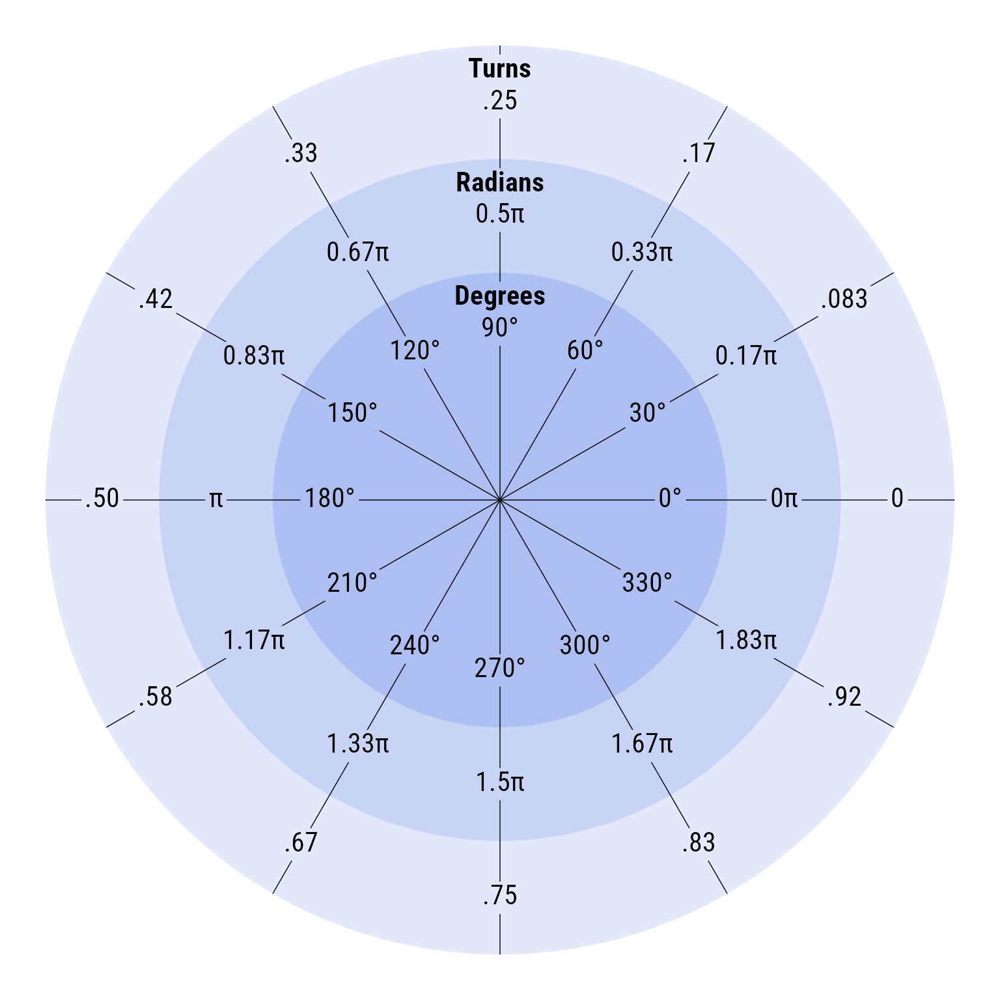
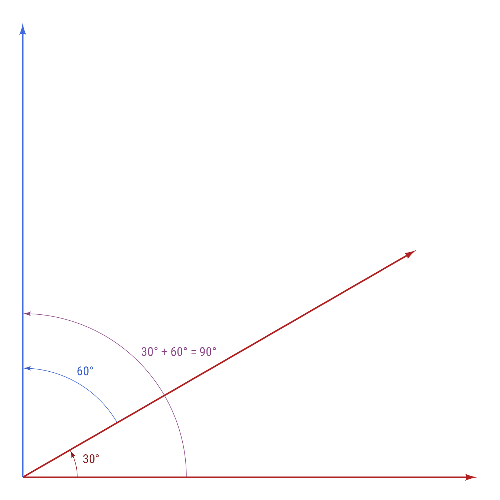
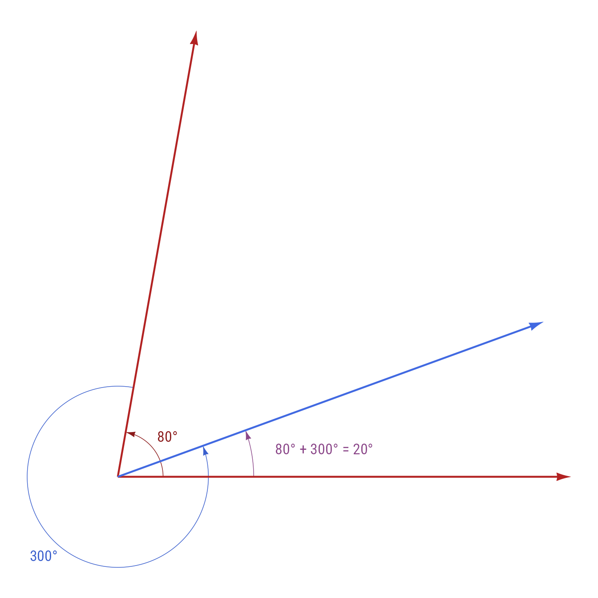
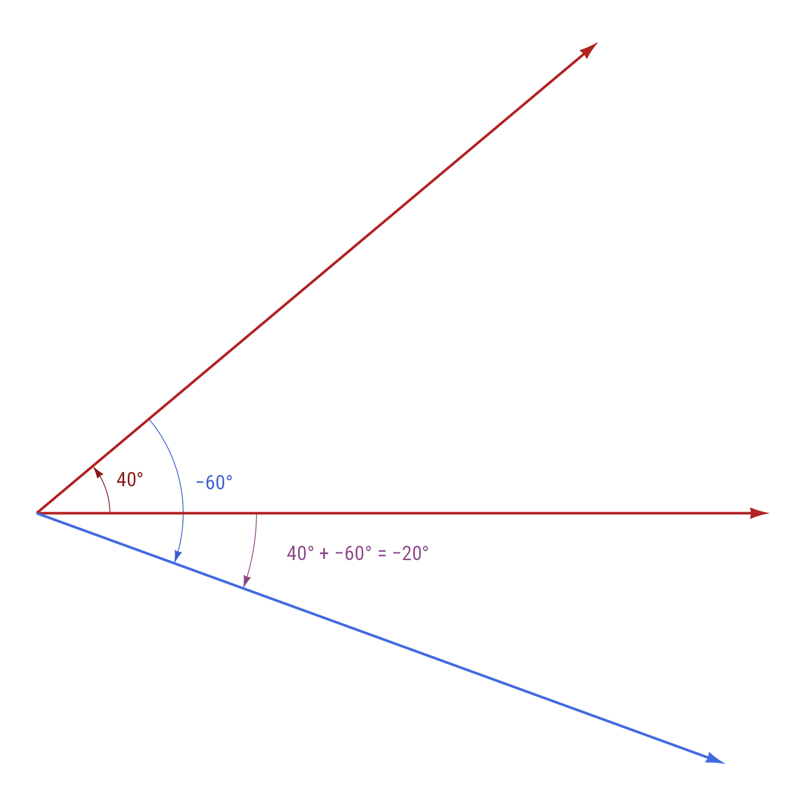
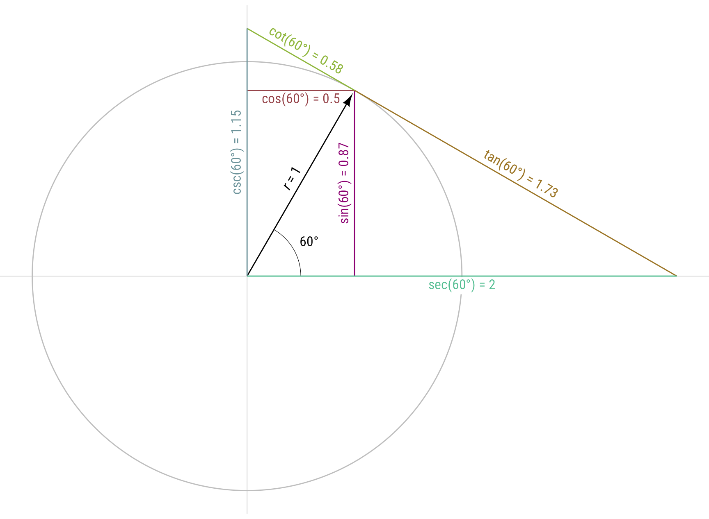

# Angles

## Setup

``` r

library(ggdiagram)
library(ggplot2)
library(dplyr)
library(ggtext)
library(ggarrow)
my_font <- "Roboto Condensed"
```

## Angles

Angles have different kinds of units associated with them: turns (1 turn
= one full rotation a circle), degrees (1 turn = 360 degrees), and
radians (1 turn = $`2\pi`$ = $`\tau`$).

I like π just fine, but I agree with Michael Hartl’s [Tau
Manifesto](https://tauday.com/tau-manifesto) that we would have been
better off if we had recognized that the number of radians to complete a
full turn of a circle (τ = 2π ≈ 6.283185) is more fundamental than the
number of radians to complete a half turn (π).

|      Turns       |              Radians              |    Degrees    |
|:----------------:|:---------------------------------:|:-------------:|
| $`\frac{1}{12}`$ | $`\frac{\tau}{12}=\frac{\pi}{6}`$ | $`30^\circ`$  |
| $`\frac{1}{8}`$  | $`\frac{\tau}{8}=\frac{\pi}{4}`$  | $`45^\circ`$  |
| $`\frac{1}{6}`$  | $`\frac{\tau}{6}=\frac{\pi}{3}`$  | $`60^\circ`$  |
| $`\frac{1}{4}`$  | $`\frac{\tau}{4}=\frac{\pi}{2}`$  | $`90^\circ`$  |
| $`\frac{1}{3}`$  | $`\frac{\tau}{3}=\frac{2\pi}{3}`$ | $`120^\circ`$ |
| $`\frac{1}{2}`$  |      $`\frac{\tau}{2}=\pi`$       | $`180^\circ`$ |
|      $`1`$       |           $`\tau=2\pi`$           | $`360^\circ`$ |

Code

``` r

theta <- degree(seq(0,330, 30))
angle_types <- c("Turns", "Radians", "Degrees")
theta_list <- lapply(list(turn, radian, degree), \(.a) .a(theta))

p <- ob_polar(theta, r = 1)


r <- seq(1, .5, length.out = length(angle_types))
my_shades <- (tinter::tinter("royalblue", 
                            steps = 7, 
                            direction = "tints")[seq_along(angle_types)])

ggplot() +
  coord_equal() +
  theme_void() +
  ob_circle(
    center = ob_point(),
    radius = r,
    fill = my_shades,
    color = NA,
    linewidth = .25
  ) +
  ob_segment(ob_point(), p, linewidth = .25) +
  purrr::pmap(
    .l = list(r, theta_list, my_shades), 
    .f = \(rs, ts, ss) {
      ob_circle(radius = rs - 1/8)@point_at(ts)@label(ts, fill = ss, size = 16)@geom(family = my_font)
      }) +
  ob_point(0, y = r - 1 / 18)@label(angle_types, 
                               fill = my_shades, 
                               fontface = "bold", 
                               family = my_font,
                               size = 16)
```



Figure 1: Angle Metrics

One can create equivalent angles with any of the three metrics.

``` r

degree(90)
#> [1] "90°"
turn(1 / 4)
#> [1] ".25"
radian(pi / 2)
#> [1] "0.5π"
```

Although these methods have convenient printing, under the hood they are
`ob_angle` objects can retrieve angles in any of the the three metrics.

``` r

radian(pi)
#> [1] "π"
radian(pi)@degree
#> [1] 180
radian(pi)@turn
#> [1] 0.5

degree(180)
#> [1] "180°"
degree(180)@turn
#> [1] 0.5
degree(180)@radian
#> [1] 3.141593

turn(.5)
#> [1] ".50"
turn(.5)@radian
#> [1] 3.141593
turn(.5)@degree
#> [1] 180
```

## Character Printing

For labeling, sometimes is convenient to convert angles to text:

``` r

as.character(degree(90))
#> [1] "90°"
as.character(turn(.25))
#> [1] ".25"
as.character(radian(.5 * pi))
#> [1] "0.5π"
```

### Angle Metric Conversions

Any of the metrics can be converted to any other:

``` r

a <- degree(degree = 270)
a
#> [1] "270°"
radian(a)
#> [1] "1.5π"
turn(a)
#> [1] ".75"
```

## Arithmetic Operations

Angles can be added, subtracted, multiplied, and divided. The underlying
value stored can be any real number (in turn units), but degrees,
radians, and turns are always displayed as between −1 and +1 turns, ±360
degrees, or ±2π radians.

30° + 60° = 90°

Code

``` r

make_angles <- function(a = c(80, 300), 
                        r = c(.1, .2, .3), 
                        label_adjust = c(0,0,0), 
                        multiplier = c(1.4,1.4,1.4)) {
start_angles <- degree(c(0,a[1], 0))
end_angles <- degree(c(a[1], sum(a), degree(sum(a))@degree))

arc_labels <- as.character(end_angles - start_angles)

mycolors <- c("firebrick4", "royalblue3", "orchid4")


arc_labels[3] <- paste0(arc_labels[1],
                        " + ", 
                        arc_labels[2],
                        " = ", 
                        arc_labels[3])

arcs <- ob_arc(radius = r, 
      start = start_angles, 
      end = end_angles,
      label = ob_label(arc_labels, 
                       color = mycolors, 
                       family = my_font),
      linewidth = .25,
      length_head = 10,
      arrow_head =  arrowhead(),
      color = mycolors)


ggplot() +
  theme_void() +
  coord_equal()  +
  arcs +
  ob_segment(
    p1 = ob_point(), 
    p2 = ob_polar(theta = degree(c(0,a[1],sum(a))), r = 1), 
    length_head = 5,
    linewidth = .75,
    arrow_head =  arrowhead(),
    color = c("firebrick", "firebrick", "royalblue")) 
}
```

Code

``` r

make_angles(a = c(30, 60), 
            r = c(.12,.24, .36), 
            multiplier = c(1.5,1.5,1.5)) 
```



Figure 2: 30° + 60° = 90°

``` r

degree(30) + degree(60)
#> [1] "90°"
```

Adding a number to the degree class assumes the number is in the degree
metric.

``` r

degree(30) + 10
#> [1] "40°"
```

Likewise, adding a number to a radian (or an angle by default) makes a
radian:

``` r

radian(pi) + 0.5 * pi
#> [1] "1.5π"
```

Turns work the same way:

``` r

turn(.1) + .2
#> [1] ".30"
```

When degrees are outside the range of ±360, they recalculate:

``` math
\begin{aligned}
80^{\circ} + 300^\circ &= 380^\circ\\
&= 380^\circ-360^\circ\\
&=20^\circ\end{aligned}
```

Code

``` r

make_angles(c(80, 300)) 
```



Figure 3: 80° + 300° = 380° = 20°

``` r

degree(80) + degree(300)
#> [1] "20°"
```

``` math
\begin{aligned}
20^\circ - 40^\circ &= -20^\circ\\&=340^\circ
\end{aligned}
```

Code

``` r

make_angles(c(40, -60)) 
```



Figure 4: 40° − 60° = −20°

``` r

degree(40) - degree(60)
#> [1] "−20°"
```

``` math
2\cdot20^\circ=40^\circ
```

``` r

2 * degree(20)
#> [1] "40°"
```

``` math
\begin{aligned}
2\cdot180 &= 360^\circ\\&=0^\circ
\end{aligned}
```

``` r

2 * degree(180)
#> [1] "0°"
```

### Positive and Negative Angles

You can ensure that an angle is always positive or negative with the
`@positive` and `@negative` attributes.

``` r

# Display a negative angle as a positive angle
degree(-30)@positive
#> [1] "330°"

# Display a positive angle as a negative angle
degree(330)@negative
#> [1] "−30°"
```

## Trigonometry

The outputs of `degree`, `radian`, and `turn` can take the three
standard trigonometric functions

``` r

theta <- degree(60)
cos(theta)
#> [1] 0.5
sin(theta)
#> [1] 0.8660254
tan(theta)
#> [1] 1.732051
```

Code

``` r

o <- ob_point(0, 0)
p <- ob_polar(theta, 1)

# col <- purrr::map2_chr(scico::scico(6, palette = "hawaii"),
#                        c(0.01,0.01,0.01,0.01,.15, .4), 
#                        tinter::darken)

my_colors <- c("#8C0172", "#944046", "#9B7424", 
               "#8EB63B", "#53BD91", "#6C939A")
ggdiagram() +
  ob_circle(fill = NA, color = "gray") +
  # axes
  ob_line(intercept = 0,
       color = "gray",
       linewidth = .25) +
  ob_line(xintercept = 0,
       color = "gray",
       linewidth = .25) +
  # degree arc
  ob_arc(
    end = theta,
    radius = .25,
    label = theta,
    linewidth = .2
  ) +
  # angle arrow
  connect(o, p, label = "*r* = 1", resect_head = 1) +
  # sin(theta)
  ob_segment(
    ob_polar(theta = 0, r = cos(theta)),
    p,
    label = paste0("sin(", 
                   theta,  
                   ") = ", 
                   round(sin(theta), 2)),
    color = my_colors[1],
    linewidth = .5
  ) +
  # cos(theta)
  ob_segment(
    ob_point(0, sin(theta)),
    ob_point(cos(theta), sin(theta)),
    label = ob_label(
      paste0(
        "cos(",
        theta,
        ") = ",
        round(cos(theta), 2)), vjust = 1),
    color = my_colors[2],
    linewidth = .5
  ) +
  # tan(theta)
  ob_segment(
    p,
    p + ob_polar(theta - 90, r = tan(theta)),
    label = paste0(
      "tan(",
      theta,
      ") = ",
      round(tan(theta), 2)),
    color = my_colors[3],
    linewidth = .5
  ) +
  # sec(theta)
  ob_segment(
    o,
    ob_point(1 / cos(theta)),
    label = ob_label(
      label = paste0(
        "sec(",
        theta,
        ") = ",
        round(1 / cos(theta), 2)),
      vjust = 1
    ),
    color = my_colors[5]
  ) +
  # cot(theta)
  ob_segment(
    p + ob_polar(theta + 90, r = 1 / tan(theta)),
    p,
    label = paste0(
      "cot(",
      theta,
      ") = ",
      round(1 / tan(theta), 2)),
    color = my_colors[4],
    linewidth = .5
  ) +
  # csc(theta)
  ob_segment(
    o,
    ob_point(0, 1 / sin(theta)),
    label = paste0(
      "csc(",
      theta,
      ") = ",
      round(1 / sin(theta), 2)),
    color = my_colors[6]
  ) 
   
```



Figure 5: Trigonometric functions

Benefits of using trigonometric functions with angles instead of numeric
radians include:

- Angle metric conversions are handled automatically.
- Under the hood, the `cospi`, `sinpi`, and `tanpi` functions are used
  to get the rounding right on key locations (e.g., 90 degrees, 180
  degrees)

For example, `tan(pi)` is slightly off from its true value of 0.

``` r

tan(pi)
#> [1] -1.224647e-16
```

By contrast, `tan(radian(pi))` rounds to 0 exactly.

``` r

tan(radian(pi))
#> [1] 0
```

## Retrieving the underlying data from a `ob_angle` object

Angles created with the `degree`, `radian`, or `turn` function are
`ob_angle` objects. The `ob_angle` function exists but is not meant to
be used directly. Its underlying data is a vector of numeric data
representing the number of turns. The underlying turn data from any
`ob_angle` object can be extracted with the `c` function (or with the
[`S7::S7_data`](https://rconsortium.github.io/S7/reference/S7_data.html)
function).

``` r

theta <- degree(c(0,180,360, 720))
# Degrees range: 0<= degree < 360
theta@degree
#> [1]   0 180   0   0
# Underlying data in turns
c(theta)
#> [1] 0.0 0.5 1.0 2.0
# Alternative method of extracting data
S7::S7_data(theta)
#> [1] 0.0 0.5 1.0 2.0
```
