# Repetition and Automation

## Setup

``` r

library(ggdiagram)
library(ggplot2)
library(dplyr)
library(ggtext)
library(ggarrow)
library(purrr)
```

## Object Lists

Any ggdiagram object made with `ob_*` functions can be made into a list,
either with the `list` function or the `c` function.

``` r

p1 <- ob_point(1, 2)
p2 <- ob_point(3, 4)
c(p1,p2)
#> [[1]]
#> 
#> ── <ob_point>
#> # A tibble: 1 × 2
#>       x     y
#>   <dbl> <dbl>
#> 1     1     2
#> 
#> [[2]]
#> 
#> ── <ob_point>
#> # A tibble: 1 × 2
#>       x     y
#>   <dbl> <dbl>
#> 1     3     4
```

## Binding lists of objects into a single object

The `bind` function will take a list of the ggdiagram objects and a
create single object. If all objects in the list are of a single type
(e.g., `ob_point`), `bind` will return an object of that type. If the
objects are of multiple types, `bind` will bind each type of object
separately and return an `ob_shape_list`.

``` r

p <- bind(c(p1,p2))
p
#> 
#> ── <ob_point>
#> # A tibble: 2 × 2
#>       x     y
#>   <dbl> <dbl>
#> 1     1     2
#> 2     3     4
```

Binding objects can make subsequent tasks easier and less repetitive.
For example, from the new object `p`, we can create two circles with one
line of code rather than the two lines that would otherwise be needed to
create separate circles from `p1` and `p2`.

``` r

ggdiagram() +
  ob_circle(center = p)
```

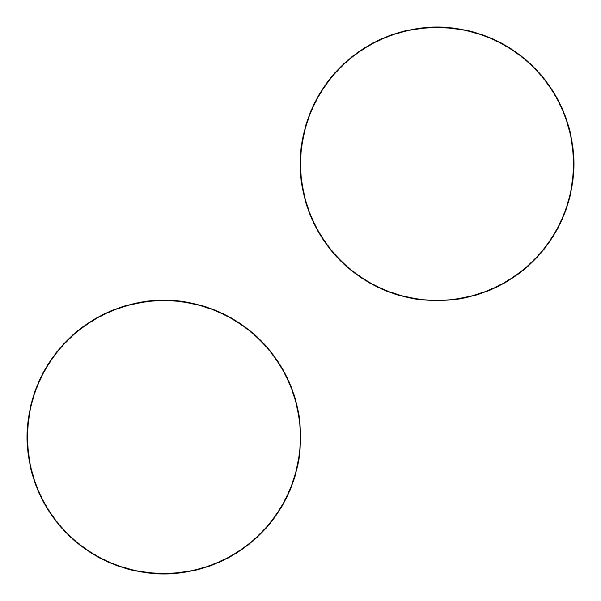

With only two points, the time savings is small. When many objects are
bound, the time savings can be substantial.

If the list of objects are of different types, the `bind` function will
bind all objects of the same type and the resulting list will be an
`ob_shape_list`. In [Figure 1](#fig-osl) we bind 2 points and 2 circles
into a `ob_shape_list` that has 1 `ob_point` and 1 `ob_circle`.

``` r

p1 <- ob_point(0,0)
p2 <- ob_point(2,0)
c1 <- ob_circle(p1, radius = 2)
c2 <- ob_circle(p2, radius = 1.5)

# bind objectins into an ob_shape_list
osl <- bind(c(p1, p2, c1, c2))
osl
#> 
#> ── <ob_shape_list> ─────────────────────────────────────────────────────────────
#> 
#> ── <ob_point>
#> # A tibble: 2 × 2
#>       x     y
#>   <dbl> <dbl>
#> 1     0     0
#> 2     2     0
#> 
#> ── <ob_circle>
#> # A tibble: 2 × 3
#>       x     y     r
#>   <dbl> <dbl> <dbl>
#> 1     0     0   2  
#> 2     2     0   1.5

ggdiagram() +
  osl
```

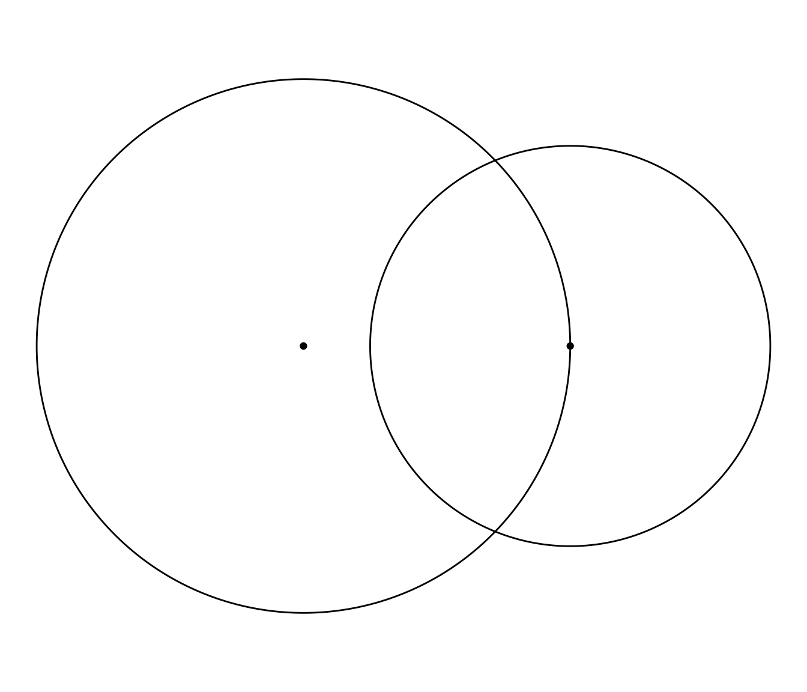

Figure 1: An ob_shape_list

There is not much benefit to making an `ob_shape_list` as shown here. It
would simpler to just include the objects one at a time. However, it can
be useful in the context of a large diagram with many elements, each of
which would require a separate layer in ggplot2. Binding all the
elements first can reduce the number of ggplot layers to the number of
object types in the `ob_shape_list`.

An `ob_shape_list`’s underlying data is a named list. The names are the
functions that were used to create the objects. For example,

``` r

osl[["ob_point"]]
#> 
#> ── <ob_point>
#> # A tibble: 2 × 2
#>       x     y
#>   <dbl> <dbl>
#> 1     0     0
#> 2     2     0
osl[["ob_circle"]]
#> 
#> ── <ob_circle>
#> # A tibble: 2 × 3
#>       x     y     r
#>   <dbl> <dbl> <dbl>
#> 1     0     0   2  
#> 2     2     0   1.5
```

## Use `unbind` to make an object into a list of objects

The `unbind` function will perform the opposite operation as `bind`. It
converts the elements of an object into a list of singleton objects. For
example, object `p` has two points. Unbinding it will create a list of 2
`ob_point` objects.

``` r

unbind(p)
#> [[1]]
#> 
#> ── <ob_point>
#> # A tibble: 1 × 2
#>       x     y
#>   <dbl> <dbl>
#> 1     1     2
#> 
#> [[2]]
#> 
#> ── <ob_point>
#> # A tibble: 1 × 2
#>       x     y
#>   <dbl> <dbl>
#> 1     3     4
```

The `unbind` function is needed when we want to loop through each
element using `lapply` or
[`purrr::map`](https://purrr.tidyverse.org/reference/map.html). In
[Figure 2](#fig-unbind), we have three points arranged in an equilateral
triangle. We `unbind` the points so that we can use `map` to place three
points around each point. Each point is then plotted as triangles. To
make the list something that ggplot2 can plot, we can `bind` the list
into a single object.

``` r

theta <- degree(seq(90, 360, 120))
ggdiagram() + 
  {p_3 <- ob_polar(
        theta = theta,
        r = .5,
        fill = "black",
        shape = "triangle down filled",
        size = 15)} +
  unbind(p_3) %>%
    purrr::map(
      \(p_i) {
        p_i + ob_polar(
          theta = theta, 
          r = .15, 
          color = "orchid", 
          fill = "orchid", 
          size = 15, 
          shape = "triangle filled")}) %>% 
  bind() +
  scale_x_continuous(NULL, expand = expansion(.15))
```

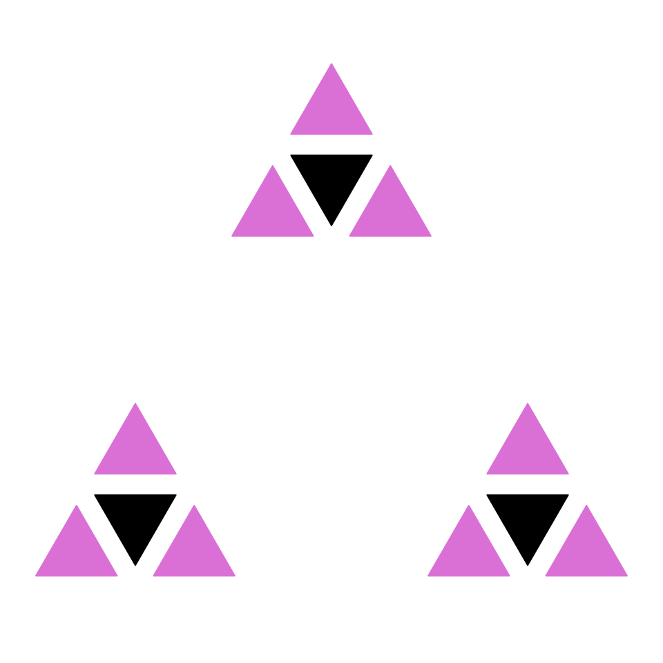

Figure 2: Using `unbind`, `map`, and `bind` to loop through elements.

Alternatively, we can convert each list item into a geom with `as.geom`
as in [Figure 3](#fig-unbindgeom).

``` r

ggdiagram() + 
  {p <- ob_polar(degree(seq(30,330,60)), 
                 r = 2, 
                 size = 10, 
                 color = "orchid")} +
  unbind(p) %>% 
    lapply(\(pp) {
      p2 <- pp + ob_polar(
        theta = degree(seq(0, 330, 30)),
        r = .5)
      
      s <- connect(pp, p2)
        
      as.geom(s)
      }) 
```

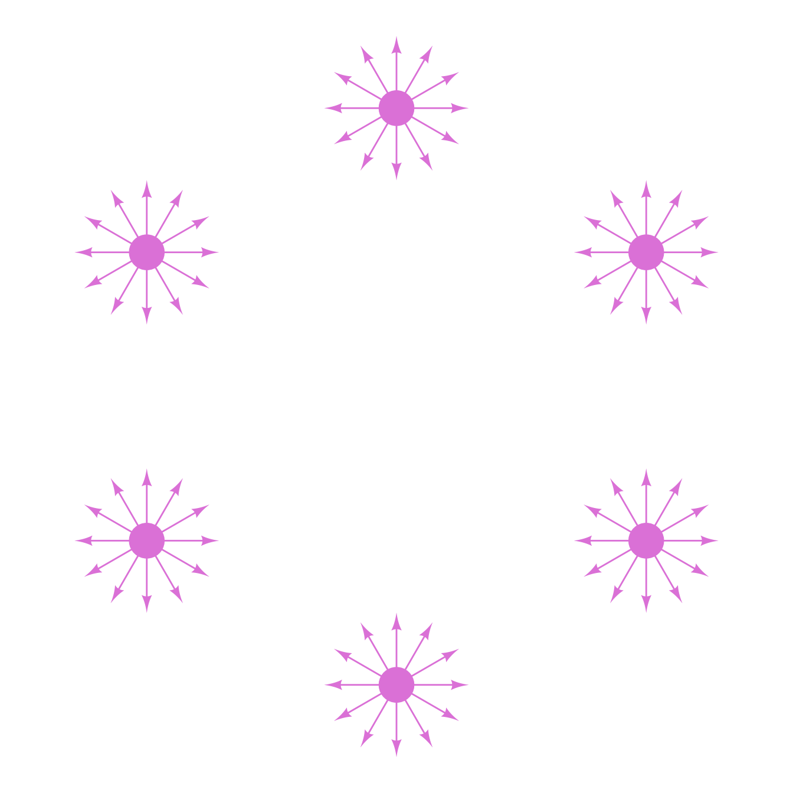

Figure 3: Using `unbind`, `lapply`, and `as.geom` to loop through
elements.

## Use `map_ob` to loop through object elements

To `unbind`, `map`, and then `bind` can be tedious every time a loop is
needed. The `map_ob` function is a wrapper for `map` that unbinds the
input and binds the output automatically.

``` r

ggdiagram() +
  {o <- ob_point()} +
  {p <- ob_polar(degree(c(0, 90, 180, 270)))} +
  connect(o, p, resect = 2) +
  p %>%
    map_ob(\(pp) {
      p2 <- pp + ob_polar(theta = degree(seq(45, 315, 90)),
                          r = sqrt(2) / 3,
                          color = "orchid")
      list(p2,
           connect(pp, p2, resect = 2))
    }) 
```

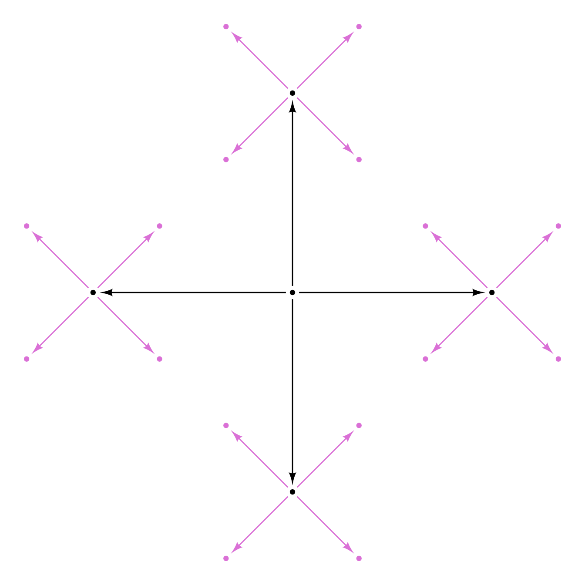

Figure 4

The `ob_map` function can output a list of different object types
simultaneously.

``` r

theta <- degree(seq(0,300, 60))

ggdiagram() +
  {e6 <- ob_ellipse(
    center = ob_polar(
      theta = theta, 
      r = 60),
    m1 = .5,
    a = 8,
    b = 4,
    angle = theta + degree(90),
    color = NA,
    fill = "orchid4", 
    size = 4)} +
  map_ob(e6, \(e_i) {
    p_i <- e_i@center
    p_ij <- p_i + ob_polar(theta, 15)
    c_ij <- ob_circle(
      center = p_ij, 
      radius = 2,
      fill = "green4",
      color = NA)
    p_ijk <- map_ob(p_ij, \(pt_ij) {
      ob_segment(pt_ij, pt_ij + ob_polar(theta, 4) )
      })
    list(p_ijk, c_ij)
  })
```

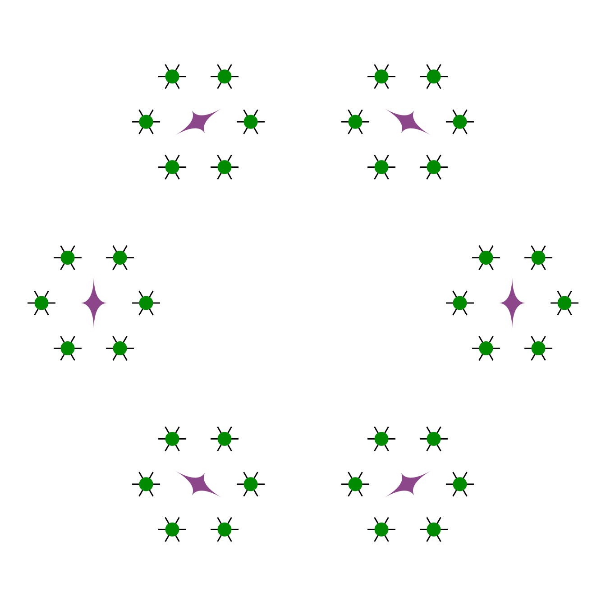

Figure 5: Outputting a list of different object types in `map_ob`.

In a more practical example, every variable in the left column of
[Figure 6](#fig-bindt1t2) is connected to every variable on the right.

``` r

k <- 5
clr <- viridis::viridis(k, begin = .3, end = .7)
ggdiagram() +
  {t1 <- ob_array(ob_circle(), k = k, where = "north", 
                  fill = clr,
                  color = clr)} +
  {t2 <- ob_circle(fill = clr, color = clr)@place(
    from = t1, 
    where = "right", 
    sep = 10)} +
  map_ob(t1, \(tt) {
    connect(tt, t2, resect = 2, color = tt@color)
  })
```

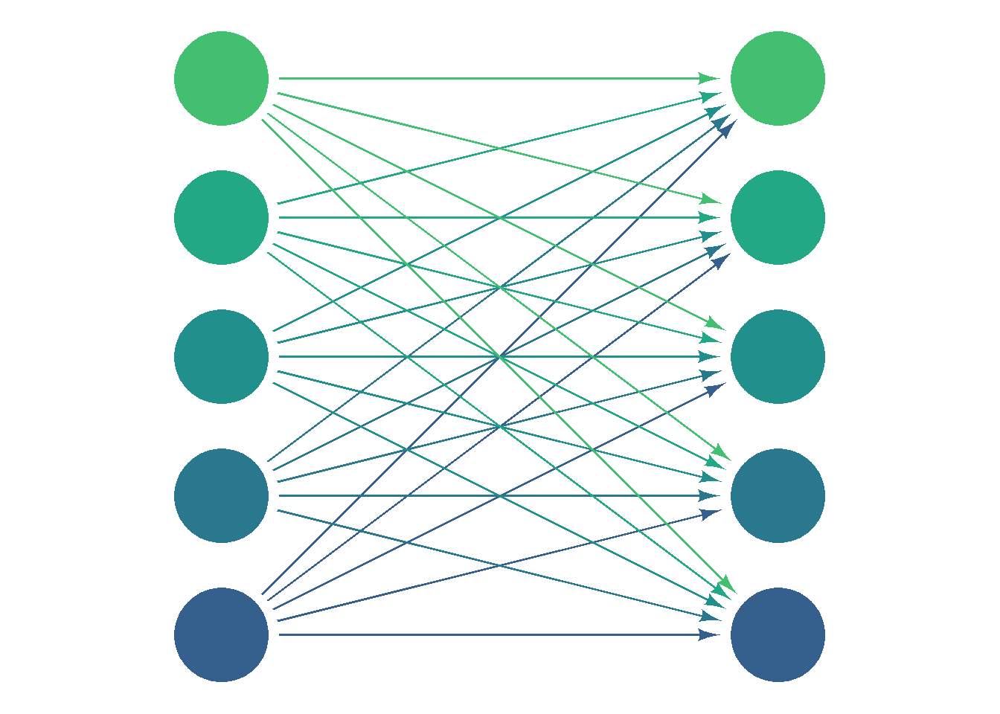

Figure 6: Using `map_ob` to the connect variables

## Subsetting objects

The `[` operator can subset ggdiagram objects created with `ob_*`
functions. Object `p` has 2 points in it. To select the first point
only:

``` r

p[1]
#> 
#> ── <ob_point>
#> # A tibble: 1 × 2
#>       x     y
#>   <dbl> <dbl>
#> 1     1     0
```

The strategic use of subsetting can make otherwise repetitive tasks much
less tedious. In [Figure 7](#fig-c12), we connect a ring of 12 circles
with one command rather than 12.

``` r

theta <- degree(seq(0,330,30))
clr <- hsv(theta@degree / 360, s = .4, v = .6)
ggdiagram() +
  {c12 <- ob_circle(
    center = ob_polar(theta, r = 6),
    fill = clr,
    color = NA)} +
  connect(c12, c12[c(2:12, 1)], 
          resect = 2, 
          color = clr) 
```

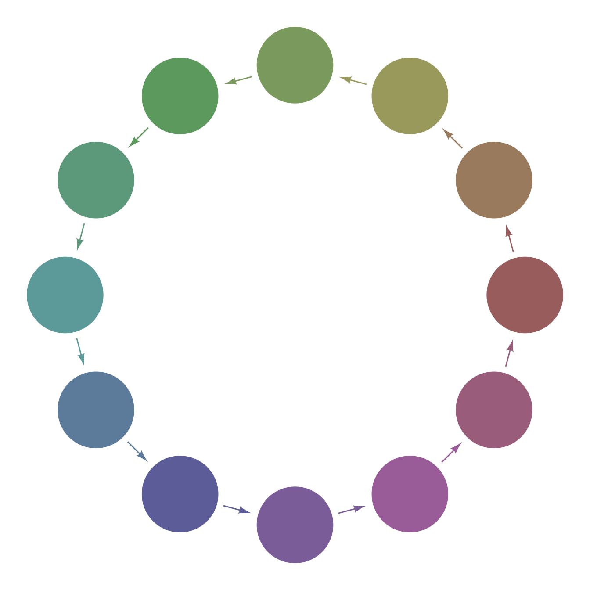

Figure 7: A ring of connected circles.

Subsetting can be used for assignment in ggdiagram objects. For example,
in [Figure 8](#fig-subsetting), the first of four points is changed from
(1,5) to (0,0)

``` r

p <- ob_point(x = 1:4, 
              y = 2:5)
p[1] <- ob_point(0,0, color = "firebrick", size = 5)

ggplot() + 
  coord_equal() +
  p 
```

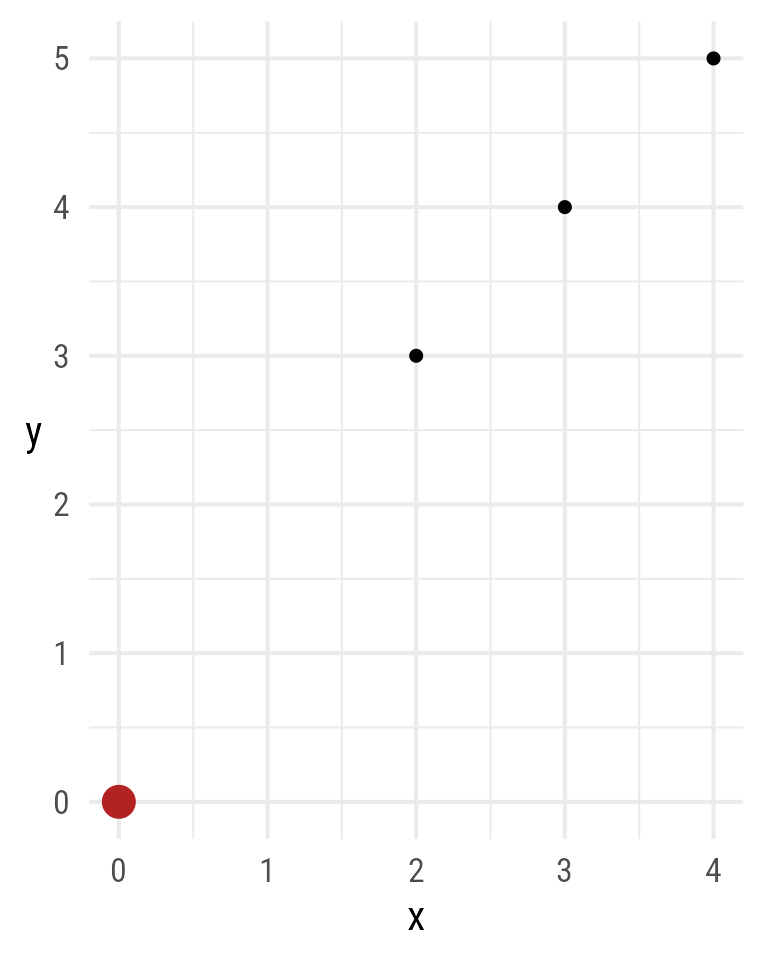

Figure 8: Subsetting objects

In [Figure 9](#fig-path), there are 8 variables with 13 arrows
connecting them. Rather than making a separate connection for each
arrow, subsetting allows us to make all 13 connections with a single
`connect` command. Using subsetting to assign variables within a `for`
loop allows for placing the variables programmatically. If more or fewer
variables are desired, setting `k` to another value, will create *k*
variables and 2*k* − 3 connections.

``` r

# Number of variables
k <- 8L

# Make k variables
x <- ob_rectangle(ob_point(rep(0, k), rep(0, k)),
                  label = ob_label(
                    label = paste0("*X*~", 1:k, "~"),
                    vjust = .6,
                    size = 20,
                    family = "Roboto Condensed"
                  ))


# Place even variables to the right and 
# odd variables below the previous variables
for (i in 2:k) {
  x[i] <- place(x[i], x[i - 1], ifelse((i %% 2) == 0, "right", "below"))
}

# Plot
ggdiagram() + 
  x +
  # paths between variables ahead by 1 and by 2
  connect(x[c(seq(1,k - 1), seq(1, k - 2))], 
          x[c(seq(2,k),     seq(3, k))],
          resect = 2)
```

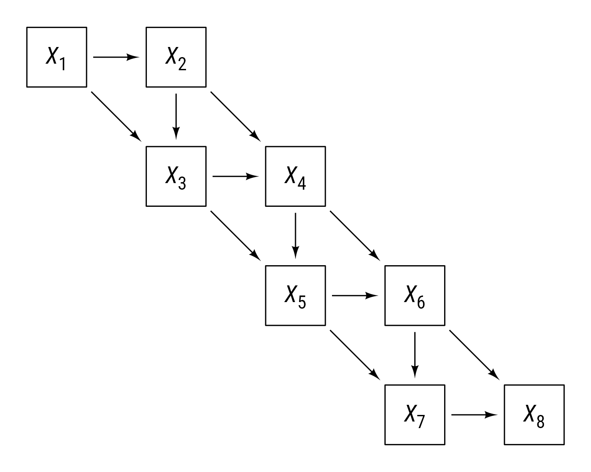

Figure 9: A model with 8 variables and 13 causal paths

### Subset by id

Functions with an `ob_*` prefix have an `id` property that can be used
to subset objects. The `id` property does not have to be unique.

``` r

p <- ob_point(1:3, 4:6, id = c("A", "B", "C"))
p[c("B", "A")]
#> 
#> ── <ob_point>
#> # A tibble: 2 × 3
#>       x     y id   
#>   <int> <int> <chr>
#> 1     2     5 B    
#> 2     1     4 A
```

### Creating objects from data.frames/tibbles

The `data2shape` function will convert a data.frame (or tibble) to a
ggdiagram `ob_...` function. For example, [Figure 10](#fig-data2shape),
a sequence of regular polygons was quickly and efficiently.

``` r

d <- tibble(
  x = 3:10,
  y = x,
  alpha = x * .1,
  radius = .6,
  angle = 90,
  fill = "dodgerblue4",
  n = x
)

ggdiagram() +
  data2shape(data = d, shape = ob_ngon)
```

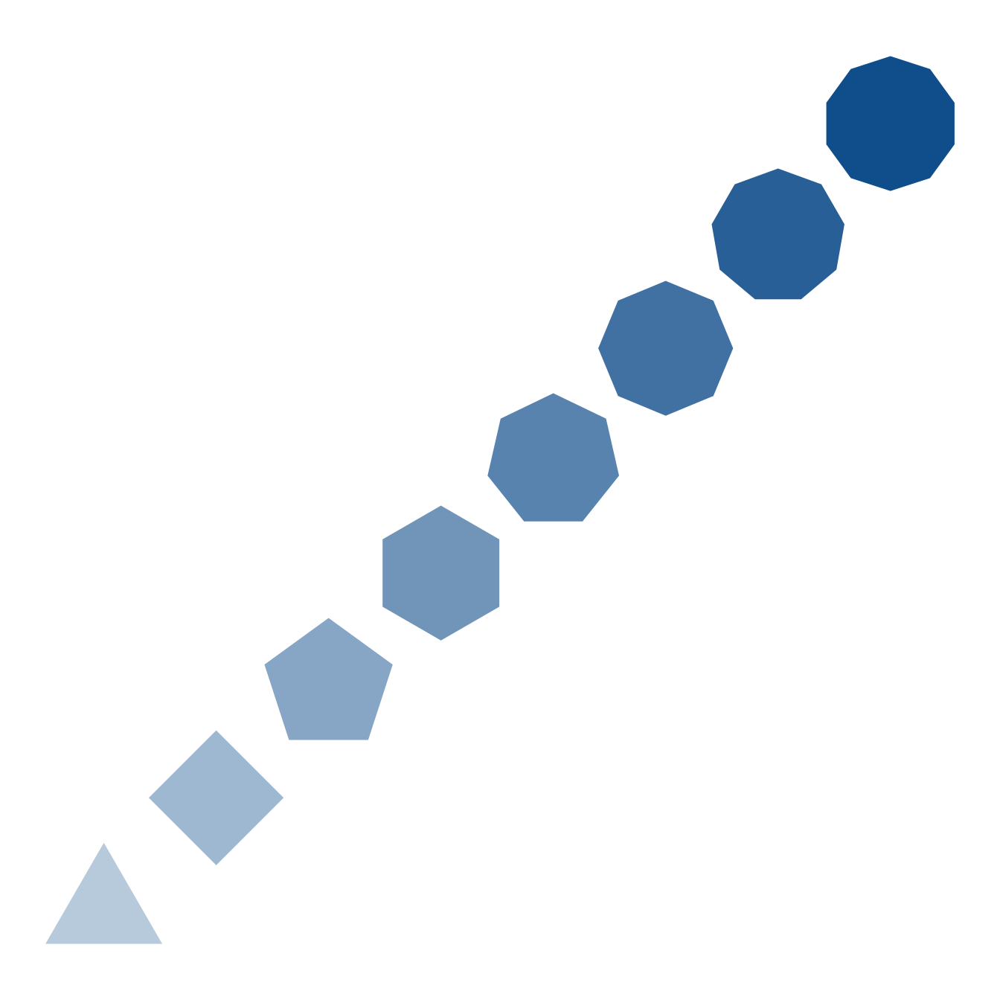

Figure 10: A sequence of regular polygons

Although `data2shape` is sometimes less verbose than standard ggplot2
syntax, using it is not always the best choice. If you start with a
data.frame (or tibble), and all you need to do is display data, the
standard ggplot2 functions are optimized for this purpose, particularly
when the data set is large. In general, the direct use of a ggplot2
function will render more quickly than its analogous ggdiagram function.
The reason to convert data to shapes via `data2shape` is to do something
that would be otherwise difficult with the standard ggplot2 functions.

For example, one of the problems that prompted me to make the ggdiagram
package was that I wanted to make path diagrams for structural equation
models with full control of every aspect of the diagram. There are
excellent functions from other packages that automate the process of
making a path diagram (e.g.,
[`semPlot`](https://cran.r-project.org/package=semPlot),
[semptools](https://sfcheung.github.io/semptools/index.html), and
[`lavaanPlot`](https://lavaanplot.alexlishinski.com/)), with options for
greater flexibility. Even so, I could not figure out how to make the
plots fully customizable.

My eventual goal is for ggdiagram to automate the tedious parts of
making path diagrams and allow for efficient customization. The code for
[Figure 11](#fig-lavaan) shows the whole process, including the tedious
bits that eventually will be tucked way in functions.

``` r

library(dplyr)
library(tidyr)
library(lavaan)

# Observed variable name conversion
onames <- c(VisualPerception = "x1",
               Cubes = "x2",
               Lozenges = "x3",
               CapitalsSpeed = "x9",
               AdditionSpeed = "x7",
               CountingSpeed = "x8",
               ParagraphComp = "x4",
               SentenceComp = "x5",
               WordMeaning = "x6")

# Data
d <- lavaan::HolzingerSwineford1939 |> 
  dplyr::select(x1:x9) |> 
  dplyr::rename(all_of(onames))

# Structural Model
m <- '
Gv =~ VisualPerception + Cubes + Lozenges + CapitalsSpeed
Gs =~ CapitalsSpeed + CountingSpeed + AdditionSpeed 
Gc =~ ParagraphComp + SentenceComp + WordMeaning
g =~ Gv + Gc + Gs
'

# Fit model with converted names
fit <- sem(m, data = d)

# Parameter table, find primary indicators
pt <- standardizedsolution(fit) %>% 
  mutate(primary_indicator = dplyr::dense_rank(
    desc(abs(est.std))) == 1 & op == "=~", 
    .by = c(rhs, op))

# Oberved and latent names
o_names <- lavaan::lavNames(fit, "ov")
l_names <- lavaan::lavNames(fit, "lv")

# Make colors
latent_colors <- l_names %>% 
  length() %>% 
  viridis::viridis(alpha = .5, begin = .2, end = .75) %>% 
  `names<-`(rev(l_names))

# Make data for creating objects
d <- tibble(id = c(o_names, l_names))  %>% 
  mutate(depth = get_depth(id, model = m),
         type = ifelse(id %in% l_names, "latent", "observed"),
         m1 = ifelse(type == "latent", 2, 15),
         a = ifelse(type == "latent", 2, 1.5),
         color = NA,
         indicators = map(id, \(v) {
           pt %>% 
             filter(op == "=~" & lhs == v) %>% 
             select(indicator = rhs,
                    loading = est.std,
                    primary_indicator)
         }),
         dvs = map(id, \(v) {
           pt %>% 
             filter(op == "~" & rhs == v) %>% 
             select(dv = rhs,
                    b = est.std)
         }),
         parents = map(id, \(v) { 
           pt %>% 
             filter(op == "=~" & rhs == v) %>% 
             arrange(desc(abs(est.std))) %>% 
             pull(lhs)
         }),
         fill = pmap_chr(
           list(i = id, 
                tp = type, 
                prnts = parents), 
           function(i, tp, prnts) {
             if (tp == "latent") {
               fll <- latent_colors[i ]
             } else {
               fll <- latent_colors[prnts[1]]
               
             }
             fll
           })) %>% 
  mutate(
    label = snakecase::to_title_case(id) %>% 
      stringr::str_wrap(width = 10, 
                        whitespace_only = FALSE) %>% 
      stringr::str_replace_all(pattern = "\\n", "<br>")) %>% 
  arrange(depth) 

# Make shapes
s <- data2shape(d, ob_ellipse) 

# Format shape labels
s@label@size[d$type == "latent"] <- 20
s@label@nudge_y[d$type == "latent"] <- -0.08
s@label@color <- class_color(s@fill)@darken(.6)@color

# Position shapes:
#   Move indicators to the right of other indicators
#   Center latent variables above their primary indicators
walk(d$id, \(v) {
  dr <- d %>% filter(id == v) 
  
  children <- dr %>% 
    unnest(indicators) %>% 
    filter(primary_indicator) %>% 
    pull(indicator)
  
  if (pull(dr, depth) == 1) {
    s[v] <<- place(s[v], 
                   s@bounding_box, 
                   "right", 
                   sep = .2)
  } else {
    s[v] <<- place(s[v], 
                   s[children]@bounding_box@north, 
                   "above", 
                   sep = 4)
  }
  
})

# Make edges
e <- d %>% 
  unnest(indicators) %>% 
  select(id, indicator, loading, fill) %>% 
  nest(.by = id) %>% 
  pmap(\(id, data) {

    children <- pull(data, indicator)
    ll <- pull(data, loading) %>% 
      round_probability()

    connect(from = s[id], 
            to = s[children], 
            # to_offset = ob_point(0,4),
            label = ob_label(ll, angle = 0, position = .47), 
            label_sloped = F,
            resect = 1, 
            color = class_color(data$fill)@lighten(.8)
            )@set_label_y()

  }) %>% 
  bind()

# Make plot
ggdiagram(font_family = my_font, 
          font_size = 12) + 
  s + 
  e
```

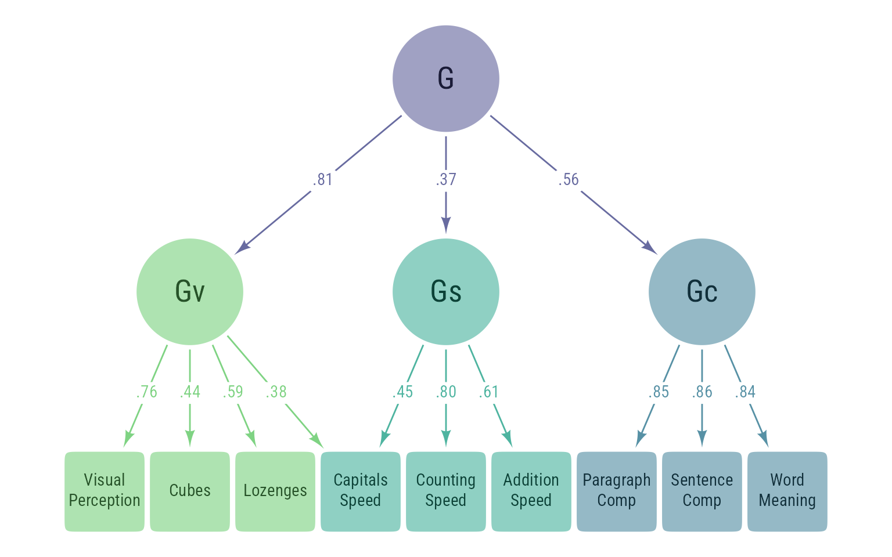

Figure 11: A latent variable model
