# Circles

## Setup

### Packages

``` r

library(ggdiagram)
library(ggplot2)
library(dplyr)
library(ggtext)
library(ggarrow)
```

### Base Plot

To avoid repetitive code, we make a base plot:

``` r

#| label: baseplot

my_font <- "Roboto Condensed"
my_font_size <- 20
my_point_size <- 2

# my_colors <- viridis::viridis(2, begin = .25, end = .5)
my_colors <- c("#3B528B", "#21908C")

theme_set(
  theme_minimal(
    base_size = my_font_size,
    base_family = my_font) +
    theme(axis.title.y = element_text(angle = 0, vjust = 0.5)))

bp <- ggdiagram(
  font_family = my_font,
  font_size = my_font_size,
  point_size = my_point_size,
  linewidth = .5,
  theme_function = theme_minimal,
  axis.title.x =  element_text(face = "italic"),
  axis.title.y = element_text(
    face = "italic",
    angle = 0,
    hjust = .5,
    vjust = .5)) +
  scale_x_continuous(labels = signs_centered,
                     limits = c(-4, 4)) +
  scale_y_continuous(labels = signs::signs,
                     limits = c(-4, 4))
```

## Specifying a Circle

Circles can be specified by a point at the circle’s center (*x*₀, *y*₀)
and a radius *r* (the distance from the center to the circle’s edge).

``` math
(x-x_0)^2+(y-y_0)^2=r^2
```

``` r

p <- ob_point(0,0)
r <- 3
c1 <-  ob_circle(center = p, radius = r)
c1
#> 
#> ── <ob_circle>
#> # A tibble: 1 × 3
#>       x     y     r
#>   <dbl> <dbl> <dbl>
#> 1     0     0     3
```

Code

``` r

bp +
  c1 +
  ob_segment(
    c1@center,
    c1@point_at(0),
    color = my_colors[1],
    label = ob_label(paste0("*r* = ", c1@radius), angle = 0, vjust = 0)
  ) +
  c1@center@label(vjust = 1.2, plot_point = TRUE) 
```

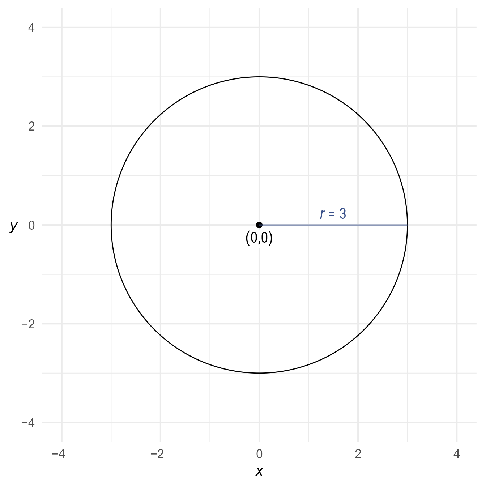

Figure 1: A circle can be specified with a center and a radius,

### Point on the circle at a specific angle

It is common to need one or more points at a specific angle.

``` r

c1@point_at(degree(60))
#> 
#> ── <ob_polar>
#> # A tibble: 1 × 2
#>       x     y
#>   <dbl> <dbl>
#> 1   1.5  2.60
```

Code

``` r

deg <- degree(60)

bp + 
  c1 +
  {p45 <- c1@point_at(deg)} +
  p45@label(polar_just = ob_polar(deg, 1.5)) +
  ob_segment(c1@center, p45) +
  ob_arc(radius = 1, start = degree(0), end = deg, label = deg)
```

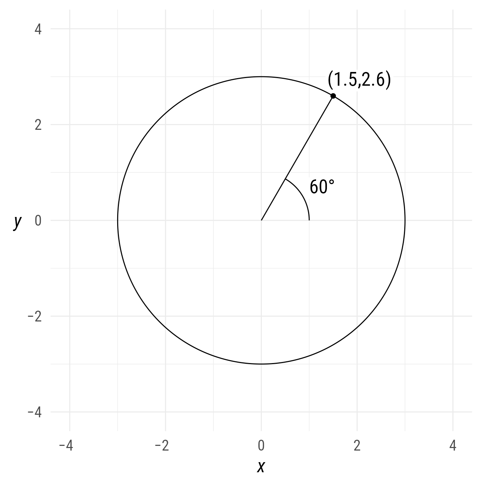

Figure 2: Point on circle that is 45° from the x-axis.

Multiple points can be specified at once.

``` r

bp + 
  c1 +
  c1@point_at(degree(seq(0,340, 20)))
  
```

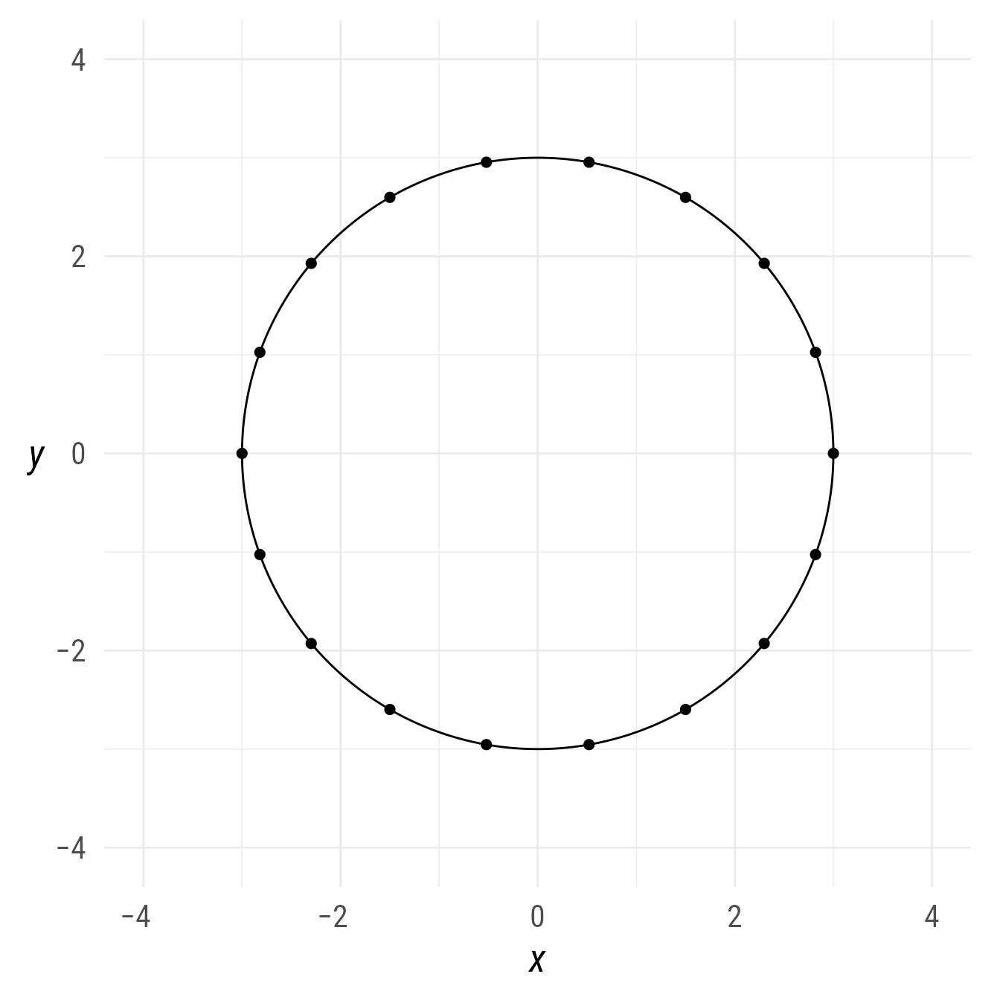

Figure 3: Points on circle 20 degrees apart.

These can be named points (e.g., north\|top\|above,
south\|bottom\|below, east\|right, west\|left, northwest\|top
left\|above left, southeast\|bottom right\|below right,
north-northwest).

``` r

positions <- c("top", "bottom", "left", "right", "northeast", "north-northeast")

bp +
  c1 +
  {p <- c1@point_at(positions)} +
  ob_label(positions, p, polar_just = ob_polar(p@theta, 1.7))
```

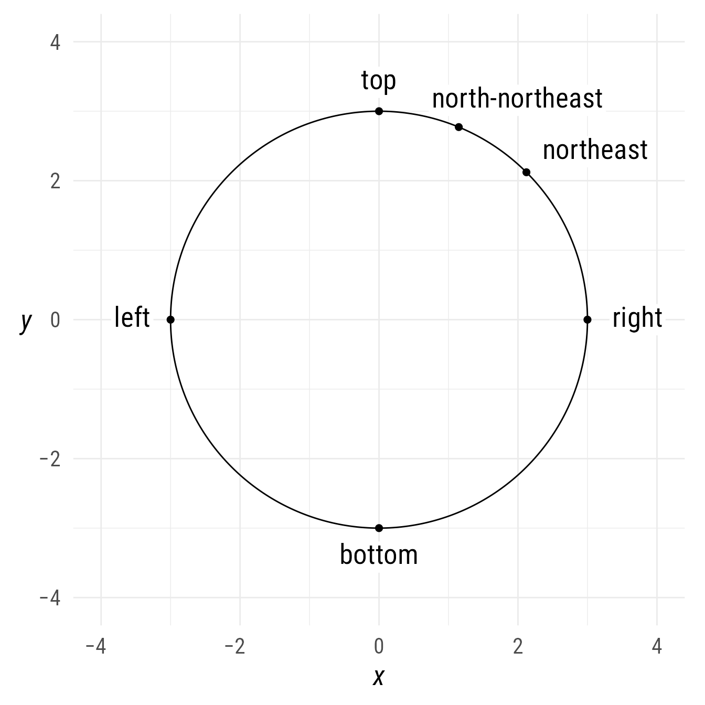

The `@point_at` property can take angles or named positions

## Placing circles

### Placing circles next to each other

The `place` function places an object at a specified direction and
distance from another object.

``` r

bp + 
  {A <- ob_circle(
    center = ob_point(-2, 0), 
    radius = 1, 
    label = ob_label("A", size = 30))} + 
  place(
    ob_circle(radius = 1.5,
           label = ob_label("B", size = 30)),
    from = A,
    where = "right",
    sep = 1)
```

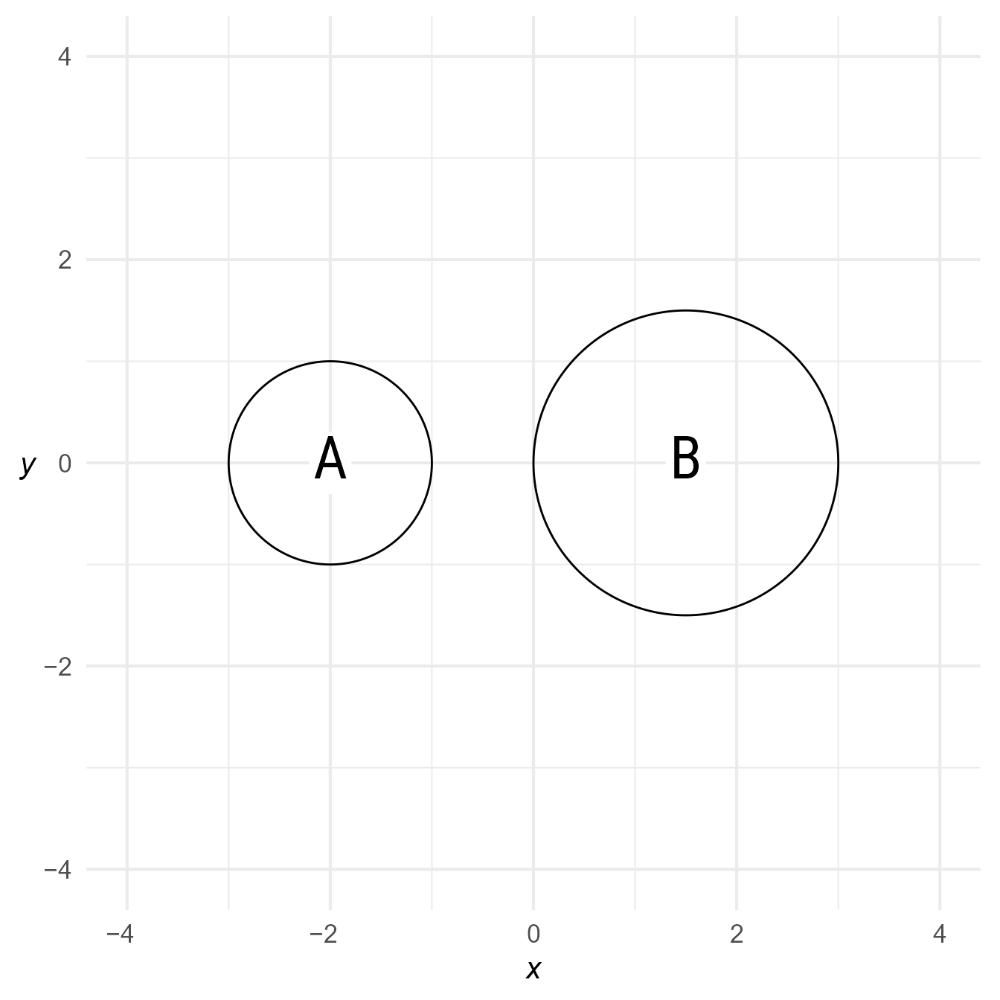

Figure 4: Place Circle B one unit to the right of Circle A

The `where` argument can take degrees or named positions:

east, right, east-northeast, northeast, top right, above right,
north-northeast, north, top, above, north-northwest, northwest, top
left, above left, west-northwest, west, left, west-southwest, southwest,
bottom left, below left, south-southwest, south, bottom, below,
south-southeast, southeast, bottom right, below right, east-southeast

Multiple circles can be created at once with named directions:

``` r

bp + 
  {c3 <- ob_circle(ob_point(0, 0), radius = 1)} + 
  place(ob_circle(radius = .5), 
        from = c3, 
        where = c("northwest", 
                  "northeast", 
                  "south-southeast", 
                  "south-southwest"), 
        sep = 1)
```

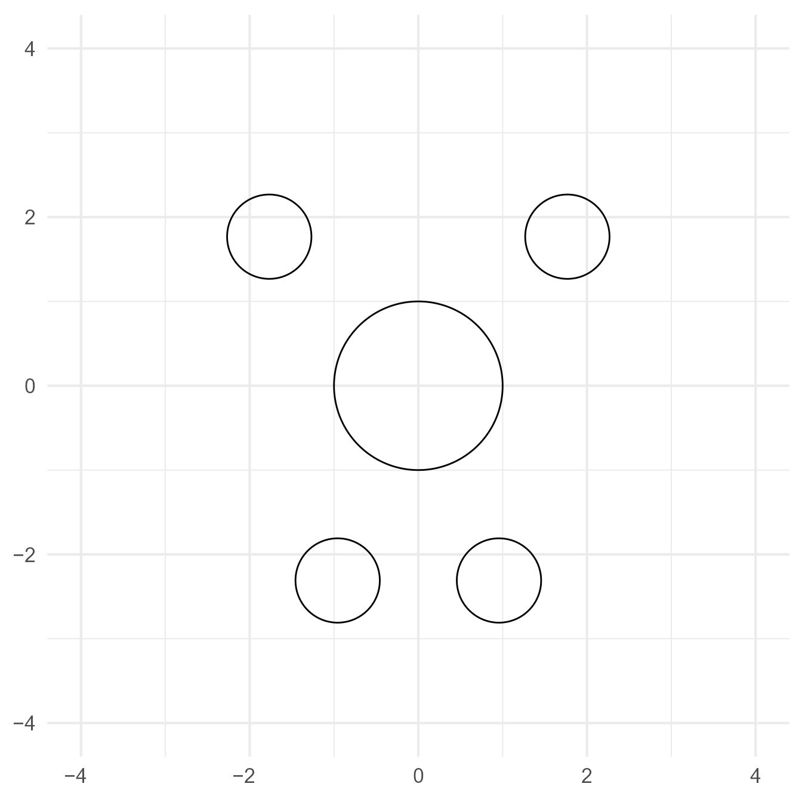

Figure 5: Place mutliple circles using named directions

Or with numbers (degrees):

``` r

bp + 
  c3 + 
  place(ob_circle(radius = .5), 
        from = c3, 
        where = c(0, 30, -30), 
        sep = 1)
```

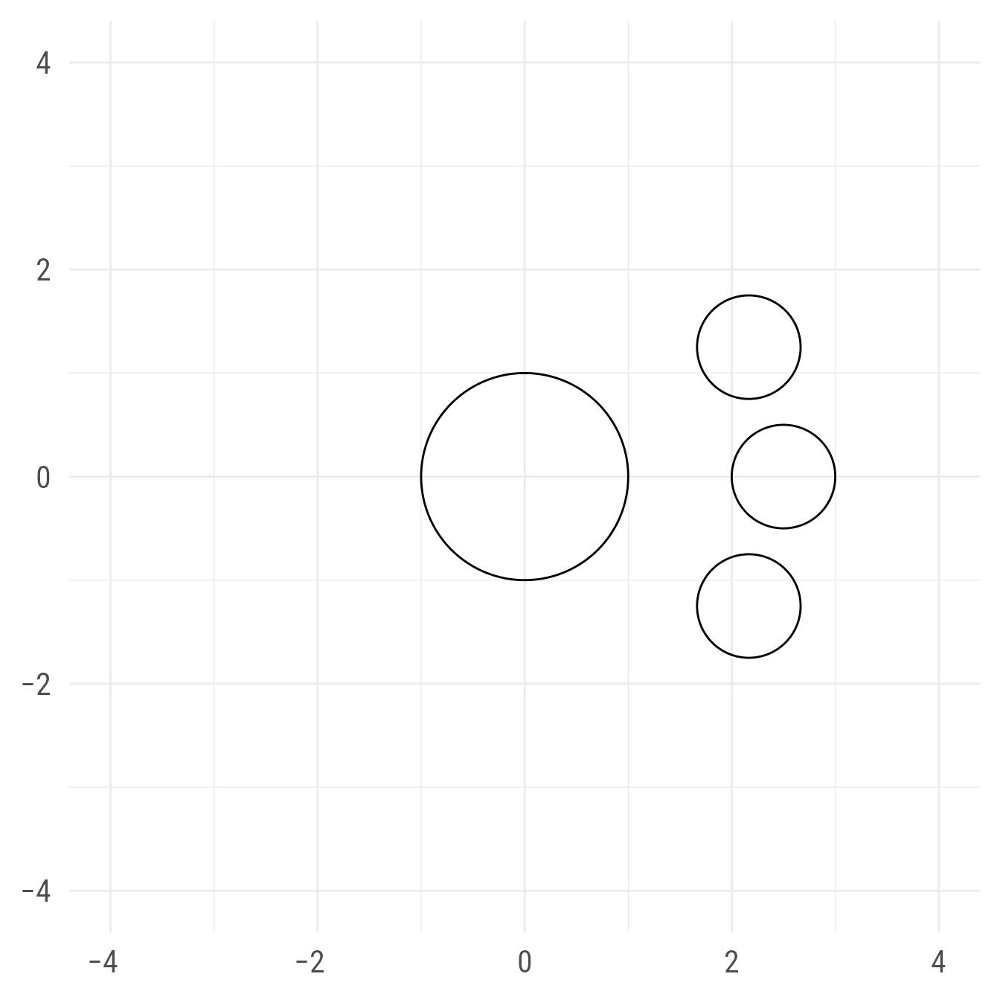

Figure 6: Place mutliple circles using degrees

With styles:

``` r

bp +
  {c4 <- ob_circle(
      radius = 1,
      color = NA,
      fill = "gray35")} +
  place(
    ob_circle(
      color = NA,
      fill = class_color(viridis::viridis(
        n = 6, 
        option = "D"))@lighten(.7)@color
    ),
    from = c4,
    where = degree(seq(0, 300, 60)),
    sep = 1
  ) 
```

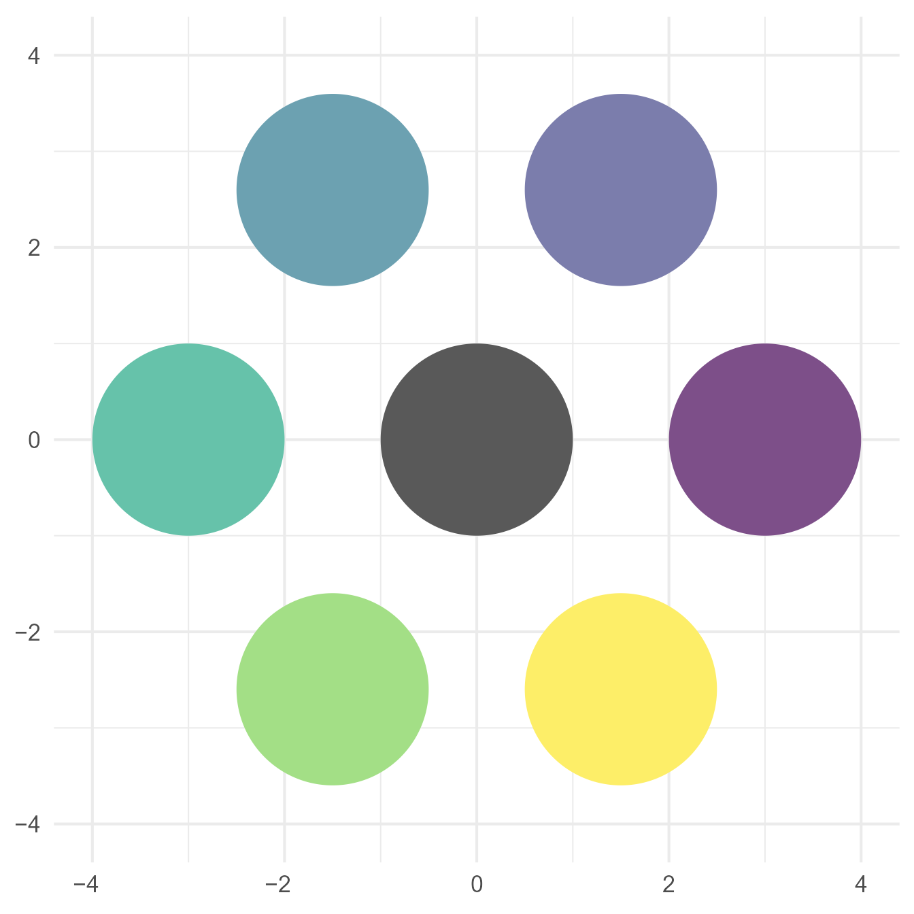

Figure 7: Place mutliple circles with styling

### Placing circles next to points and points next to circles

This works the same as placing circles next to each other. Here we
create a point in the center, place six circles around it, and then
place 12 points around each circle using the
[`map_ob`](https://wjschne.github.io/ggdiagram/articles/reference/map_ob.md)
function to “map” objects like the [`map_*`
functions](https://purrr.tidyverse.org/reference/map.html) in the purrr
package.

``` r

bp +
  {p1 <- ob_point(0, 0)} +
  {c6 <- place(
      x = ob_circle(
        radius = .5,
        fill = viridis::viridis(6),
        color = NA
      ),
      from = p1,
      where = degree(seq(0, 300, 60)),
      sep = 2
    )} +
  map_ob(unbind(c6),
         \(x) ob_point(color = x@fill) |>
           place(
             from = x,
             where = degree(seq(0, 330, 30)),
             sep = .5
           ))
```

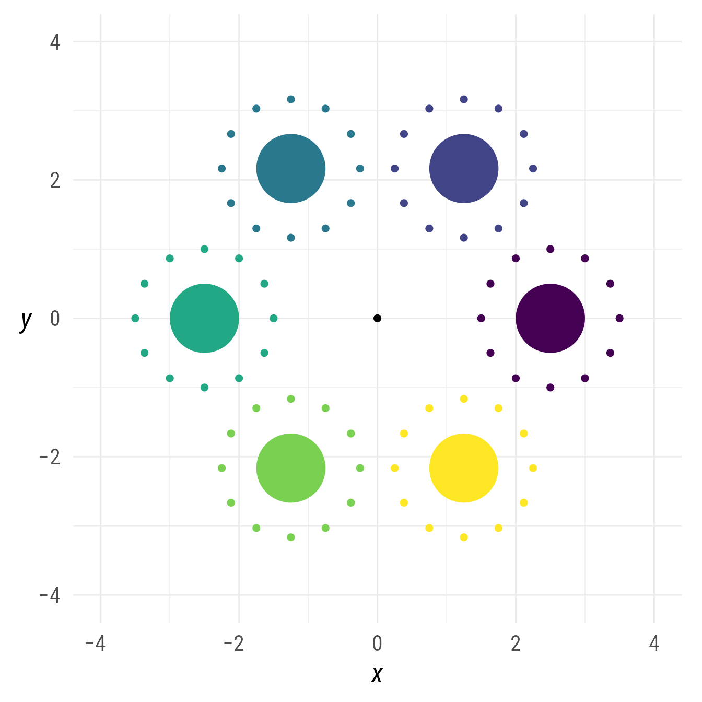

Figure 8: Place circles around a point, and points around each circle

### Placing lines next to circles

``` r

bp +
  {c7 <- ob_circle()} +
  place(ob_line(), c7, where = degree(45), sep = 1)
```

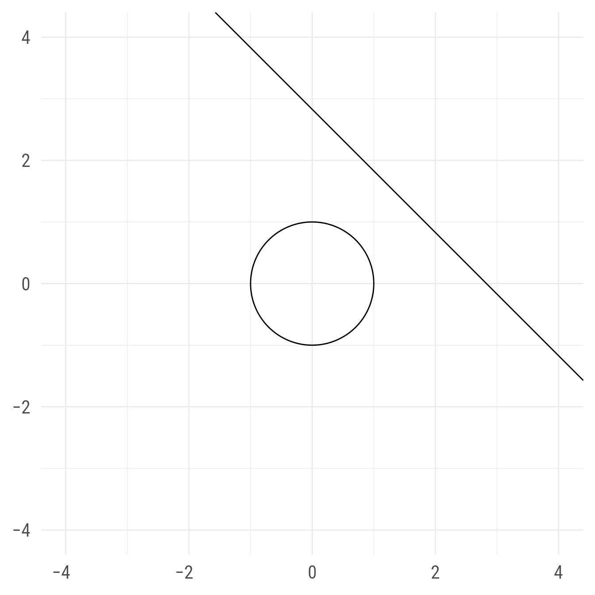

Figure 9: Placing a line one unit northeast of a circle

## Drawing path connectors between circles

Let’s make two circles and draw an arrow path between them

``` r

bp + 
  {c1 <- ob_circle(ob_point(-2, 2), radius = 1)} + 
  {c2 <- ob_circle(ob_point(1.5,-1.5), radius = 1.5)} +
  connect(c1, c2)
```

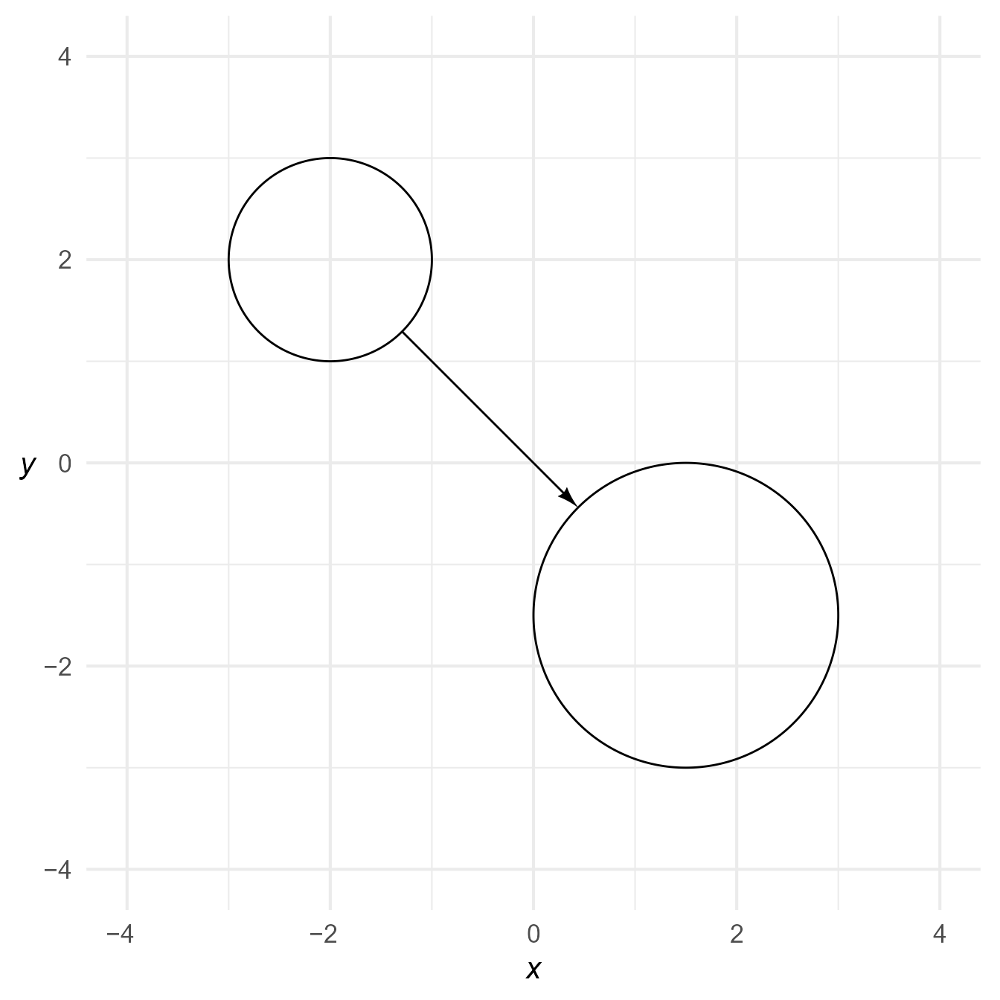

Figure 10: Connect two circles

That is fine, but we often need labels and styling to make scientific
diagrams. For example:

``` r

bp +
  {cthis <- ob_circle(
    ob_point(-2, 2),
    radius = 1,
    fill = my_colors[1],
    color = NA,
    label = ob_label(
      "This",
      color = "white",
      fill = NA,
      size = 35
    )
  )} + 
  {cthat <- ob_circle(
    ob_point(1.5, -1.5),
    radius = 1.5,
    fill = my_colors[2],
    color = NA,
    label = ob_label(
      "That",
      color = "white",
      fill = NA,
      size = 55
    )
  )} +
  connect(cthis, cthat, 
       resect = 2, 
       label = ob_label("Causes", size = 20, vjust = 0),
       color = "black")
```

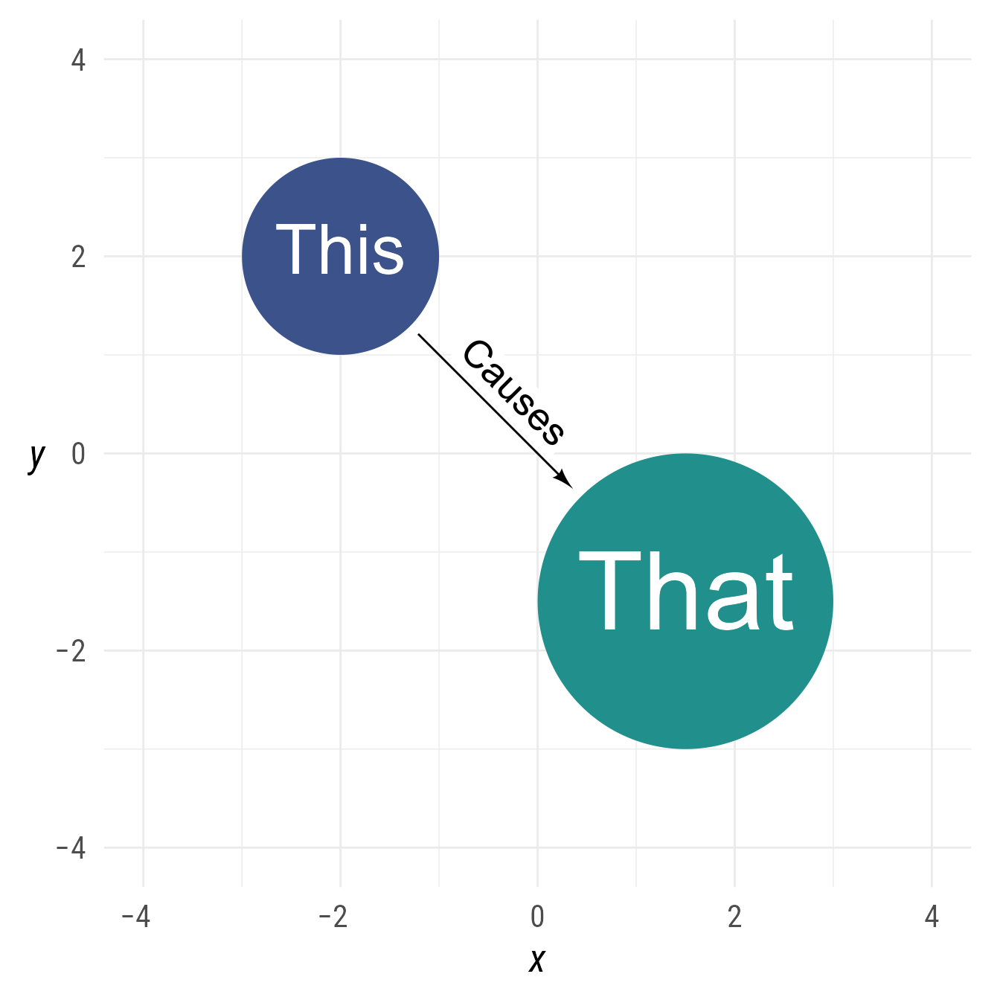

Figure 11: Connect two circles with labels and styles

## Paths between circles and lines

To connect a circle and the shortest distance to a line:

``` r

bp + 
  c1 +
  {l1 <- ob_line(slope = 2, intercept = 0)} +
  connect(c1, l1) +
  {c2 <- ob_circle(ob_point(2, -2))} + 
  connect(l1, c2)
```

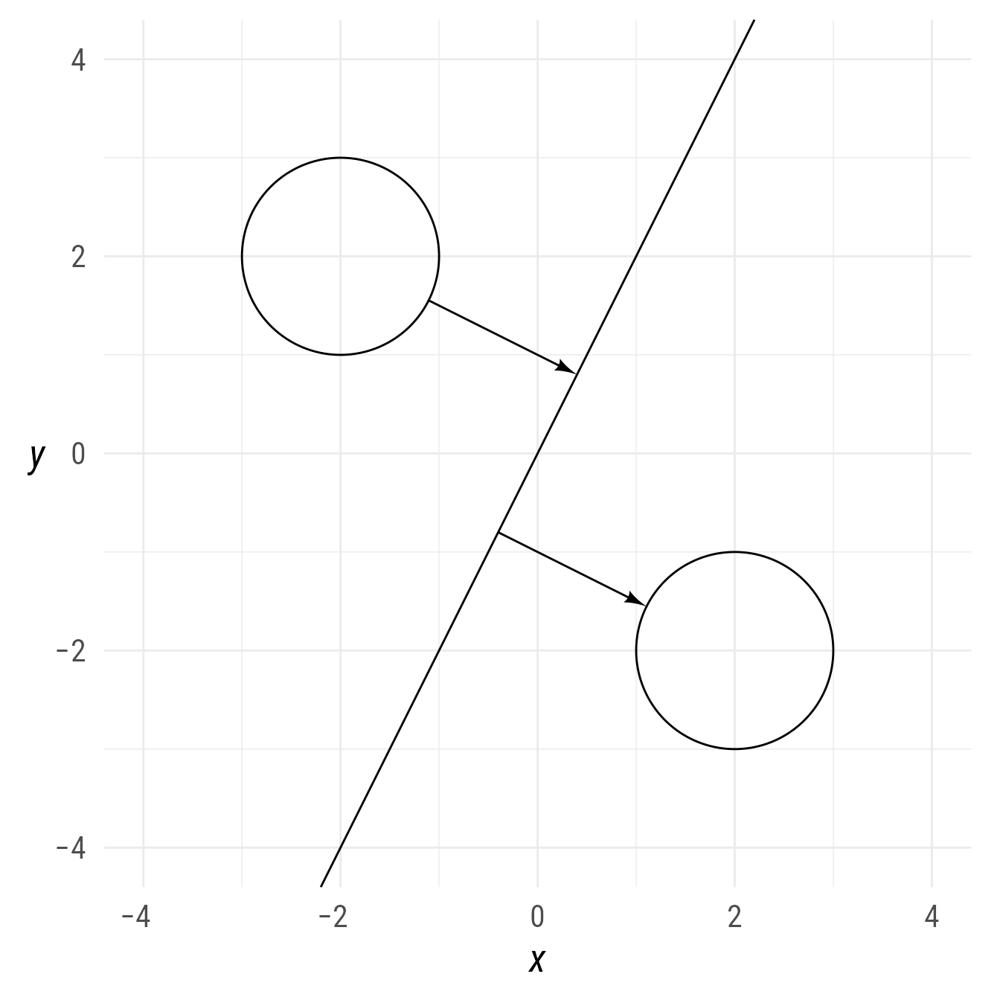

Figure 12: Connect a circle to a line and a line to a circle

To connect a circle to some other point on the line, we can use the the
`@point_at_x` or `@point_at_y` function from the `ob_line` object. For
example, to connect from a circle to a line horizontally and vertically:

``` r

bp + 
  c1 +
  l1 +
  connect(c1, l1@point_at_x(c1@center@x)) +
  connect(c1, l1@point_at_y(c1@center@y)) 
```

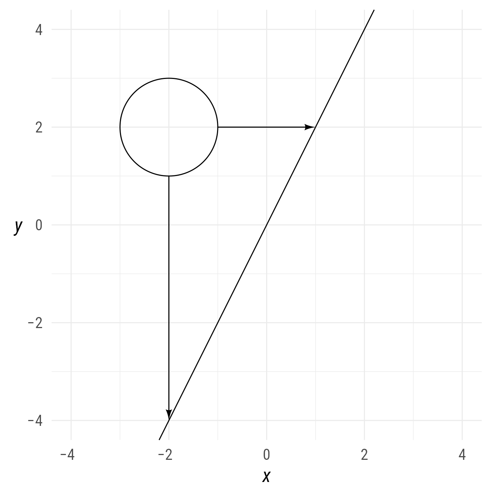

Figure 13: Connect a circle to a line via horiztonal and vertical lines
