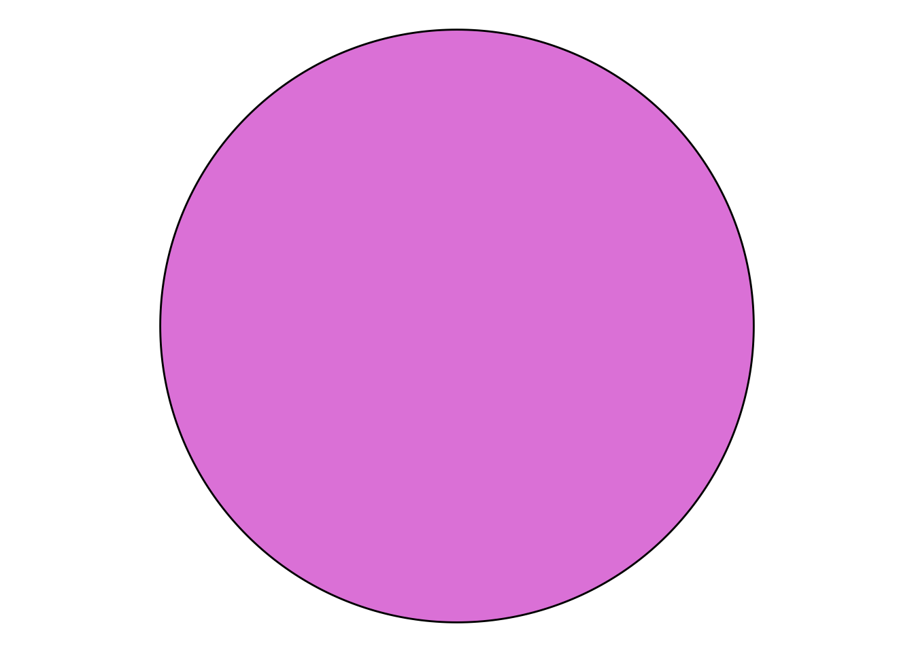
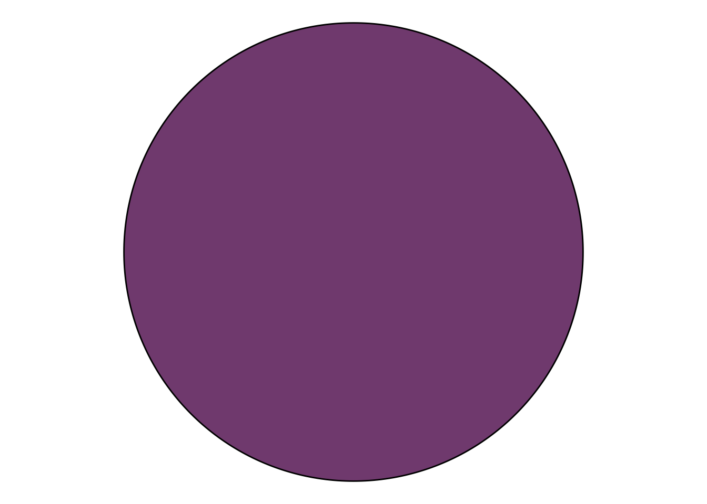
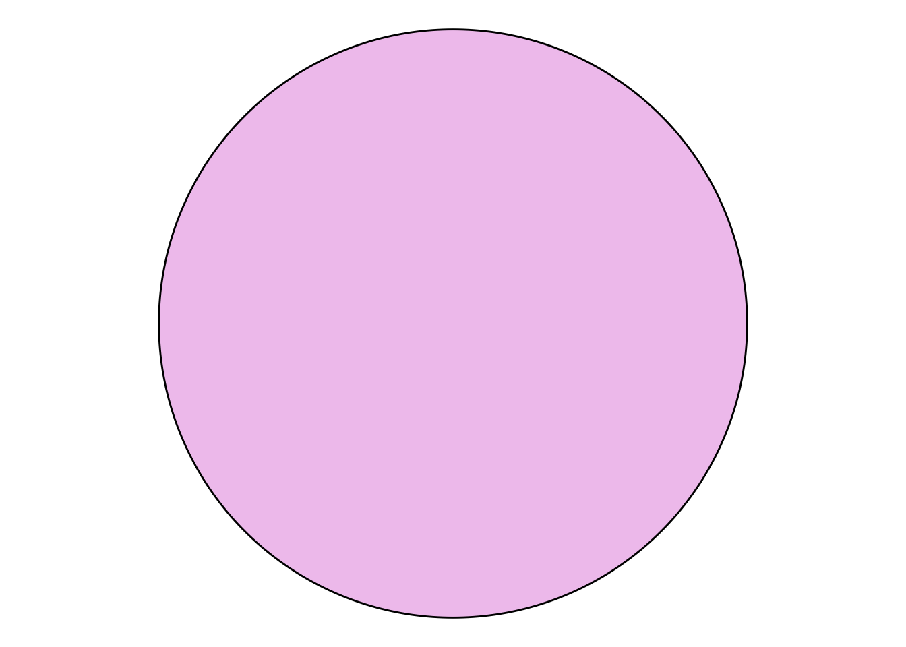
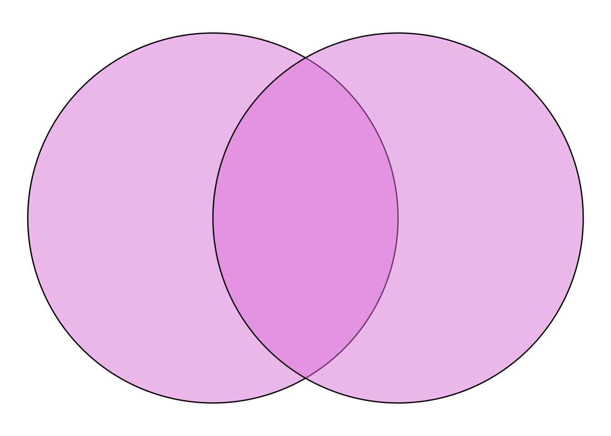
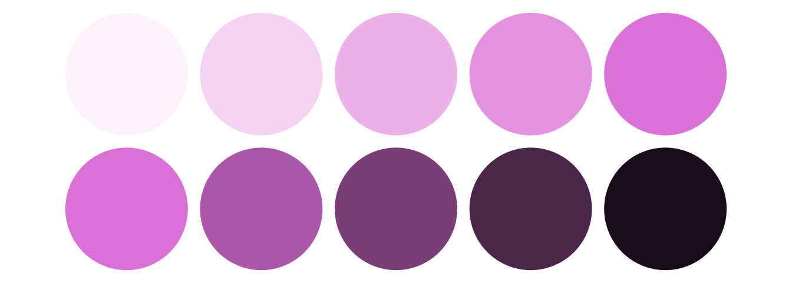
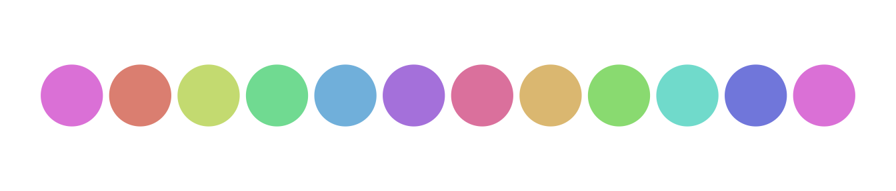
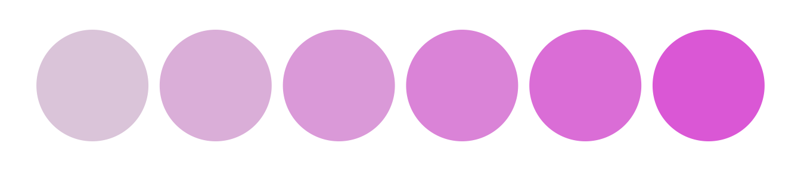

# Colors

``` r

library(ggdiagram)
```

The `class_color` object has some useful utilities for working with
colors. It mostly makes use of functions from the
[tinter](https://github.com/sebdalgarno/tinter) and
[farver](https://github.com/thomasp85/farver) packages.

The `class_color` object takes R color names or hex strings as input.

``` r

my_color <- class_color("orchid")
```

The underlying data of `class_color` can be retrieved with the `c`
function or via the `@color` property:

``` r

c(my_color)
#> [1] "#DA70D6FF"
my_color@color
#> [1] "#DA70D6FF"
```

The `ob_*` classes have fill and color properties that can take direct
character strings or `class_color` objects as input.

``` r

ggdiagram() +
  ob_circle(fill = my_color)
```



A variety of color manipulation functions are available. Colors can be
darkened:

``` r

ggdiagram() +
  ob_circle(fill = my_color@darken(.5))
```



Colors can be lightened:

``` r

ggdiagram() +
  ob_circle(fill = my_color@lighten(.5))
```



Colors can be made transparent:

``` r

ggdiagram() +
  ob_circle(fill = my_color@transparentize(.5)) +
  ob_circle(fill = my_color@transparentize(.5), 
            center = ob_point(1,0))
```



Here we create sequences of shades with the `@lighten` and `@darken`
properties:

``` r

ggdiagram() + 
  {my_array <- ob_circle(color = NA) %>% 
    ob_array(fill = my_color@lighten(seq(.1,1,length.out = 5)), 
             k = 5, 
             sep = .2)} + 
  ob_circle(color = NA) %>% 
    ob_array(fill = my_color@darken(seq(0,.9,length.out = 5)), 
             k = 5, 
             sep = .2) %>% 
    place(my_array, "below", sep = .2) 
```



The `@lighten` function makes colors appear the same as
`@transparentize` with a white background. This feature can make be
useful when text labels need to be placed over transparent shapes. The
`@darken` function makes colors appear the same as `@transparentize`
with a black background (with `@darken`’s `amount` values subtracted
from 1).

## Color Properties

Different properties of colors and be retrieved and set. Using the HSV
color model for Hue (0–360), Saturation (0–1), and Value/Brightness
(0–1)

``` r

my_color@hue
#> [1] 302.2642
my_color@saturation
#> [1] 0.4862385
my_color@brightness
#> [1] 0.854902
```

We can set a sequence of colors with the same brightness and saturation
as the original color but with different hues:

``` r

my_color_array <- class_color(
  my_color, 
  hue = my_color@hue + seq(0,720, length.out = 12))

ggdiagram() +
  ob_circle(color = NA) %>%
  ob_array(fill = my_color_array,
           k = 12,
           sep = .2)
```



We can set an array of colors with the same hue as the original color
but with different saturation and/or brightness:

``` r

my_color_array <- class_color(my_color, 
                              saturation = seq(.1, .6, .1))

ggdiagram() +
  ob_circle(color = NA) %>%
  ob_array(fill = my_color_array, 
           k = 6, 
           sep = .2)
```



Alternately, the RGB (Red/Green/Blue) color properties can also be
retrieved or set. Values are integers ranging from 0 to 255.

``` r

my_color@red
#> [1] 218
my_color@green
#> [1] 112
my_color@blue
#> [1] 214
```
