# Ellipses

## Setup

### Packages

``` r

library(ggdiagram)
library(ggplot2)
library(dplyr)
library(ggtext)
library(ggarrow)
```

### Base Plot

To avoid repetitive code, we set defaults and make a base plot:

``` r

my_font <- "Roboto Condensed"
my_font_size <- 20
my_point_size <- 2


# my_colors <- viridis::viridis(2, begin = .25, end = .5)
my_colors <- c("#3B528B", "#21908C")

theme_set(
  theme_minimal(
    base_size = my_font_size,
    base_family = my_font) +
    theme(axis.title.y = element_text(angle = 0, vjust = 0.5)))

bp <- ggdiagram(
  font_family = my_font,
  font_size = my_font_size,
  point_size = my_point_size,
  linewidth = .5,
  theme_function = theme_minimal,
  axis.title.x =  element_text(face = "italic"),
  axis.title.y = element_text(
    face = "italic",
    angle = 0,
    hjust = .5,
    vjust = .5)) +
  scale_x_continuous(labels = signs_centered,
                     limits = c(-4, 4)) +
  scale_y_continuous(labels = signs::signs,
                     limits = c(-4, 4))
```

A common way to specify an ellipse is with a center point and the two
distances from the center point *c* to the horizontal and vertical
edges, *a* and *b*, respectively.

``` math
\left(\frac{x-c_x}{a}\right)^2+\left(\frac{y-c_y}{b}\right)^2=1
```

``` r

a <- 4
b <- 3
c1 <- ob_point(0, 0)
e1 <- ob_ellipse(c1, a = a, b = b)
```

Code

``` r

bp +
  e1 +
  ob_segment(c1,
          ob_point(c(a, 0), c(0, b)),
          color = my_colors,
          label = ob_label(
            label = paste0(c("*a* = ", "*b* = "),
                           c(a, b)),
            angle = 0)) +
  c1
```

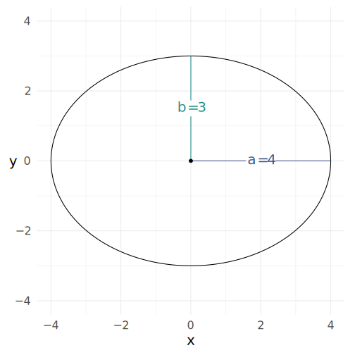

Figure 1: An ellipse can be specified with a center, and semi-major
radii.

## Foci

A circle has one focus, the center. If *a* ≠ *b*, an ellipse has two
foci.

``` r

bp +
  e1 +
  ob_label("*F*~1~", e1@focus_1, 
           plot_point = TRUE, 
           vjust = 1.2) +
  ob_label("*F*~2~", e1@focus_2, 
           plot_point = TRUE, 
           vjust = 1.2)
```

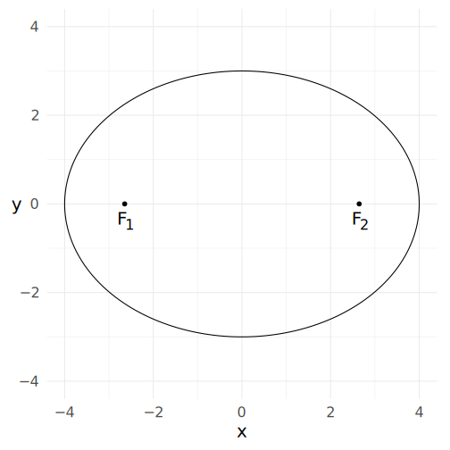

Figure 2: An ellipse has two foci

For any point *P* on the ellipse, the sum of PF₁ and PF₂ is 2*a* if *a*
\> *b* and 2*b* if *b* \> *a*.

``` r

deg <- degree(61.5)

bp +
  e1 +
  ob_label("*F*~1~", e1@focus_1, plot_point = TRUE, vjust = 1.2) +
  ob_label("*F*~2~", e1@focus_2, plot_point = TRUE, vjust = 1.2) +
  {p <- e1@point_at(deg)} +
  p@label("*P*", polar_just = ob_polar(deg, 1.5)) +
  ob_segment(e1@focus_1,
          p,
          label = paste0("*PF*~1~ = ",
                         distance(e1@focus_1, p) |>
                           round())) +
  ob_segment(p,
          e1@focus_2,
          label = paste0("*PF*~2~ = ",
                         distance(e1@focus_2, p) |>
                           round())) +
  ob_label("*PF*~1~ + *PF*~2~ = 2*a* = 8",
        center = ob_point(0,4),
        size = 20)
```

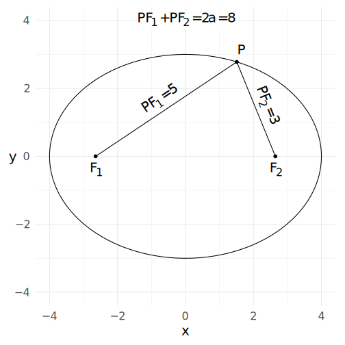

Figure 3: The sum of distances from the foci is constant.

## Rotated Ellipses

As seen in fig-ellipserotated, rotate an ellipse by setting the `angle`
property with a `degree`, `radian`, or `turn` object or a numeric value
(degrees).

``` r

bp +
  ob_ellipse(a  = 2, b = 1, angle = 45)
```

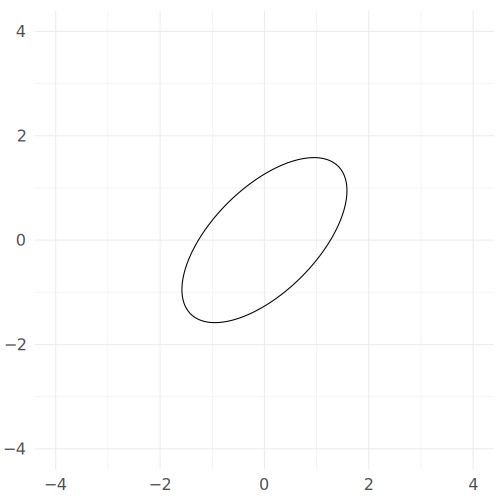

Figure 4: An ellipse rotated 45 degrees

Setting the angle of an ellipse will rotate it about its center. If you
want to rotate it around a different point, use the `rotate` function,
setting the `origin` parameter to any point you wish to rotate the
ellipse around.

``` r

bp +
  {p1 = ob_point(2,0)} +
  {e2 <- ob_ellipse(a  = 2, b = 1)} +
  rotate(e2, theta = degree(45), origin = p1, color = "red") 
```

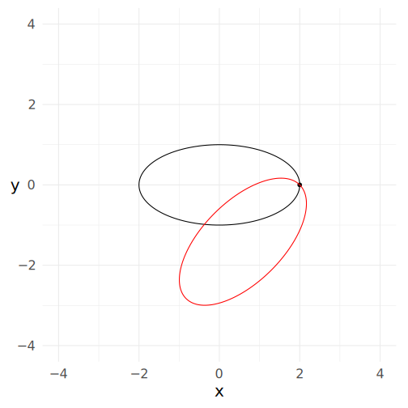

Figure 5: An ellipse rotated 45 degrees about point (2, 0)

## Point on the ellipse at a specific angle

The `@point_at` property of an `ob_ellipse` object is a function that
can find a point at a specific angle.

``` r

e1@point_at(degree(60))
#> 
#> ── <ob_point>
#> # A tibble: 1 × 2
#>       x     y
#>   <dbl> <dbl>
#> 1  1.59  2.75
```

Code

``` r

deg <- degree(60)
bp +
  e1 +
  {p45 <- e1@point_at(deg)} +
  p45@label(polar_just = ob_polar(deg, 1.5)) +
  ob_segment(e1@center, p45) +
  ob_arc(
    center = e1@center,
    radius = 1,
    start = degree(0),
    end = deg,
    label = deg
  )
```

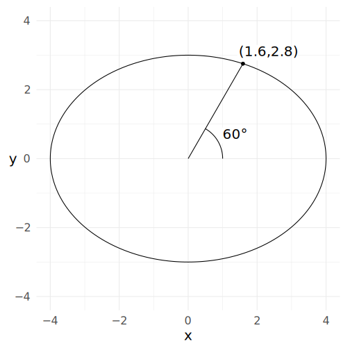

Figure 6: Point on ellipse that is 45° from the x-axis.

## Point on the ellipse using definitional parameter *t*

The angle expected by the `@point_at` function is a true angle. However,
the parametric equation for ellipses has a parameter *t* that looks like
an angle, but actually has no direct geometric interpretation:

``` math
\begin{aligned}
t&=[0,2\pi)\\
(x,y) &= (a\cos(t),b\sin(t))
\end{aligned}
```

Code

``` r

theta <- degree(seq(0, 350, 30))

bp +
  {c1 <- ob_circle(radius = 3.6, color = "gray30")} +
  {e1 <- ob_ellipse(a = 2.8, b = 1)} +
  {p1 <- c1@point_at(theta)} +
  ob_label(theta, p1, polar_just = ob_polar(theta, r = 1.5)) +
  ob_segment(ob_point(), p1, linewidth = .2) +
  {p2 <- e1@point_at(theta, definitional = T, color = "dodgerblue")} +
  ob_segment(ob_point(), p2) + 
  ob_label(theta@degree, p2, polar_just = ob_polar(theta, r = 1.5)) +
  theme_void() + 
  scale_x_continuous(expand = expansion(.12))
#> Scale for x is already present.
#> Adding another scale for x, which will replace the existing scale.
```

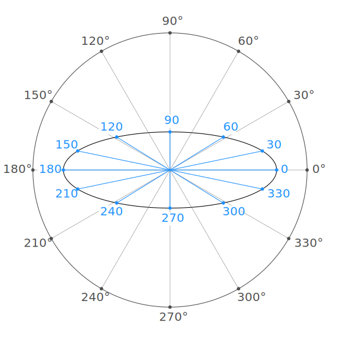

Figure 7: The ellipse’s definitional parameter *t* does not always line
up with angles on a circle

If the definitional point at *t* is desired:

``` r

ob_ellipse(a = 2)@point_at(degree(60), definitional = TRUE)
#> 
#> ── <ob_point>
#> # A tibble: 1 × 2
#>       x     y
#>   <dbl> <dbl>
#> 1     1  1.73
```

## Tangent lines

Like the `@point_at` property, the `@tangent` property is a function
that will find the tangent line at a specified angle or point.

``` r

bp + 
  {e1 <- ob_ellipse(a = 3, b = 2)} + 
  e1@point_at(60, color = "firebrick4") + 
  e1@tangent_at(60, color = "firebrick4")
```

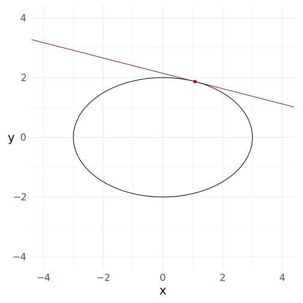

Figure 8: Tangent lines on an ellipse

The `@tangent` function can also take a point instead of an angle.

``` r

bp + 
  e1 + 
  {p1 <- e1@point_at(60)} +
  e1@tangent_at(p1) 
```

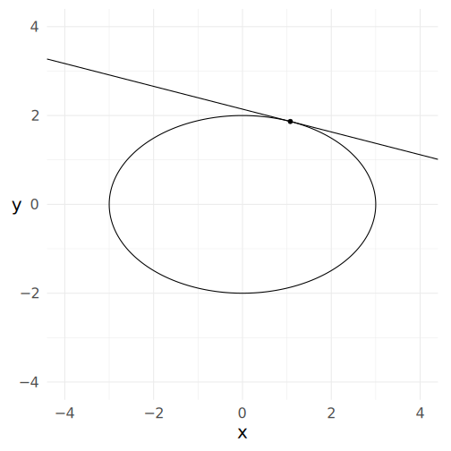

Figure 9: Tangent line at a specific point on an ellipse

If the point is not on the ellipse, the tangent will be at the point’s
projection onto the ellipse:

``` r

bp + 
  e1 + 
  {p1 <- ob_point(3, 2, color = "firebrick4")} +
  e1@tangent_at(p1) + 
  projection(p1, e1)
```

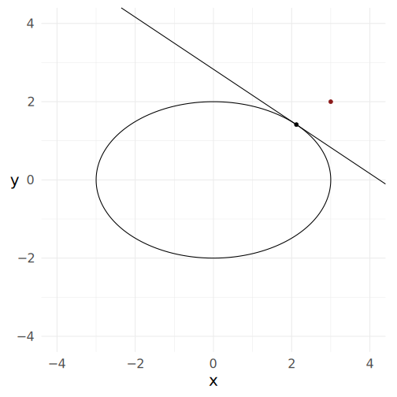

Figure 10: Tangent line at a specific point projected onto an ellipse

## Superellipses

The standard formula for an ellipse can be altered such that the squared
entities can be raised to any positive number.

``` math
\left(\frac{x-c_x}{a}\right)^{m_1}+\left(\frac{y-c_y}{b}\right)^{m_2}=1
```

*m*₂ is set equal to *m*₁ unless otherwise specified.

If *m*₁ is 4, and *a* and *b* are equal, we can make a *squircle*, which
is a square-ish circle.

``` r

bp +
  ob_ellipse(a = 3, b = 3, m1 = 4)
```

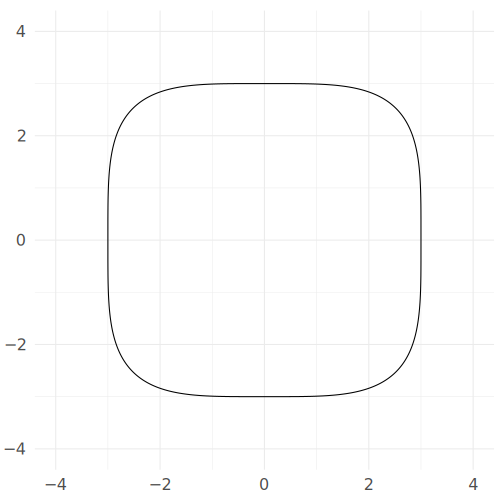

Figure 11: A squircle

If we increase *m*₁ to a high value like 10, we can create a rectangle
with pleasingly rounded corners.

``` r

bp +
  ob_ellipse(
    a = 3,
    b = 3,
    m1 = 10,
    color = NA,
    fill = "dodgerblue",
    label = ob_label(
      label = "My<br>Variable",
      fill = NA,
      color = "white",
      size = 70
    )
  )
```

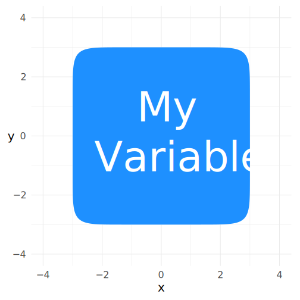

Figure 12: A superellipse can look like a rectangle with rounded
corners.

## Connection Paths Among Ellipses

``` r

bp + 
  {e1 <- ob_ellipse(ob_point(-2,0), a = 2)} +
  {e2 <- ob_ellipse(ob_point(3,2), b = 2)} +
  connect(e1, e2, resect = 2)
```

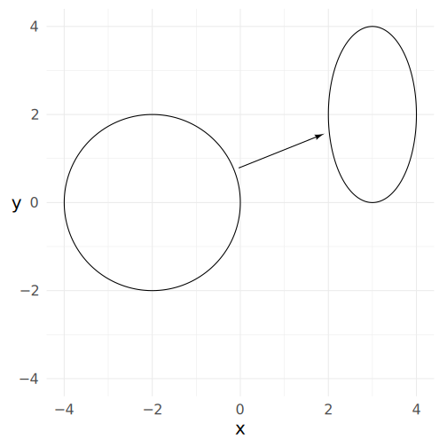

Figure 13: Connections between ellipses

## Placing Ellipses

The `place` function will set an object at a position and distance from
another object. Here we set an ellipse to the the right of `e1` (i.e.,
“east” or 0 degrees) with a separation of 2.

``` r

bp +
  {e1 <- ob_ellipse(center = ob_point(-2, 0), a = 2)} +
  place(ob_ellipse(b = 2),
        from = e1,
        where = "right",
        sep = 2)
```

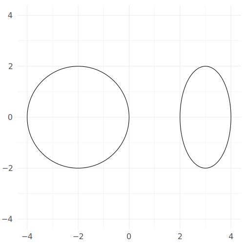

Figure 14: Place an ellipse 2 units to the right of another ellipse.

The `sep` parameter in the `place` function is not necessarily the
shortest distance between ellipses. Instead, it is the distance between
the ellipses on the segment connecting the center points.

``` r

deg <- degree(30)

bp + 
  {e1 <- ob_ellipse(
    center = ob_point(-2,-1, color =  "dodgerblue4"), 
    a = 2, 
    b = 1.5)} +
  {e2 <- place(
    ob_ellipse(
      center = ob_point(color = "orchid4"),
      b = 2),
    from = e1, 
    where = deg, 
    sep = 2)} + 
  connect(
    e1,
    e2,
    arrow_head = ggarrow::arrow_head_minimal(),
    linetype = "dashed",
    label = ob_label(2, vjust = 0)
  ) +
  ob_arc(e1@center, end = deg, label = deg) + 
  ob_segment(e1@center, 
             e1@point_at(deg)) + 
  ob_segment(e2@center, 
             e2@point_at(deg + degree(180))) + 
  ob_label("*e*~1~", e1@center) + 
  ob_label("*e*~2~", e2@center)
```

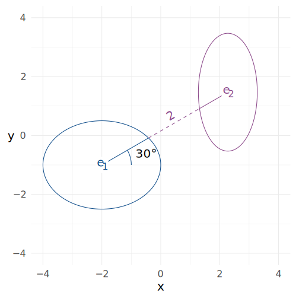

Figure 15: The separation distance between ellipses is along the path
that connects their centers.

You can place many ellipses at once. In
[Figure 16](#fig-manyconnections), 12 ellipses are placed around the
central ellipse. Connection paths are then drawn to each ellipse.

``` r

# Number of ellipses
k <- 12

# Colors
e_fills <- hsv(
  h = seq(0, 1 - 1 / k, length.out = k), 
  s = .4, 
  v = .6)

bp + 
  {e_0 <- ob_ellipse(
    m1 = 6,
    label = ob_label(
      "*e*~0~",
      size = 40,
      color = "white",
      fill = "gray20"
    ),
    color = NA,
    fill = "gray20"
  )} + 
  {e_x <- place(
    x = ob_ellipse(
      a = .4,
      b = .4,
      m1 = 6,
      label = ob_label(
        paste0("*e*~", seq(k), "~"),
        color = "white",
        fill = e_fills
      ),
      color = NA,
      fill = e_fills
    ),
    from = e_0,
    where = degree(seq(0, 360 - 360 / k, 360 / k)),
    sep = 2
  )} +
  connect(e_0, e_x, resect = 2, color = e_fills) + 
  theme_void()
```

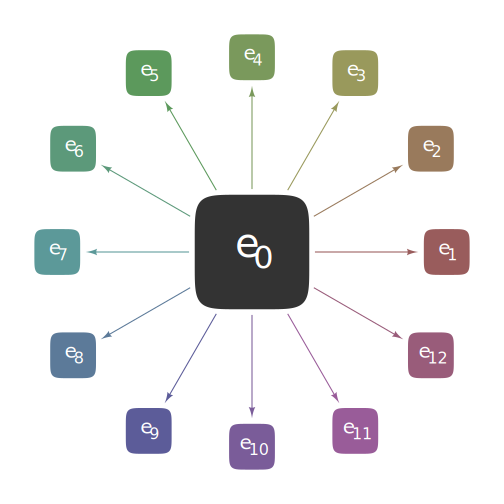

Figure 16: Many ellipses can be placed at once.

Lines can be placed in relation to ellipses:

``` r

bp + 
  {e1 <- ob_ellipse(m1 = 4)} +
  {l1 <- place(
    x = ob_line(),
    from = e1,
    where = {deg1 <- degree(45)},
    sep = {d <- 3}
  )} + 
  connect(
    e1,
    l1,
    label = paste0("Distance = ", d),
    arrow_fins = arrowhead(),
    length_fins = 8,
    length_head = 8,
    resect = 1
  ) + 
  ob_label(
    label = equation(l1),
    center = ob_polar(theta = deg1, 
                      r = e1@point_at(deg1)@r + d),
    angle = l1@angle,
    vjust = 0
  )
```

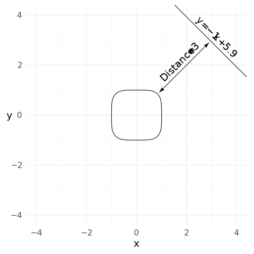

Figure 17: A line placed 3 units and 45 degrees from a squircle.
