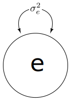
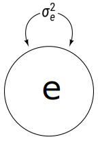
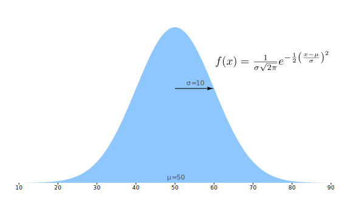
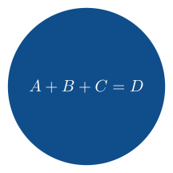
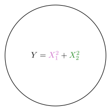
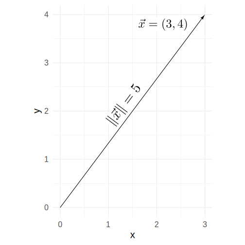
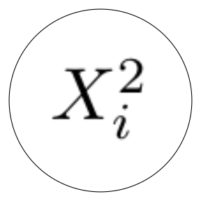
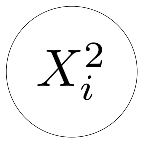

# Equations with LaTeX

## Setup

``` r

library(ggplot2)
library(ggdiagram)
library(tibble)
library(dplyr)
library(purrr)
library(ggarrow)
```

## Advantages of `ob_label` over `ob_latex`

The `ob_label` function uses
[`ggtext::geom_richtext`](https://wilkelab.org/ggtext/reference/geom_richtext.html)
to create labels. It’s primary advantage is that it is simple and
renders quickly. Wherever possible, it is the recommended way to create
labels. It understands basic markdown formatting (e.g., italics,
bolding, subscripts, and superscripts) as well as some HTML tags (e.g.,
`span` and `img`).

## Advantages of `ob_latex` over `ob_label`

If something more elaborate is needed than italics, bolding, subscripts,
and superscripts, we can use LaTeX instead. The `ob_latex` function can
place an image of a LaTeX equation in a ggplot diagram.

For example, suppose I want to label a latent variable’s variance with
the symbol $`\sigma_e^2`$. This symbol would be difficult to render in
pure HTML, so we can render it in LaTeX instead.

``` r

ggdiagram(font_family = "Roboto Condensed") +
  {l <- ob_circle(label = ob_label("*e*", size = 48))} +
  {lv <- ob_variance(l)} +
  ob_latex(tex = "\\sigma_e^2",
           center = lv@midpoint(), 
           width = .4) 
```



Figure 1: Latent variable with variance

If we want the symbol to be in the same font as the rest of the figure,
we can trick LaTeX into giving us any font we have installed on our
system. I often use [Roboto
Condensed](https://fonts.google.com/specimen/Roboto+Condensed):

``` r

ggdiagram(font_family = "Roboto Condensed") +
  {l <- ob_circle(label = ob_label("*e*", size = 48))} +
  {lv <- ob_variance(l)} +
  ob_latex(tex = r"(\text{\emph{σ}}_{\text{\emph{e}}}^{\text{2}})",
           center = lv@midpoint(), 
           width = .4, 
           family = "Roboto Condensed") 
```



Figure 2: Latent variable with variance rendered in Roboto Condensed

If you need an equation in a plot that requires something other than a
1:1 aspect ratio, you can set the aspect ratio of the equation to be the
same as the aspect ratio as the plot.

``` r

mu <- 50
sigma <- 10
ratio <- (4 * sigma)  / dnorm(mu, mu, sigma)

ggplot() +
  coord_fixed(ratio = ratio) +
  theme_classic(base_family = "Roboto Condensed") +
  theme(axis.line = element_blank(), axis.title.x = element_markdown()) +
  stat_function(
    fun = \(x) dnorm(x, mean = mu, sd = sigma),
    geom = "area",
    n = 1000,
    fill = "dodgerblue",
    alpha = .5
  ) +
  scale_x_continuous(NULL,
                     breaks = mu + seq(-4 * sigma, 4 * sigma, sigma), 
                     limits = mu + c(-4 * sigma, 4 * sigma)) +
  scale_y_continuous(
    NULL,
    breaks = NULL,
    limits = c(0, dnorm(mu, mu, sigma)),
    expand = expansion()
  ) +
  ob_latex(
    r"(f(x) =
    \frac{1}{\sigma\sqrt{2\pi}}
    e^{-\frac{1}{2}
    \left(\frac{x-\mu}{\sigma}\right)^2})",
    width = sigma * 3,
    aspect_ratio = ratio,
    border = 1,
    filename = "zscore",
    density = 600
  ) |>
  place(ob_point(mu + sigma * .7, dnorm(mu + sigma * .7, mu, sigma)), 
        where = "right", 
        sep = 3) + 
  ob_label(label = paste0("*&mu;* = ", mu), 
           ob_point(mu, 0), 
           vjust = 0,
           fill = NA,
           color = "gray30") +
  connect(
    {p_mu <- ob_point(x = mu, y = dnorm(mu + sigma, mu, sigma))},
    {p_sigma <- p_mu + ob_point(sigma, 0)},
    label = ob_label(
      paste0("*&sigma;* = ", sigma),
      fill = NA,
      vjust = 0,
      color = "gray30"
    )
  )
```



Figure 3: Normal distribution’s probability density function

## Text Color and Background Fill Color

The text color is black by default. It can be set to any color via the
`color` property.

The background color of the LaTeX expression will be white by default.
If the LaTeX expression is placed inside an object with a filled
background, you might want to give the expression the same background
fill color.

``` r

ggdiagram() +
  ob_circle(fill = "dodgerblue4", color = NA) +
  ob_latex(
    "A+B+C=D",
    center = ob_point(),
    color = "white",
    fill = "dodgerblue4",
    density = 900,
    width = 1.5
  )
```



Figure 4: Altering the text color and background fill color.

Of course, you can always manipulate text color via LaTeX.

``` r

ggdiagram() +
  ob_circle() +
  ob_latex("Y={\\color[HTML]{CD69C9} X_1^2} + {\\color[HTML]{228B22} X_2^2}")
```


Figure 5: Latex Colors

As a convenience, the `latex-color` function will surround the
expression with the right LaTeX expression to change the color.

``` r

ggdiagram() +
  ob_circle() +
  ob_latex(paste0("Y=", 
                  latex_color("X_1^2", color = "orchid3"),
                  "+",
                  latex_color("X_2^2", color = "forestgreen")))
```



Figure 6: Using `latex_color` to alter text color in LaTeX expressions.

## Rotation

The LaTeX expression can be rotated by setting the `angle` property.

``` r

ggdiagram(theme_function = ggplot2::theme_minimal, font_size = 20) +
  {s <- connect(ob_point(), ob_point(3,4))} +
  ob_latex("\\left\\lVert\\vec{x}\\right\\rVert=5", 
           center = s@midpoint(), 
           height = .35,
           density = 900,
           angle = s@line@angle, 
           vjust = -.1) + 
  ob_latex(
    paste0("\\vec{x}=", s@p2@auto_label),
    vjust = 1.2,
    hjust = 1.3,
    center = s@p2,
    height = .3,
    density = 600
  ) 
 
```



Figure 7: Rotated equation

## Image quality

The default density for `ob_latex` images is 300 dots per inch. If a
small expression is displayed as a large image, it will appear
pixelated.

``` r

ggdiagram() +
  ob_circle(radius = 1) +
  ob_latex("X_i^2", 
           width = 1.25)
```



Figure 8: A latex expression with poor image quality

Setting the density to a higher value will usually create a better
image.

``` r

ggdiagram() +
  ob_circle(radius = 1) +
  ob_latex("X_i^2", 
           width = 1.25,
           density = 900)
```



Figure 9: A latex expression with better image quality

Higher densities are not always better, however. In addition to using
more memory and rendering more slowly, images with very high densities
will sometimes appear blurry or pixelated.

## How does `ob_latex` work?

The `ob_latex` function works through these steps:

1.  Create a .tex file with content based on the LaTeX [standalone
    package](https://ctan.org/pkg/standalone).
2.  Create a .pdf file via the
    [`tinytex::xelatex`](https://rdrr.io/pkg/tinytex/man/latexmk.html)
    function, if tinytex is available. Otherwise, use xelatex via a
    shell command.
3.  Import the .pdf file as a raster bitmap via the
    [`magick::image_read_pdf`](https://docs.ropensci.org/magick/reference/editing.html)
    function.
4.  Store the raster bitmap in the `ob_latex@image` slot.

When rendered in ggplot2, the bitmap is displayed via
[`ggplot2::annotation_raster`](https://ggplot2.tidyverse.org/reference/annotation_raster.html).

## The xdvir Package: A Cool Alternative to `ob_latex`

If you want the best image quality possible for a LaTeX snippet in a
ggplot2 plot, then give the
[xdvir](https://cran.r-project.org/package=xdvir) package a try. It can
put LaTeX in plot titles, subtitles, and captions, as well as anywhere
on the plot. It gets the typography right as well. Be warned! At least
for now, xdvir renders S L O W L Y.

Of course, you can use ggdiagram functions to place LaTeX snippets but
use xdvir functions to render them.
