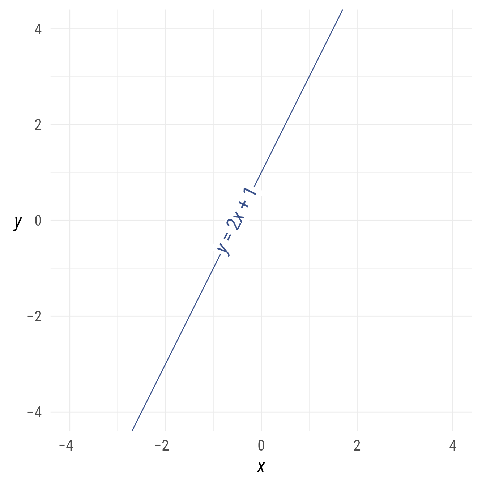
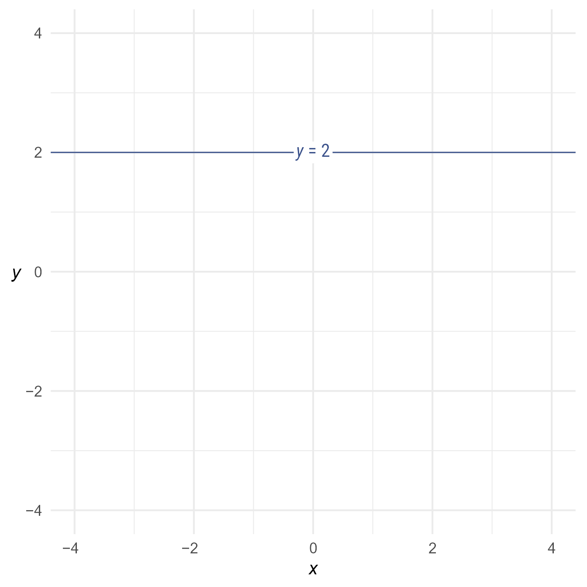
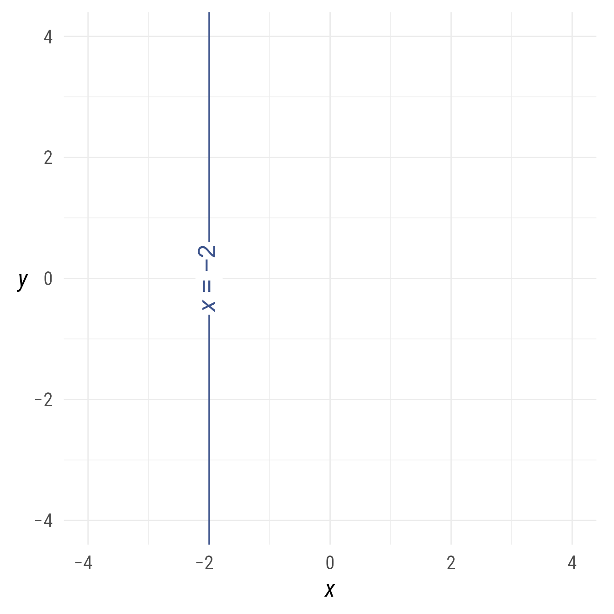
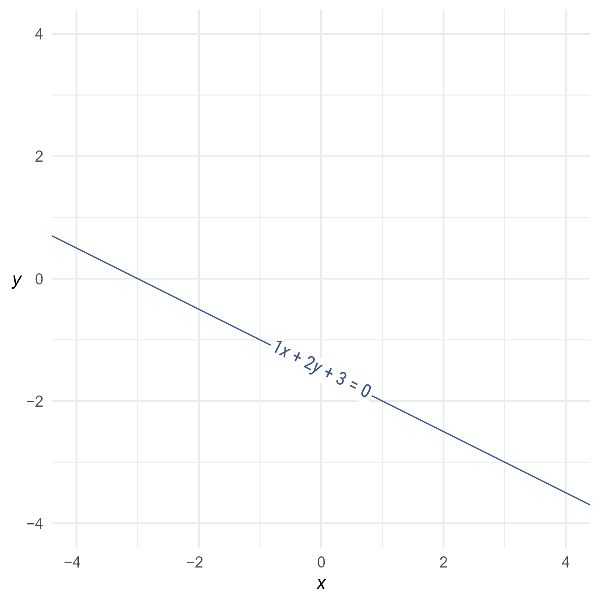
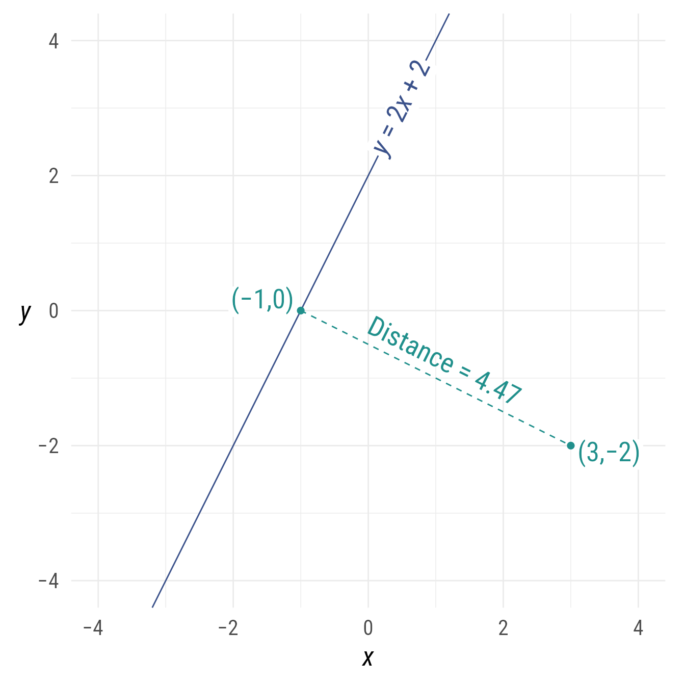

# Lines

## Setup

### Packages

``` r

library(ggdiagram)
library(ggplot2)
library(dplyr)
library(ggtext)
library(ggarrow)
```

### Base Plot

To avoid repetitive code, we set defaults and make a base plot:

``` r

my_font <- "Roboto Condensed"
my_font_size <- 20
my_point_size <- 2


# my_colors <- viridis::viridis(2, begin = .25, end = .5)
my_colors <- c("#3B528B", "#21908C")

theme_set(
  theme_minimal(
    base_size = my_font_size,
    base_family = my_font) +
    theme(axis.title.y = element_text(angle = 0, vjust = 0.5)))

bp <- ggdiagram(
  font_family = my_font,
  font_size = my_font_size,
  point_size = my_point_size,
  linewidth = .5,
  theme_function = theme_minimal,
  axis.title.x =  element_text(face = "italic"),
  axis.title.y = element_text(
    face = "italic",
    angle = 0,
    hjust = .5,
    vjust = .5)) +
  scale_x_continuous(labels = signs_centered,
                     limits = c(-4, 4)) +
  scale_y_continuous(labels = signs::signs,
                     limits = c(-4, 4))
```

## Making Lines

Lines can be constructed from a slope and an intercept:

``` r

l <- ob_line(slope = 2, intercept = 1, color = my_colors[1])
l
#> 
#> ── <ob_line>
#> # A tibble: 1 × 7
#>   slope intercept xintercept     a     b     c color  
#>   <dbl>     <dbl>      <dbl> <dbl> <dbl> <dbl> <chr>  
#> 1     2         1       -0.5    -2     1    -1 #3B528B
```

Code

``` r

bp +
  l +
  l@point_at_y(0)@label(l@equation(), angle = l@angle)
```



Figure 1: A line with slope of 2 and intercept of 1

Because the default slope is 0, a horizontal ob_line can be set with
just the intercept:

``` r

h <- ob_line(intercept = 2, color = my_colors[1])
h
#> 
#> ── <ob_line>
#> # A tibble: 1 × 7
#>   slope intercept xintercept     a     b     c color  
#>   <dbl>     <dbl>      <dbl> <dbl> <dbl> <dbl> <chr>  
#> 1     0         2       -Inf     0     1    -2 #3B528B
```

Code

``` r

bp + 
  h + 
  h@point_at_x(0)@label(equation(h))
```



Figure 2: A horizontal line intercept of 2

A vertical line can be set with the x-intercept:

``` r

v <- ob_line(xintercept = -2, color = my_colors[1])
v
#> 
#> ── <ob_line>
#> # A tibble: 1 × 7
#>   slope intercept xintercept     a     b     c color  
#>   <dbl>     <dbl>      <dbl> <dbl> <dbl> <dbl> <chr>  
#> 1  -Inf      -Inf         -2     1     0     2 #3B528B
```

Code

``` r

bp + 
  v + 
  v@point_at_y(0)@label(equation(v), angle = v@angle * -1)
```



Figure 3: Vertical line at x = −2

Any line—horizontal, vertical, or sloped—can be constructed from the
coefficients of the general form of a line:

``` math
ax+by+c=0
```

``` r

l_123 <- ob_line(a = 1, b = 2, c = 3, color = my_colors[1])
```

Code

``` r

bp +
  l_123 +
  l_123@point_at_x(
    x = 0)@label(
      equation(l_123, type = "general"), 
      angle = l_123@angle)
```



Figure 4: Line with slope = 0 and intercept = −2

With respect to the general form, the slope is equal to
$`-\frac{a}{b}`$, the y-intercept is equal to $`-\frac{c}{b}`$, and the
x-intercept is equal to $`-\frac{c}{a}`$

## Methods

### Projections and Distances

A point can be “projected” onto a line. Imagine shining a light on the
point in a direction perpendicular to the line. The point’s shadow on
the line would be the shortest distance between the line and the point.

``` r

p <- ob_point(3,-2, color = my_colors[2])
l <- ob_line(slope = 2, intercept = 2, color = my_colors[1])
# Point p projected onto line l
p_projected <- projection(p, l)

# Alternately:
l@projection(p)
#> 
#> ── <ob_point>
#> # A tibble: 1 × 3
#>       x     y color  
#>   <dbl> <dbl> <chr>  
#> 1    -1     0 #21908C
```

The shortest distance from a point to a line can be calculated.

``` r

# distance from point p to line l
distance(p, l)
#> [1] 4.472136

# Equivalently:
ob_segment(p, l@projection(p))@distance
#> [1] 4.472136
```

Code

``` r

bp +
  l +
  l@point_at_x(.5)@label(
    label = equation(l), 
    angle = l@angle) +
  {s_projected <- ob_segment(
      p1 = l@projection(p),
      p2 = p,
      linetype = "dashed",
      label = paste0("Distance = ", 
                     distance(l@projection(p), p) |>
                       round(digits = 2) |>
                       as.character()))} + 
  s_projected@midpoint(c(0, 1))@label(
    polar_just = degree(s_projected@line@angle) + c(180, 0),
    plot_point = TRUE)  
```



Figure 5: Shortest distance between a line and point
