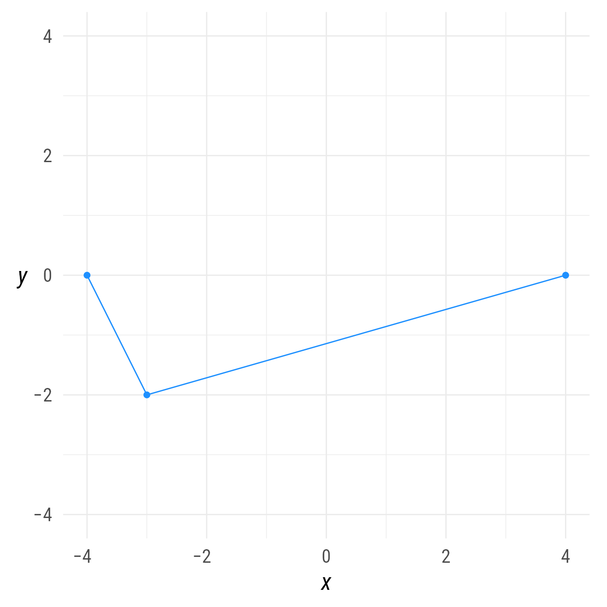
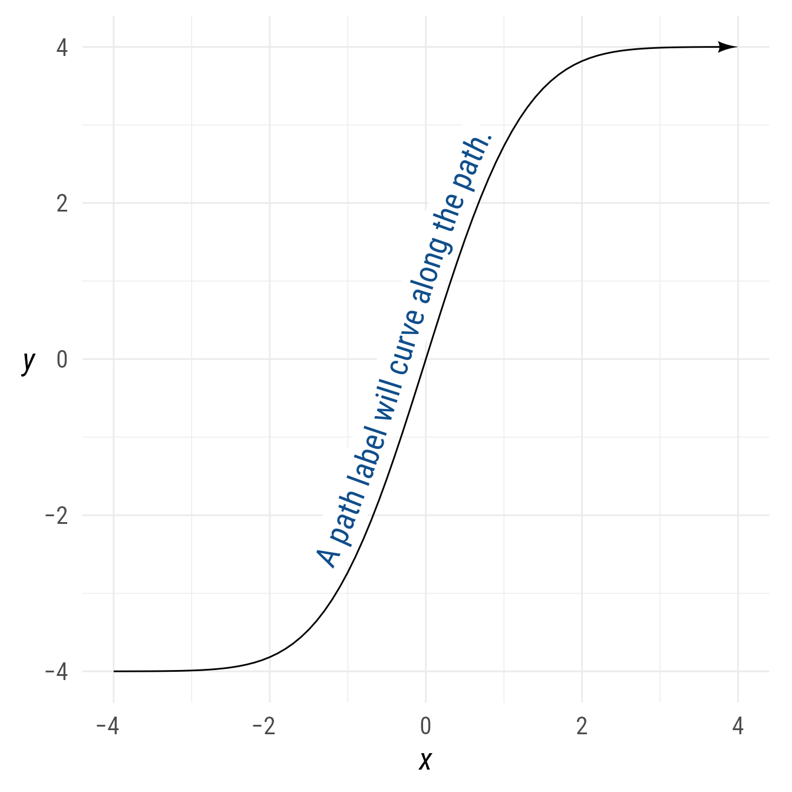
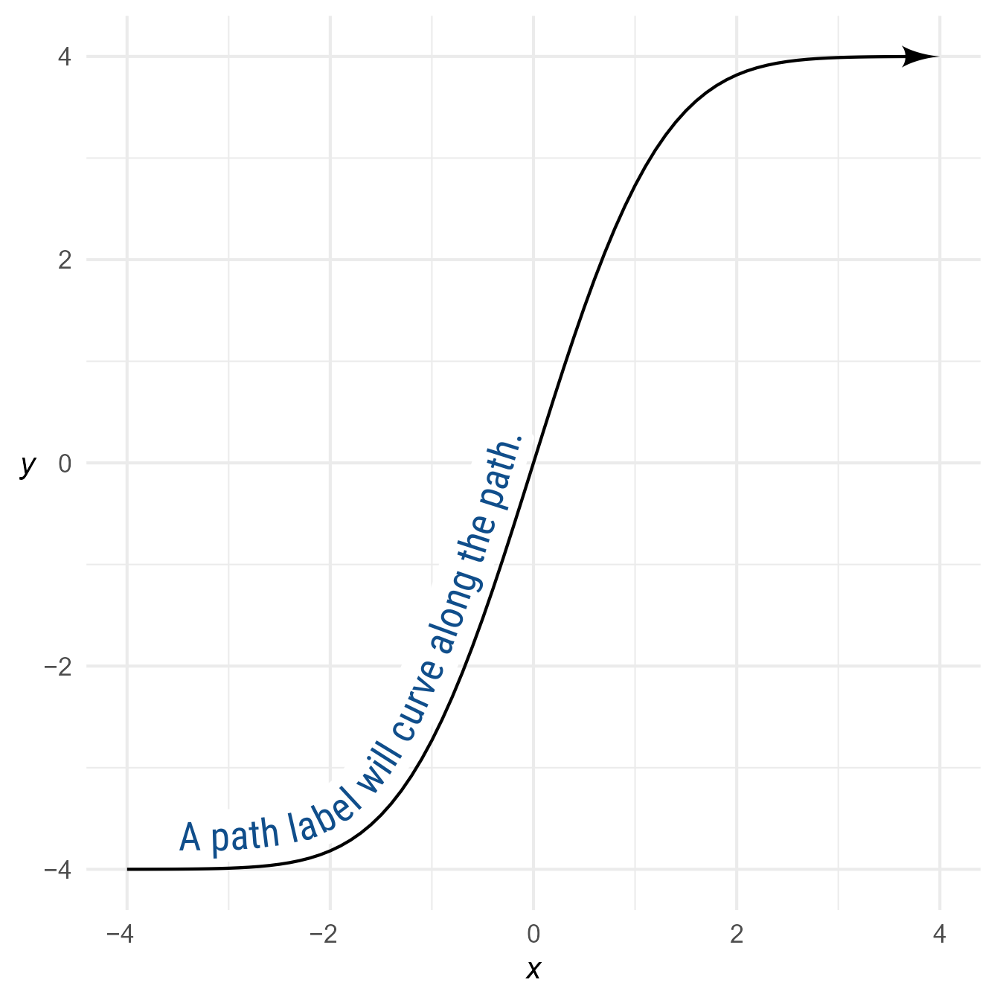
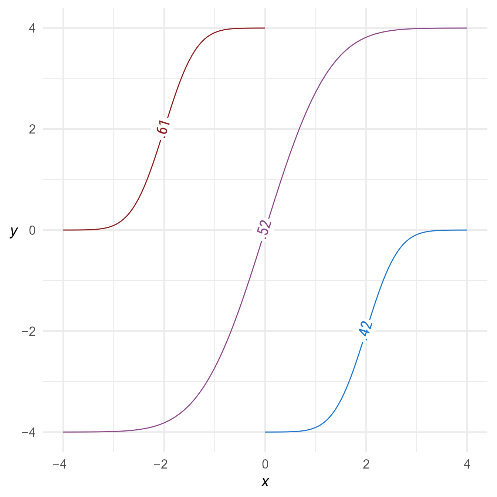
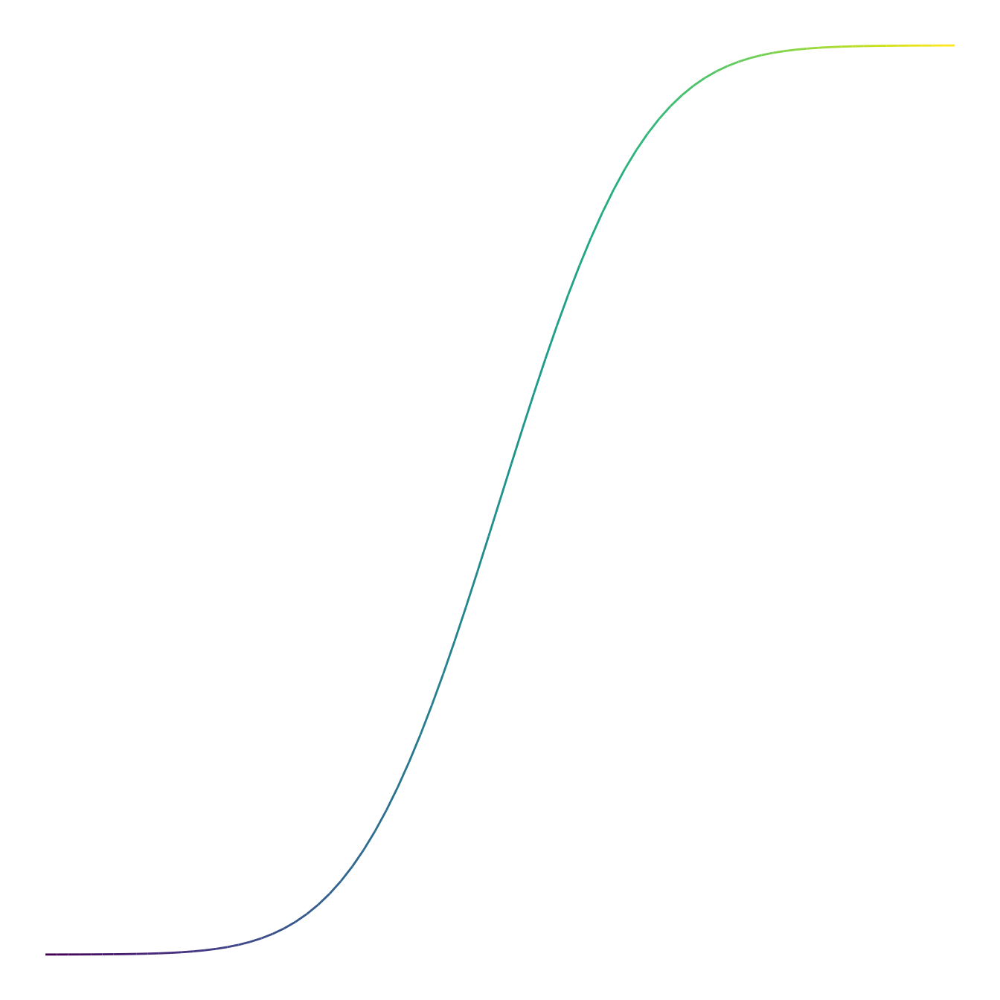

# Paths

## Setup

### Packages

``` r

library(ggdiagram)
library(ggplot2)
library(dplyr)
library(ggtext)
library(ggarrow)
```

### Base Plot

To avoid repetitive code, we make a base plot:

``` r

my_font <- "Roboto Condensed"
my_font_size <- 20
my_point_size <- 2


# my_colors <- viridis::viridis(2, begin = .25, end = .5)
my_colors <- c("#3B528B", "#21908C")

theme_set(
  theme_minimal(
    base_size = my_font_size,
    base_family = my_font) +
    theme(axis.title.y = element_text(angle = 0, vjust = 0.5)))

bp <- ggdiagram(
  font_family = my_font,
  font_size = my_font_size,
  point_size = my_point_size,
  linewidth = .5,
  theme_function = theme_minimal,
  axis.title.x =  element_text(face = "italic"),
  axis.title.y = element_text(
    face = "italic",
    angle = 0,
    hjust = .5,
    vjust = .5)) +
  scale_x_continuous(labels = signs_centered,
                     limits = c(-4, 4)) +
  scale_y_continuous(labels = signs::signs,
                     limits = c(-4, 4))
```

## Paths

The `path` function creates an object that connects points along a path.

``` r

p <- ob_point(c(-4,-3,4), c(0,-2, 0), color = "dodgerblue")
bp + 
  ob_path(p) +
  p
```



Figure 1: Plotting a path.

## Path Labels

The label of a path is created with
[`geomtextpath::geom_labelpath`](https://allancameron.github.io/geomtextpath/reference/geom_textpath.html),
and thus will curve if the path is curved.

``` r

p_curve <- tibble(x = seq(-4, 4, .1), 
                  y = (pnorm(x) * 8 - 4)) |>
  ob_point()


bp +
  ob_path(
    p = p_curve,
    label = ob_label(
      "A path label will curve along the path.",
      vjust = -.1,
      size = 20,
      color = "dodgerblue4"
    ),
    arrowhead_length = 8,
    arrow_head = arrowhead()
  )
```



Figure 2: A path with a curved label

You can control the position of the path label with either the label’s
`position` or `hjust` properties.

``` r

bp +
  ob_path(
    p = p_curve,
    label = ob_label(
      "A path label will curve along the path.",
      vjust = -.1,
      size = 20,
      color = "dodgerblue4",
      position = .1
    ),
    arrowhead_length = 8,
    arrow_head = arrowhead()
  )
```



Figure 3: A path with a curved label at position .1

## Multiple paths

To create multiple paths at once, specify a list or vector of point
objects.

``` r

bp +
  ob_path(c(p_curve, 
         p_curve * .5 + ob_point(2,-2),
         p_curve * .5 + ob_point(-2,2)), 
       color = c("orchid4",
                 "dodgerblue3",
                 "firebrick4"),
       label = c(".52", ".42", ".61"))
```



Figure 4: Multiple paths

## Segments

It is possible to create color gradients along a path using the paths’
segments.

``` r

ggdiagram() +
  ob_path(p_curve)@segment |> 
  set_props(color = viridis::viridis(p_curve@length - 1))
```


