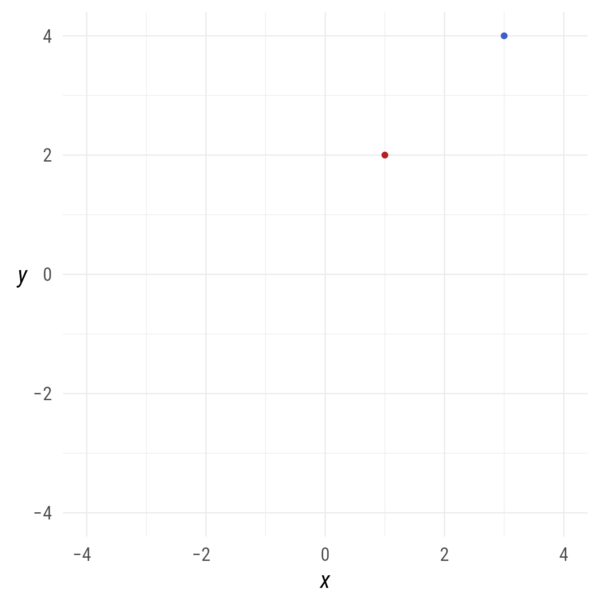
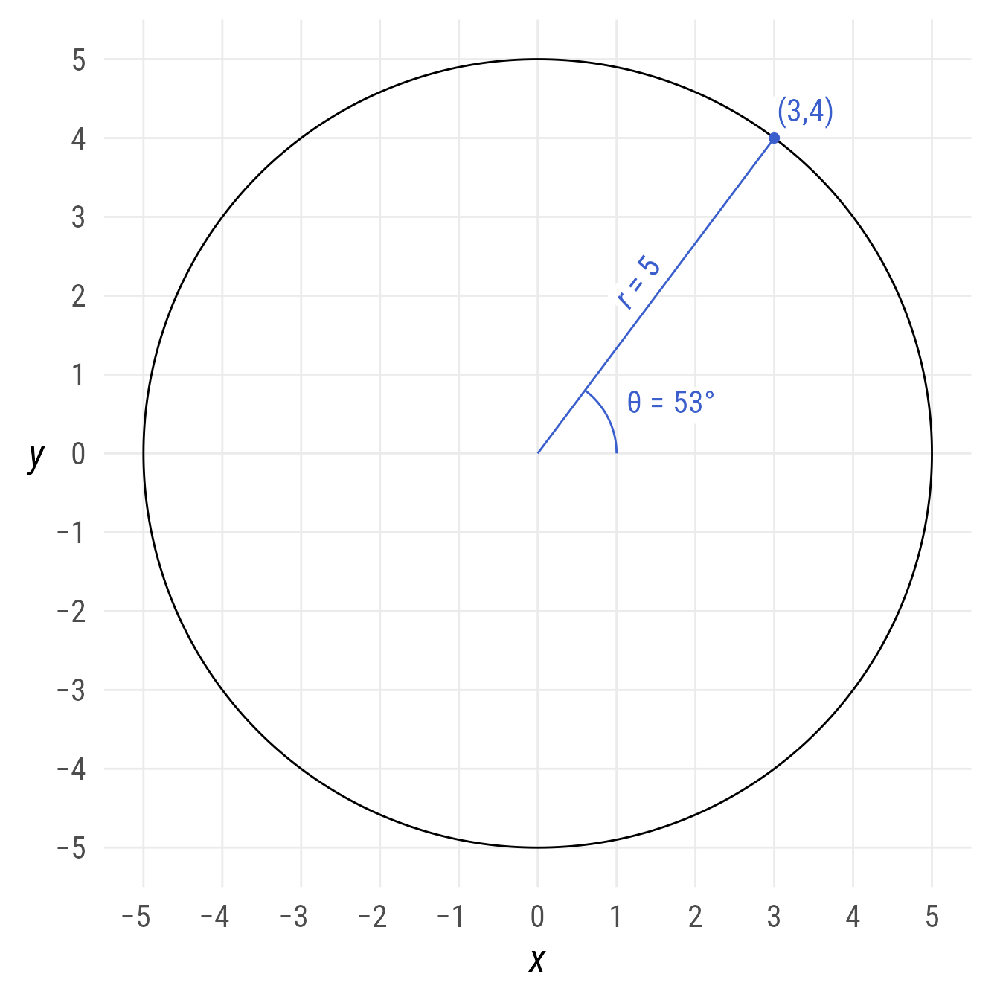
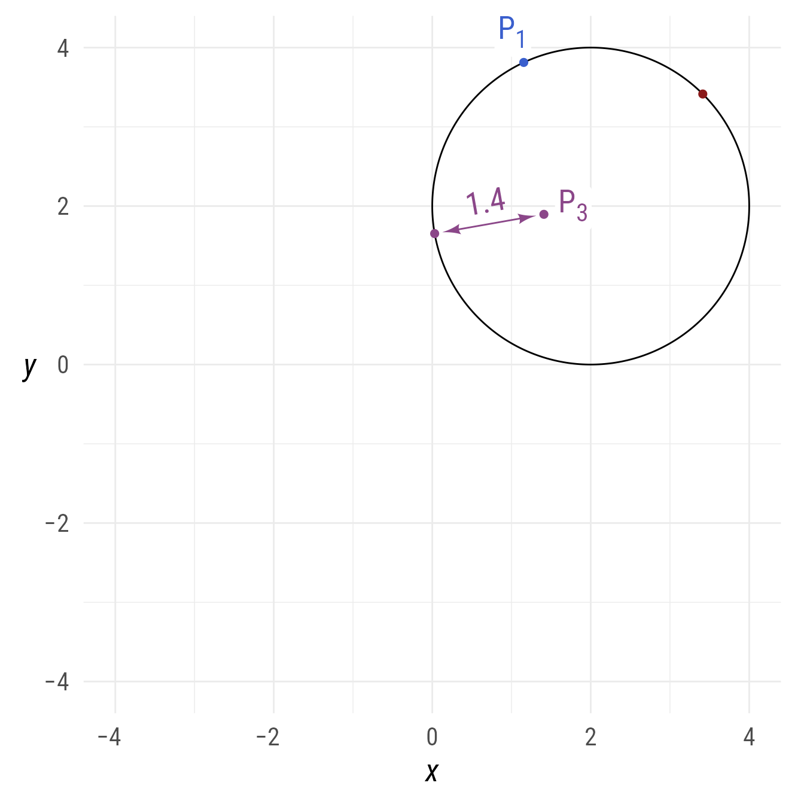
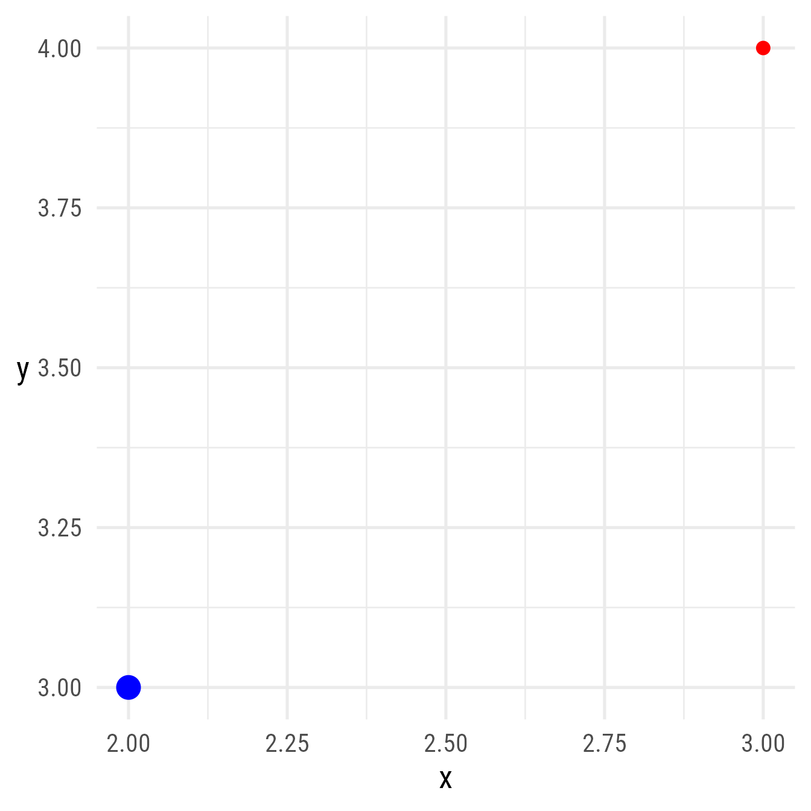
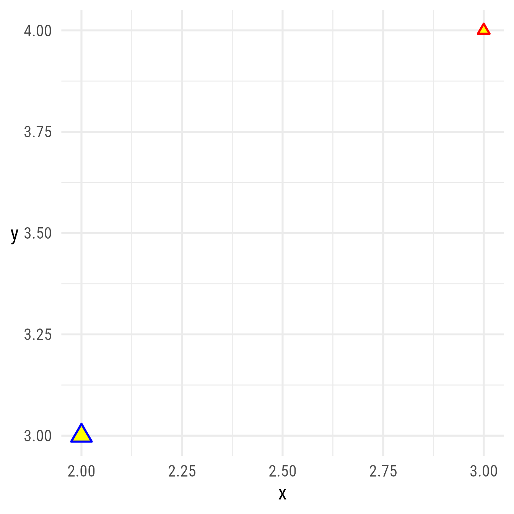
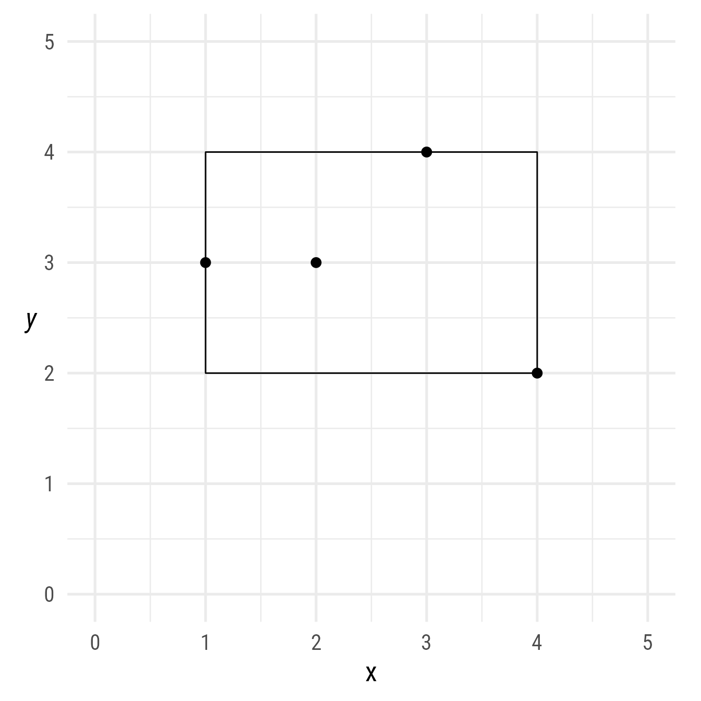

# Points

## Setup

### Packages

``` r

library(ggdiagram)
library(ggplot2)
library(dplyr)
library(ggtext)
library(ggarrow)
library(arrowheadr)
```

### Base Plot

To avoid repetitive code, we make a base plot:

``` r


my_font <- "Roboto Condensed"
my_font_size <- 20
my_point_size <- 2


# my_colors <- viridis::viridis(2, begin = .25, end = .5)
my_colors <- c("#3B528B", "#21908C")

theme_set(
  theme_minimal(
    base_size = my_font_size,
    base_family = my_font) +
    theme(axis.title.y = element_text(angle = 0, vjust = 0.5)))

bp <- ggdiagram(
  font_family = my_font,
  font_size = my_font_size,
  point_size = my_point_size,
  linewidth = .5,
  theme_function = theme_minimal,
  axis.title.x =  element_text(face = "italic"),
  axis.title.y = element_text(
    face = "italic",
    angle = 0,
    hjust = .5,
    vjust = .5)) +
  scale_x_continuous(labels = signs_centered,
                     limits = c(-4, 4)) +
  scale_y_continuous(labels = signs::signs,
                     limits = c(-4, 4))
```

## Points

Points have x and y coordinates.

``` r

p1 <- ob_point(1, 2, color = "firebrick")
p2 <- ob_point(3, 4, color = "royalblue3")

bp + 
  p1 + 
  p2
```



Figure 1: Creating points

## Polar Coordinates

A point’s x and y coordinates can be specified in polar coordinates

- `@r`: The distance from the origin to the point (i.e., the vector’s
  magnitude)
- `@theta`: The angle (in radians) from the line on the x-axis to the
  line containing the vector.

``` r

p2@x
#> [1] 3
p2@y
#> [1] 4
p2@r
#> [1] 5
p2@theta
#> [1] "0.3π"
```

Code

``` r


bp +
  coord_equal(xlim = c(-p2@r, p2@r), 
              ylim = c(-p2@r, p2@r)) +
  scale_x_continuous(breaks = -10:10, 
                     minor_breaks = NULL, 
                     labels = signs_centered) +
  scale_y_continuous(breaks = -10:10, 
                     minor_breaks = NULL, 
                     labels = signs::signs) +
  ob_circle(radius = p2@r) +
  p2@label(plot_point = TRUE, 
           size = 16,
           polar_just = ob_polar(p2@theta, r = 1.5)) +
  ob_segment(p1 = ob_point(), 
          p2 = p2, 
          label = ob_label(paste0("*r* = ", round(p2@r, 2)),
                           size = 16,
                           vjust = 0)) + 
   ob_arc(
     end = p2@theta,
     color = "royalblue3",
     label = ob_label(
       paste0("&theta; = ", 
              degree(p2@theta)),
       size = 16,
        color = "royalblue3"))
```



Figure 2: Polar Coordinates

A point can be created with polar coordinates with `ob_polar` function:

``` r

ob_polar(r = 5, theta = degree(60))
#> 
#> ── <ob_polar>
#> # A tibble: 1 × 2
#>       x     y
#>   <dbl> <dbl>
#> 1   2.5  4.33
```

If the angle is numeric instead of an angle, it is assumed to be in
radians.

``` r

ob_polar(r = 1, theta = pi)@theta
#> [1] "π"
```

## Convert to tibble

This will extract any styles that have been set.

``` r

get_tibble(ob_point(1,2, 
                 color = "red", 
                 shape = 16))
#> # A tibble: 1 × 4
#>       x     y color shape
#>   <dbl> <dbl> <chr> <dbl>
#> 1     1     2 red      16
```

As a convenience, the tibble associated with the point object can be
accessed with the `@tibble` property.

``` r

ob_point(1:5,2, 
      color = "blue", 
      shape = 1:5)@tibble
#> # A tibble: 5 × 4
#>       x     y color shape
#>   <int> <dbl> <chr> <int>
#> 1     1     2 blue      1
#> 2     2     2 blue      2
#> 3     3     2 blue      3
#> 4     4     2 blue      4
#> 5     5     2 blue      5
```

## Methods

### Arithmetic

Points can be added and subtracted:

``` r

p1 <- ob_point(2, 3)
p2 <- ob_point(2, 1)
p3 <- p1 + p2
p3
#> 
#> ── <ob_point>
#> # A tibble: 1 × 2
#>       x     y
#>   <dbl> <dbl>
#> 1     4     4
p3 - p2
#> 
#> ── <ob_point>
#> # A tibble: 1 × 2
#>       x     y
#>   <dbl> <dbl>
#> 1     2     3
```

Points can be scaled with constants

``` r

p2 * 2
#> 
#> ── <ob_point>
#> # A tibble: 1 × 2
#>       x     y
#>   <dbl> <dbl>
#> 1     4     2
p3 / 4
#> 
#> ── <ob_point>
#> # A tibble: 1 × 2
#>       x     y
#>   <dbl> <dbl>
#> 1     1     1
```

The *x* and *y* coordinates can be scaled separately with other points:

``` r

p1 / p3
#> 
#> ── <ob_point>
#> # A tibble: 1 × 2
#>       x     y
#>   <dbl> <dbl>
#> 1   0.5  0.75
p1 * p3
#> 
#> ── <ob_point>
#> # A tibble: 1 × 2
#>       x     y
#>   <dbl> <dbl>
#> 1     8    12
```

## Distance

The distance between two points:

``` r

distance(p1, p2)
#> [1] 2
```

The shortest distance from a point to a line:

``` r

l1 <- ob_line(slope = 1, 
           intercept = 2)
distance(p1, l1)
#> [1] 0.7071068
```

The shortest distance from a point to a circle’s edge:

``` r

c1 <- ob_circle(center = ob_point(-1, -1), radius = 2)
p1 <- c1@center + ob_polar(
  r = c1@radius * 1, 
  theta = degree(115), 
  color = "royalblue3")

p2 <- c1@center + ob_polar(
  r = c1@radius * 2, 
  theta = degree(45), 
  color = "firebrick4")

p3 <- c1@center + ob_polar(
  r = c1@radius * .3, 
  theta = degree(190), 
  color = "orchid4")


# p1 is on circle, so its distance is 0
distance(p1, c1)
#> [1] 0
# p2 is outside the circle
distance(p2, c1)
#> [1] 2
# p3 is inside the circle
distance(p3, c1)
#> [1] 1.4
```

Code

``` r

intersect_c1_p2 <- c1@point_at((p2 - c1@center)@theta)

seg_style <- ob_style(
  arrowhead_length = 7,
  arrow_head = arrowhead(),
  arrow_fins = arrowhead(),
  resect = unit(5, "pt")
)

seg_c1_p2 <- ob_segment(
  intersect_c1_p2,
  p2,
  style = seg_style,
  label = scales::number(distance(intersect_c1_p2, p2), .1))

intersect_c1_p3 <- c1@point_at((p3 - c1@center)@theta)

seg_c1_p3 <- ob_segment(
  intersect_c1_p3,
  p3,
  color = p3@color,
  label = scales::number(distance(intersect_c1_p3, p3), .1),
  style = seg_style)

p_labels <- subscript("P", 1:3)

bp +
  c1 +
  p1@label(label = p_labels[1],
           plot_point = TRUE,
           polar_just = ob_polar(
             theta = (p1 - c1@center)@theta,
             r = 1.3)) +
  seg_c1_p2 +
  seg_c1_p2@midpoint(c(0, 1)) +
  seg_c1_p2@midpoint(1)@label(
    label = p_labels[2],
    polar_just = ob_polar(theta = seg_c1_p3@line@angle, 1.5)) +
  seg_c1_p3 +
  seg_c1_p3@midpoint(c(0, 1)) +
  seg_c1_p3@midpoint(c(1))@label(
    label = p_labels[3],
    polar_just = ob_polar(theta = seg_c1_p3@line@angle, 1.5))
```



Figure 3: Point to Circle Distances

## Convert points to geoms

The `as.geom` function is called implicitly whenever a point object is
added to a ggplot.

``` r

pts <- ob_point(
  x = c(3, 2),
  y = c(4, 3),
  color = c("red", "blue"),
  size = c(3, 6)
)

ggplot() +
  pts
```


Figure 4

This is equivalent to

``` r

ggplot() +
  as.geom(pts)
```



Figure 5

And this is equivalent to

``` r

ggplot() +
  geom_point(
    aes(
      x,
      y,
      color = I(color),
      size = I(size)),
    data = get_tibble_defaults(pts))
```


Figure 6

That is, any style information that can be mapped will be handled via
the `I` (identity) function in the mapping statement (`aes`).

Calling the `as.geom` function directly is useful for overriding any
style information in the points.

``` r

ggplot() +
  as.geom(pts,
          stroke = 1.5,
          fill = "yellow",
          shape = "triangle filled")
```


Figure 7

This is equivalent to

``` r

ggplot() +
  geom_point(
    aes(x = x,
        y = y,
        size = I(size),
        color = I(color)),
    stroke = 1.5,
    fill = "yellow",
    shape = "triangle filled",
    data = pts@tibble
  )
```



Figure 8

## Bounding box

It is possible to find the rectangle that bounds all the points in an
`ob_point` object

``` r

bp +
  {pts <- ob_point(x = 1:4, 
                   y = c(3, 3, 4, 2))} +
  pts@bounding_box
```



Figure 9: The bounding box of a set of points
