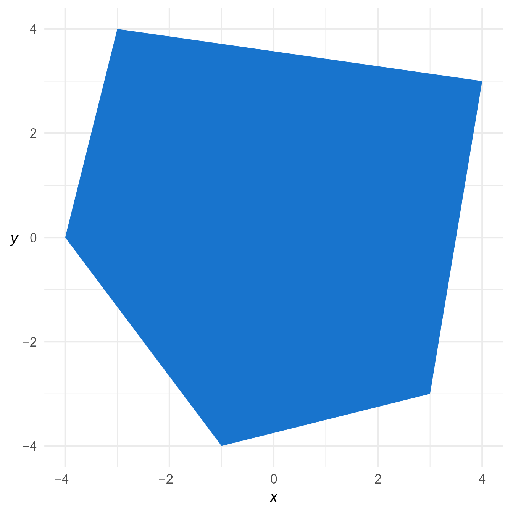
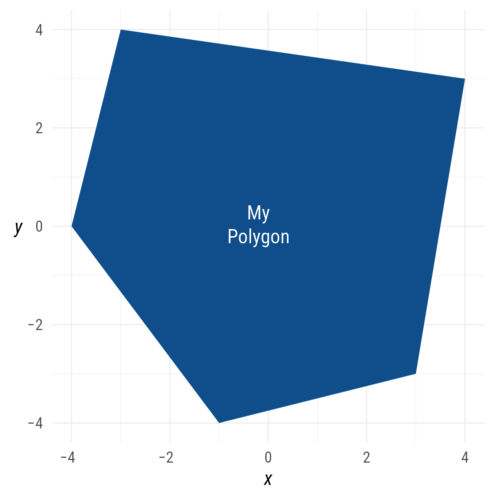
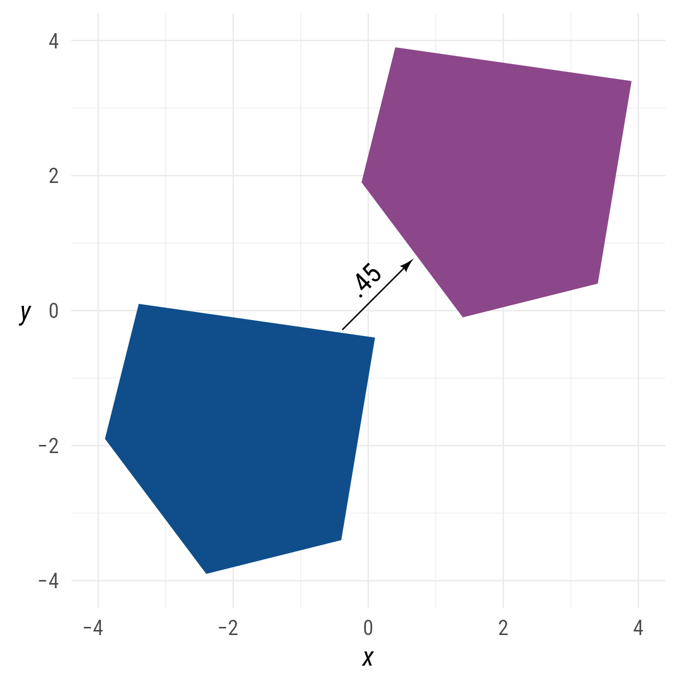
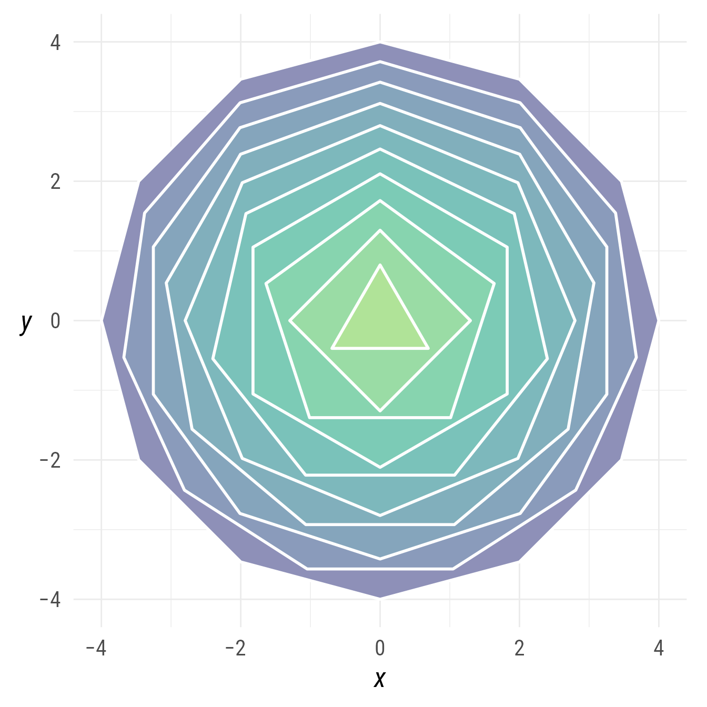
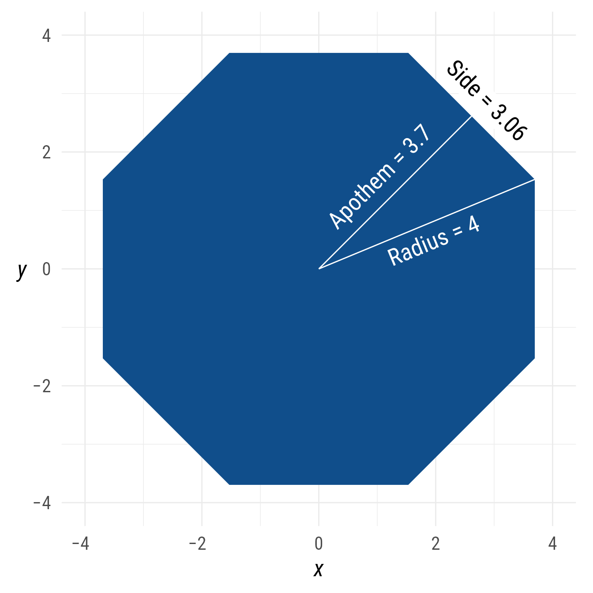
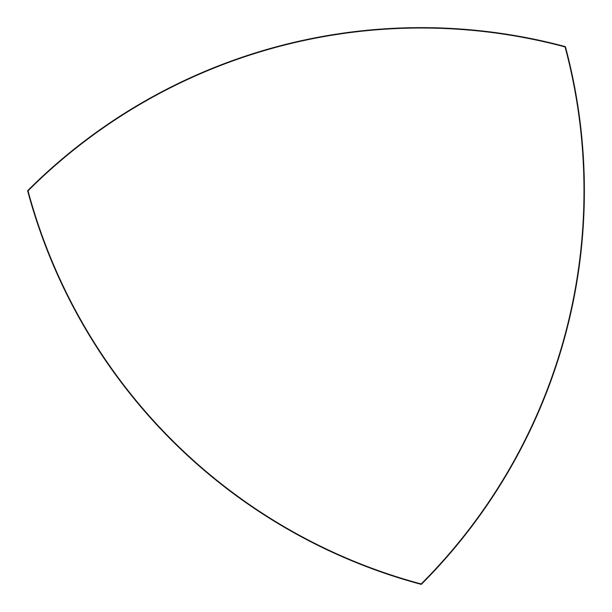
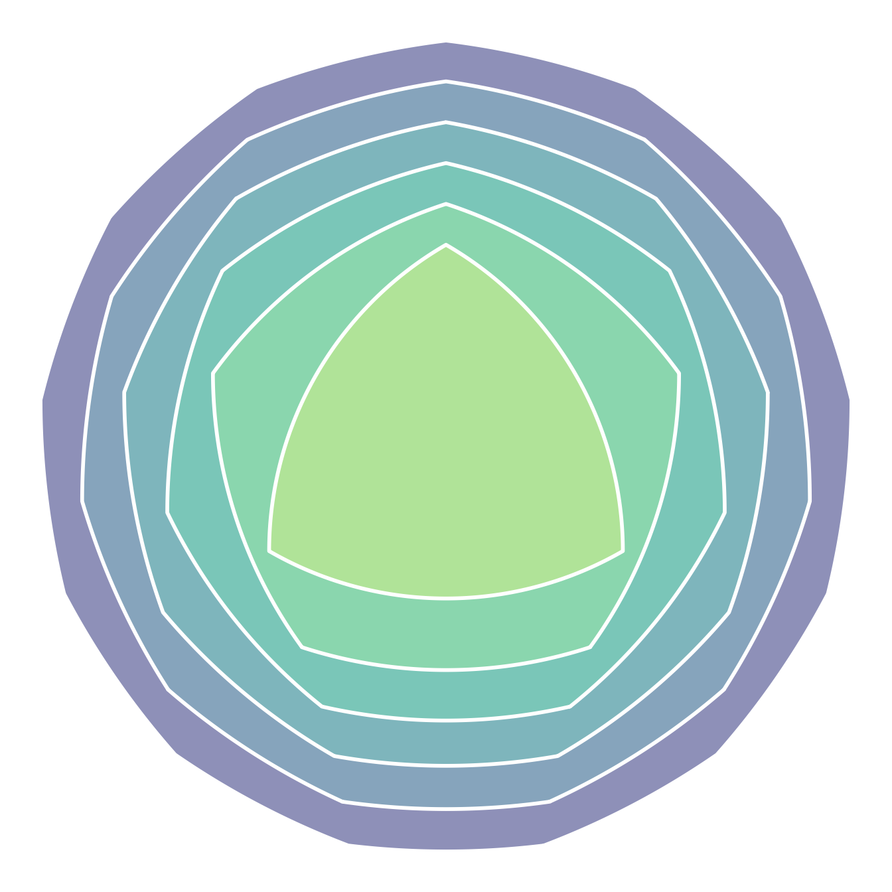
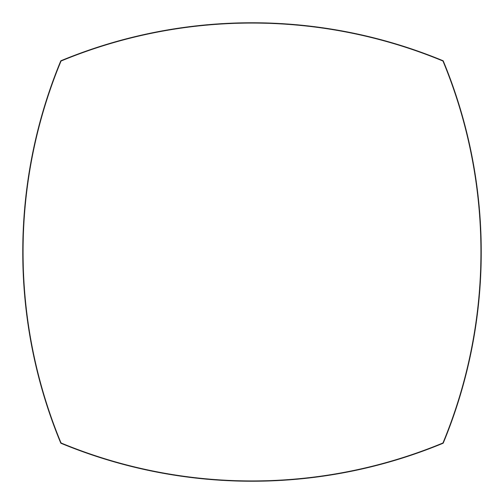
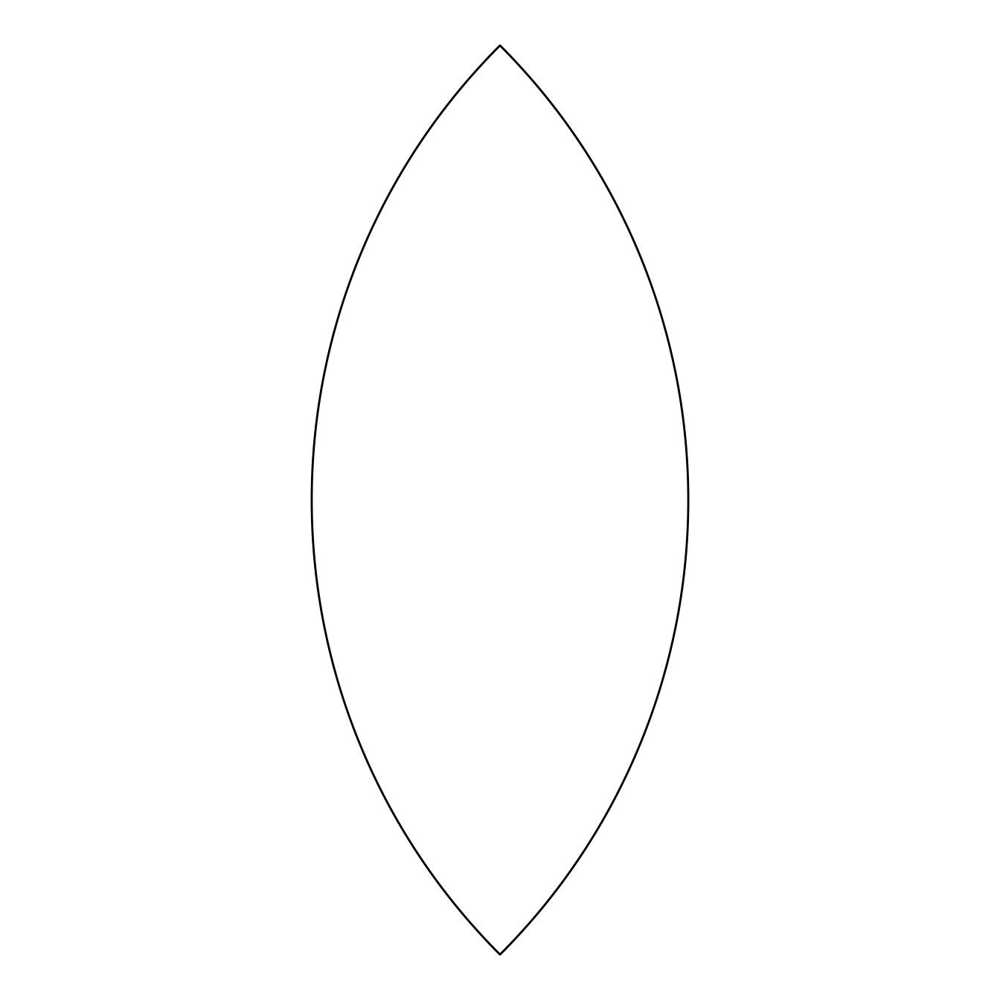

# Polygons

## Setup

### Packages

``` r

library(ggdiagram)
library(ggplot2)
library(dplyr)
library(ggtext)
library(ggarrow)
library(arrowheadr)
```

### Base Plot

To avoid repetitive code, we make a base plot:

``` r


my_font <- "Roboto Condensed"
my_font_size <- 20
my_point_size <- 2

# my_colors <- viridis::viridis(2, begin = .25, end = .5)
my_colors <- c("#3B528B", "#21908C")

theme_set(
  theme_minimal(
    base_size = my_font_size,
    base_family = my_font) +
    theme(axis.title.y = element_text(angle = 0, vjust = 0.5)))

bp <- ggdiagram(
  font_family = my_font,
  font_size = my_font_size,
  point_size = my_point_size,
  linewidth = .5,
  theme_function = theme_minimal,
  axis.title.x =  element_text(face = "italic"),
  axis.title.y = element_text(
    face = "italic",
    angle = 0,
    hjust = .5,
    vjust = .5)) +
  scale_x_continuous(labels = signs_centered,
                     limits = c(-4, 4)) +
  scale_y_continuous(labels = signs::signs,
                     limits = c(-4, 4))
```

## Polygons

The `ob_polygon` function creates an object that connects points to make
a polygon.

``` r

p <- ob_point(
  x = c(-4, -3, 4, 3, -1),
  y = c(0, 4, 3, -3, -4))

bp +
  ob_polygon(p, fill = "dodgerblue3")
```



Figure 1: Plotting a path.

## Polygon Labels

The label of a `ob_polygon` object is placed, by default, at the
centroid of the polygon. The centroid is the point whose x coordinate is
the average of all the x coordinates of the polygon’s points and whose y
coordinate is likewise the average of all the point’s y coordinates.

``` r

bp +
  ob_polygon(
    p = p,
    label = ob_label(
      "My<br>Polygon",
      size = 20,
      color = "white"
    ),
    fill = "dodgerblue4"
  )
```



Figure 2: A path with a curved label

## Connecting polygons

Connections between polygons are arrows that emanate from and point
towards the polygons’ centroids.

``` r

bp +
  {p1 <- ob_polygon(.5 * p - ob_point(1.9, 1.9),
                    fill = "dodgerblue4")} +
  {p2 <- ob_polygon(.5 * p + ob_point(1.9, 1.9),
                    fill = "orchid4")} +
  connect(p1, p2,
          resect = 1,
          label = ".45")
```



Figure 3: Arrow between two polygons

## Rounding polygons

The `@radius` property controls the radius of the rounded vertices. It
must be of length 1. It can be given in as a
[`ggplot2::unit`](https://rdrr.io/r/grid/unit.html) or as a numeric
value. If numeric, it is understood as a proportion of the plot area
width.

``` r

bp +
  ob_polygon(
    p,
    radius = unit(5, "mm"),
    fill = "dodgerblue4")
```


Figure 4: A polygon with rounded vertices

## Regular Polygons (ngons)

An `ob_ngon` (regular polygon) can be be created by specifying the
center point, the number of sides, and the radius (the distance from the
center to a vertex).

In [Figure 5](#fig-regon), many regular polygons are displayed
concentrically.

``` r

n <- 10
bp +
  ob_ngon(
    n = n:1 + 2,
    radius = 4 * seq(1, .1, length.out = n) ^ .7,
    fill = viridis::viridis(n = n, begin = .2, end = .8) %>%
      tinter::lighten(.6),
    color = "white",
    linewidth = 1,
    angle = 90
  )
```



Figure 5: Regular polygons

Alternately, instead of the `radius`, the `ob_ngon` object can be
specified with either the `side_length` or the `apothem` (the distance
from the center to a side’s midpoint).

``` r

bp +
  {ng <- ob_ngon(n = 8,
                 radius = 4,
                 angle = degree(22.5),
                 fill = "dodgerblue4")} +
  ob_segment(
    ng@center,
    ng@vertices[1],
    color = "white",
    label = ob_label(
      paste0("Radius = ", ng@radius),
      vjust = 1.2,
      fill = NA,
      family = my_font
    )
  ) +
  ob_segment(
    ng@center,
    ng@segment[1]@midpoint(),
    color = "white",
    label = ob_label(
      paste0("Apothem = ", round(ng@apothem, 2)),
      vjust = -.2,
      fill = NA,
      family = my_font
    )
  ) +
  ob_label(paste0("Side = ",
                  round(ng@side_length, 2)),
           ng@segment[1]@midpoint(),
           angle = ng@segment[1]@line@angle,
           vjust = -0.2,
           family = my_font)
```



Figure 6: The `ob_ngon` object can be specificied with the `radius`,
`side_length`, or `apothem`.

## Reuleaux Polygons

Start with a regular polygon with an odd number of sides. For each pair
of adjacent vertices, draw an arc with its center on the vertex of the
opposite side. Amazingly, if you roll a Reuleaux polygon, its height is
constant. This means that a Reuleaux polygon can roll smoothly. In
[Figure 7](#fig-reuleaux3), a Reuleaux triangle is made with the
`ob_reuleaux` function.

``` r

th <- 275
ggdiagram() +
  {x <- ob_reuleaux(
    n = 3,
    fill = NA,
    angle = 45
  )}
```



Figure 7: A Reuleaux triangle

In [Figure 8](#fig-reuleaux) we draw 6 Reuleaux polygons with sides
ranging from 3 to 13.

``` r

ggdiagram() +
  ob_reuleaux(
    n = seq(13, 3, -2),
    radius = seq(2, 1, -.2),
    fill = viridis::viridis(
      n = 6,
      begin = .2,
      end = .8) %>%
      tinter::lighten(.6),
    color = "white",
    linewidth = 1
  )
```



Figure 8: Six Reuleaux polygons arranged concentrically

A true Reuleaux polygon with an even number of sides is not possible,
but it is possible to draw even-sided figures that resemble Reuleaux
polygons ([Figure 9](#fig-reuleaux4)). These figures do not have same
height as they roll.

``` r

ggdiagram() +
  ob_reuleaux(
    n = 4,
    fill = NA,
    angle = 45
  )
```



Figure 9: A Reuleaux-like square

Specifying `n = 2` will create a symmetric lens, which is also not a
Reuleaux polygon.

``` r

ggdiagram() +
  ob_reuleaux(
    n = 2,
    fill = NA
  )
```



Figure 10: A symmetric lens
