# Rectangles

## Setup

### Packages

``` r

library(ggdiagram)
library(ggplot2)
library(dplyr)
#> 
#> Attaching package: 'dplyr'
#> The following objects are masked from 'package:stats':
#> 
#>     filter, lag
#> The following objects are masked from 'package:base':
#> 
#>     intersect, setdiff, setequal, union
library(ggtext)
library(ggarrow)
library(arrowheadr)
```

### Base Plot

To avoid repetitive code, we make a base plot:

``` r


my_font <- "Roboto Condensed"
my_font_size <- 20
my_point_size <- 2


# my_colors <- viridis::viridis(2, begin = .25, end = .5)
my_colors <- c("#3B528B", "#21908C")

theme_set(
  theme_minimal(
    base_size = my_font_size,
    base_family = my_font) +
    theme(axis.title.y = element_text(angle = 0, vjust = 0.5)))

bp <- ggdiagram(
  font_family = my_font,
  font_size = my_font_size,
  point_size = my_point_size,
  linewidth = .5,
  theme_function = theme_minimal,
  axis.title.x =  element_text(face = "italic"),
  axis.title.y = element_text(
    face = "italic",
    angle = 0,
    hjust = .5,
    vjust = .5)) +
  scale_x_continuous(labels = signs_centered,
                     limits = c(-4, 4)) +
  scale_y_continuous(labels = signs::signs,
                     limits = c(-4, 4))

my_colors <- list(
  primary = class_color("royalblue4"),
  secondary = class_color("firebrick4"),
  tertiary = class_color("orchid4"))
```

## Specifying a Rectangle

A rectangle has 4 corners (`northeast`, `northwest`, `southwest`, and
`southeast`). It has a center. It has width and height. For the purpose
of demonstration, we can specify all these features, though in practice
not all of them are necessary.

``` r

# northeast corner
ne <- ob_point(4, 2)
# northwest corner
nw <- ob_point(0, 2)
# southwest corner
sw <- ob_point(0, 0)
# southeast corner
se <- ob_point(4, 0)
# center point
cent <- ob_point(2, 1)
# width
w <- 4
# height
h <- 2
```

If you give the `rectangle` function enough information to deduce where
its four corners will be, all other features will be calculated. All of
the following will give the same rectangle:

### Give width, height, and any point

An easy way to specify a rectangle is to specify its width and height
and any of its points. All the following rectangles are equivalent.

#### Center, width, and height

``` r

r1 <- ob_rectangle(
  width = w,
  height = h,
  center = cent,
  color = my_colors$primary,
  fill = my_colors$primary@transparentize(.15),
  linewidth = 1
)
r1
#> 
#> ── <ob_rectangle>
#> # A tibble: 1 × 8
#>       x     y width height angle color     fill      linewidth
#>   <dbl> <dbl> <dbl>  <dbl> <dbl> <chr>     <chr>         <dbl>
#> 1     2     1     4      2     0 #27408BFF #27408B26         1
```

Code

``` r

double_arrowstyle <- ob_style(
  arrow_head = arrowhead(),
  arrow_fins = arrowhead(),
  color = my_colors$secondar
)

s_east <- r1@side@east@nudge(x = .1)
s_east@style <- double_arrowstyle

s_north <- r1@side@north@nudge(y = .1)
s_north@style <- double_arrowstyle

rc_plot <- ggplot() +
  coord_equal(ylim = c(0, 2.2)) +
  scale_y_continuous(breaks = -10:10) +
  r1

rc_center <- list(
  r1@center,
  r1@center@label(
    fill = my_colors$primary@lighten(.15),
    vjust = -.15)) |>
  bind()

rc_width <- s_north |>
  set_props(label = ob_label(
    label = paste0("Width = ", r1@width),
    center = midpoint(s_north),
    color = my_colors$secondary,
    vjust = 0,
    label.margin = ggplot2::margin(2, 2, 2, 2, "pt")
  ))

rc_height <- s_east |>
  set_props(label = ob_label(
    label = paste0("Height = ", r1@height),
    center  = midpoint(s_east),
    vjust = 0,
    color = my_colors$secondary,
    angle = -90))


rc_nw <- r1@northwest@label(
  plot_point = TRUE,
  vjust = 1.1,
  hjust = 0,
  fill = my_colors$primary@lighten(.15)
)

rc_ne <- r1@northeast@label(
  plot_point = TRUE,
  vjust = 1.1,
  hjust = 1,
  fill = my_colors$primary@lighten(.15)
)

rc_sw <- r1@southwest@label(
  plot_point = TRUE,
  vjust = -.1,
  hjust = 0,
  fill = my_colors$primary@lighten(.15)
)

rc_se <- r1@southeast@label(
  plot_point = TRUE,
  vjust = -.1,
  hjust = 1,
  fill = my_colors$primary@lighten(.15)
)

rc_plot + rc_center + rc_width + rc_height
```

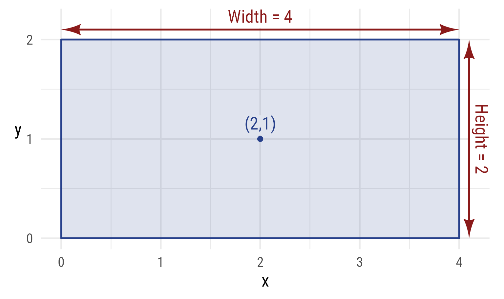

Figure 1: Center, Width, and Height

#### Northeast corner, width, and height

``` r

r1 == ob_rectangle(
  width = w,
  height = h,
  northeast = ne)
#> [1] TRUE
```

Code

``` r

rc_plot + rc_width + rc_height + rc_ne
```

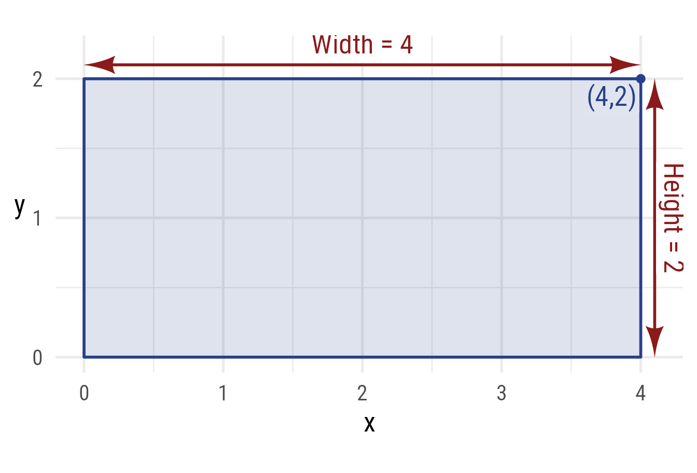

Figure 2: Specify a rectangle with height, width, and the northeast
corner

### Give the center and any of the 4 corners

A rectangle can be specified with the center and any other corner. The
following rectangles are equivalent.

For example:

``` r

r1 == ob_rectangle(
  center = cent,
  northeast = ne)
#> [1] TRUE
```

Code

``` r

rc_plot + rc_center + rc_ne
```

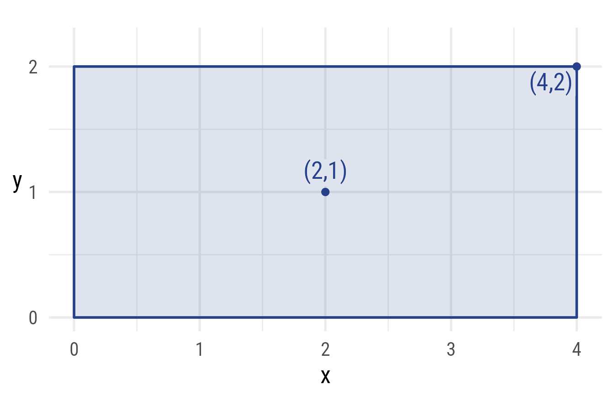

Figure 3: Specify a rectangle with the center and the northeast corner

### Give opposite corners

A rectangle can be specified with points from opposite corners. These
rectangles are equivalent.

For example,

``` r

r1 == ob_rectangle(
  northeast = ne,
  southwest = sw)
#> [1] TRUE
```

Code

``` r

rc_plot + rc_sw + rc_ne
```

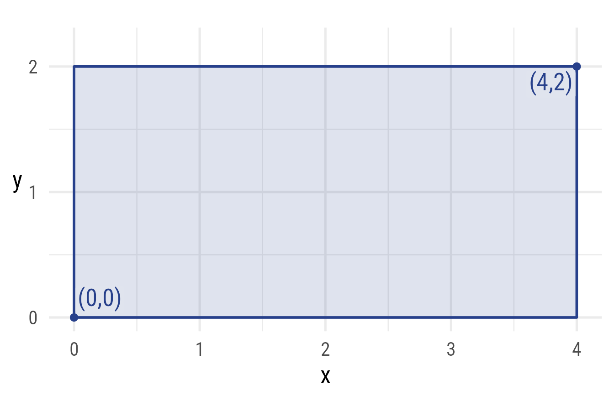

Figure 4: Specify a rectangle with the northeast and southwest corners

### Give width and two points on either side

A rectangle can be specified with the width and 2 points from the left
or right side. These rectangles are equivalent.

``` r

r1 == ob_rectangle(
  width = w,
  northwest = nw,
  southwest = sw)
#> [1] TRUE
```

Code

``` r

rc_plot + rc_width + rc_nw + rc_sw
```

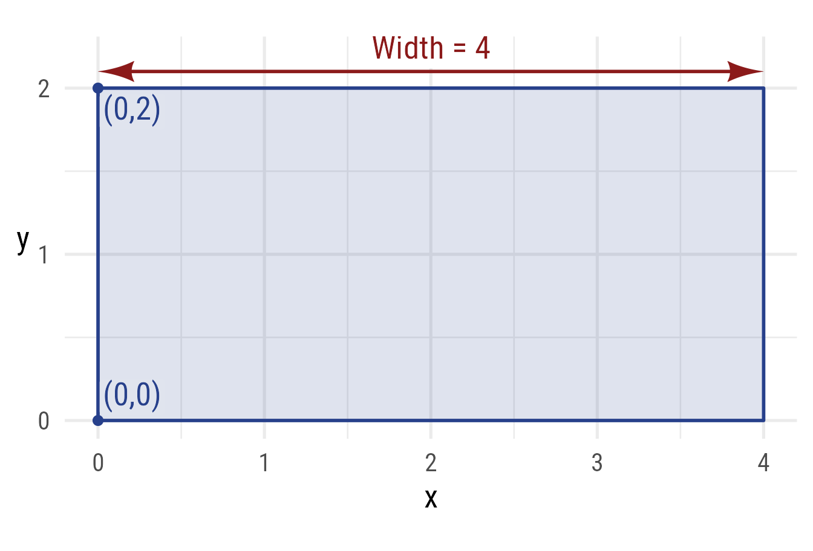

Figure 5: Specify a rectangle with the width and the left corners

### Give height and two points on top or bottom

A rectangle can be specified with the height and 2 points from the top
or bottom side. These rectangles are equivalent.

For example,

``` r

r1 == ob_rectangle(
  height = h,
  northwest = nw,
  northeast = ne)
#> [1] TRUE
```

Code

``` r

rc_plot + rc_height + rc_ne + rc_nw
```

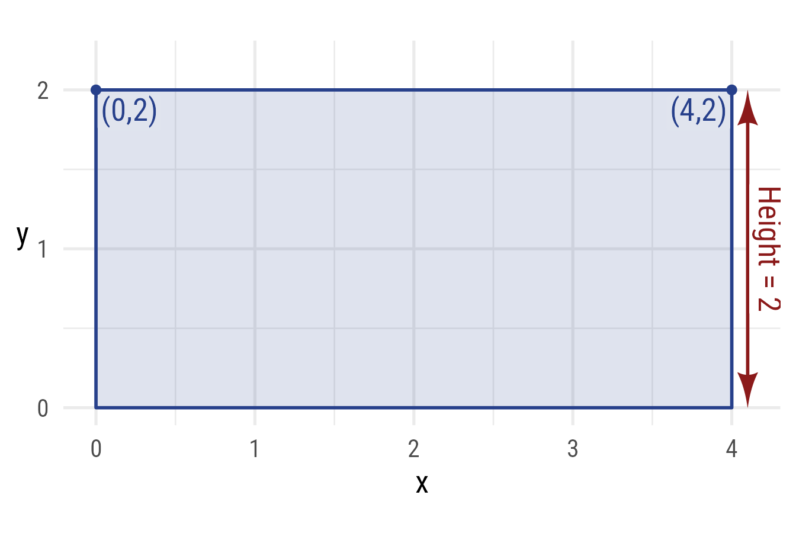

Figure 6: Specify a rectangle with the height and the top corners

## Rectangle points

The corners and side midpoints can be extracted. Here is the north point
(i.e., the midpoint of the north side):

``` r

r1@north
#> 
#> ── <ob_point>
#> # A tibble: 1 × 4
#>       x     y color     fill     
#>   <dbl> <dbl> <chr>     <chr>    
#> 1     2     2 #27408BFF #27408B26
```

Code

``` r

rc_plot +
  purrr::map(
    c(
      "east",
      "north",
      "west",
      "south",
      "northeast",
      "northwest",
      "southeast",
      "southwest",
      "center"
    ),
    \(x) {
      v <- ifelse(
        grepl(x = x, "north"),
        1.1,
        ifelse(
          grepl(x = x, "south|center"),
          -.1,
          .5))
      
      h <- ifelse(
        grepl(x = x, "east"),
        1.1,
        ifelse(grepl(x = x, "west"), -.1, .5))
      c(
        as.geom(
          prop(r1, x)@label(
            label = x,
            hjust = h,
            vjust = v,
            fill = my_colors$primary@lighten(.15)
          )
        ),
        as.geom(
          prop(r1, x)@label(hjust = 1 - h, vjust = 1 - v),
          fill = ifelse(x == "center",
                        my_colors$primary@lighten(.15),
                        "white")
        ),
        as.geom(prop(r1, x))
      )
    }
  ) +
  coord_equal(
    xlim = c(-.25, 4.25),
    ylim = c(-.25, 2.25))
```

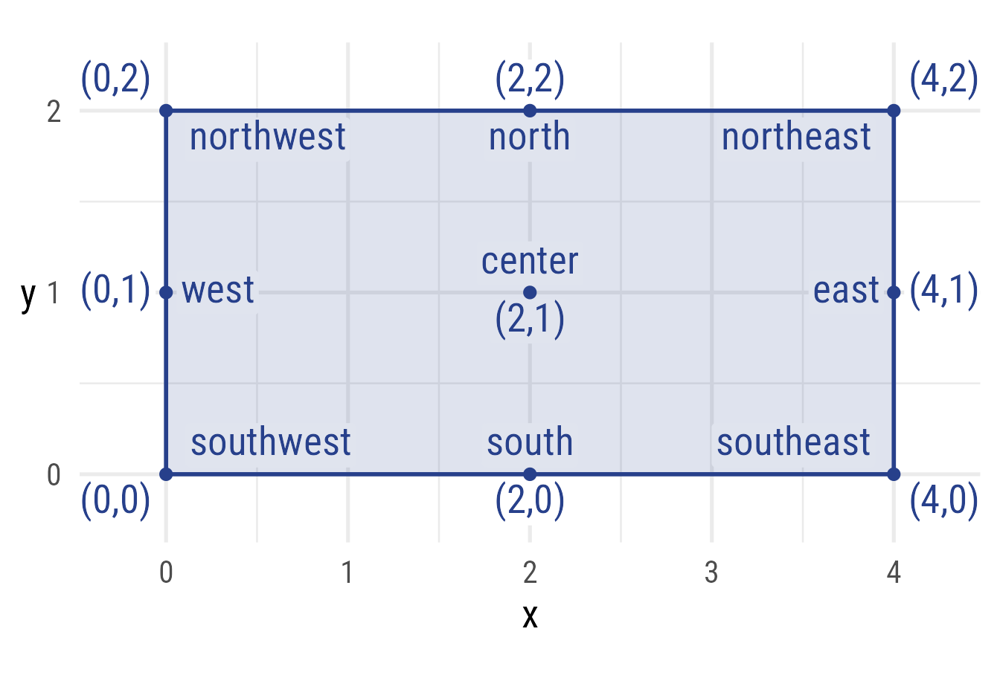

Figure 7: The named points of a rectangle

Points at any angle

``` r

theta <- degree(60)
r1@point_at(theta)
#> 
#> ── <ob_point>
#> # A tibble: 1 × 4
#>       x     y color     fill     
#>   <dbl> <dbl> <chr>     <chr>    
#> 1  2.58     2 #27408BFF #27408B26
```

Code

``` r

r1_theta <- r1@point_at(theta)

rc_plot +
  ob_segment(r1@center, r1_theta) +
  r1_theta@label(
    polar_just = ob_polar(theta, 1.5),
    plot_point = TRUE) +
  ob_arc(center = r1@center,
      radius = .5,
      end = theta,
      label = ob_label(
        theta,
        fill = my_colors$primary@lighten(.15),
        color = my_colors$primary@color))
```

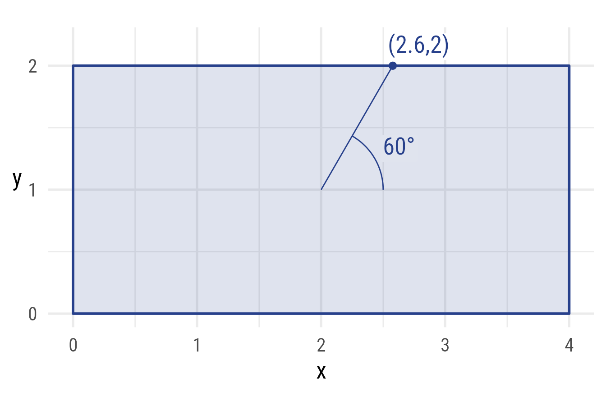

Figure 8: The point on a rectangle at angle θ = 60°

## Rectangle sides

Each side of the rectangle can be extracted. For example, here is the
north side segment:

``` r

r1@side@north
#> 
#> ── <ob_segment>
#> # A tibble: 1 × 8
#>       x     y  xend  yend arrow_head    arrowhead_length color     linewidth
#>   <dbl> <dbl> <dbl> <dbl> <list>                   <dbl> <chr>         <dbl>
#> 1     0     2     4     2 <dbl [2 × 2]>                7 #27408BFF         1
```

Code

``` r

rc_plot +
  r1@side@north |>
    set_props(color = my_colors$secondary@color, linewidth = 2) +
  r1@north@label(label = "North Side",
                 vjust = -.1,
                 size = 20,
                 color = my_colors$secondary)
```

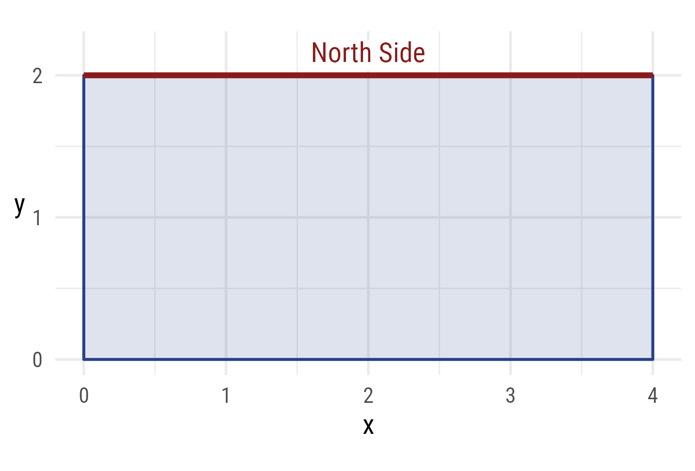

Figure 9: The north side of a rectangle

## Rounded corners

The `@radius` property controls the radius of the rounded corners. It
must be of length 1. It can be given in as a
[`ggplot2::unit`](https://rdrr.io/r/grid/unit.html) or as a numeric
value. If numeric, it is understood as a proportion of the plot area
width. Rounding does not affect the location of corners.

``` r

ggplot() +
  coord_equal(xlim = c(-4, 4),
              ylim = c(-4, 4)) +
  ob_rectangle(
    ob_point(0, 0),
    width = 6,
    height = 4,
    radius = unit(5, "mm")
  )
```

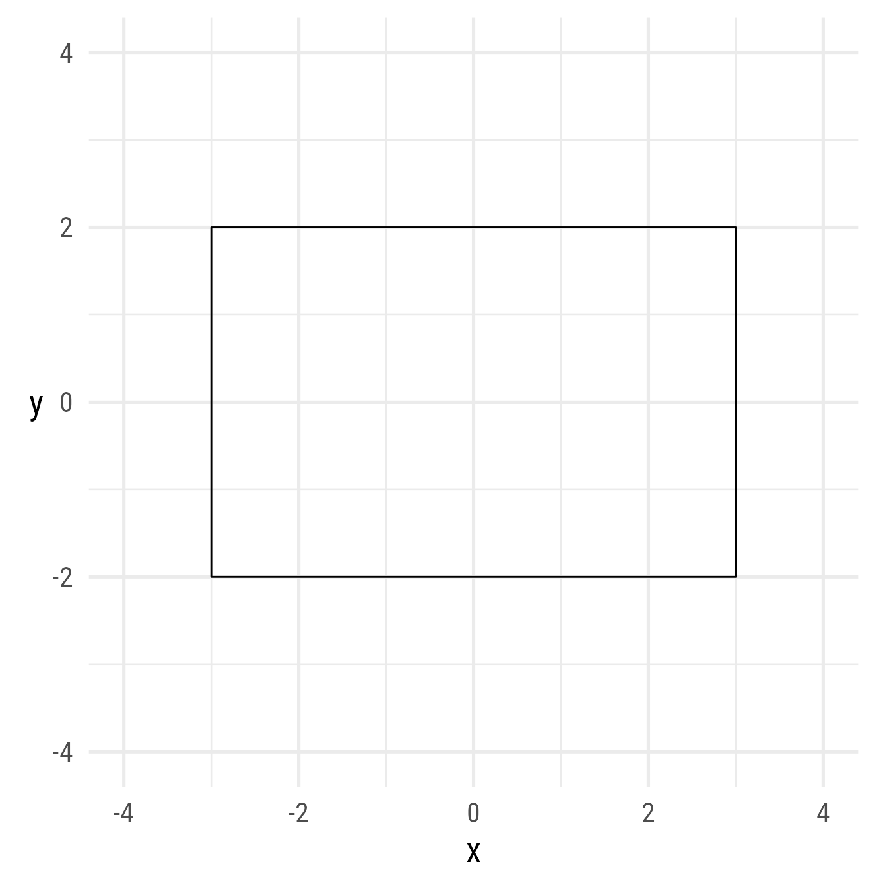

Figure 10: Specify a rectangle rounded corners

## Rotation angle

It is possible to rotate a rectangle.

``` r

ggplot() +
  coord_equal(xlim = c(-4, 4),
              ylim = c(-4, 4)) +
  ob_rectangle(
    center = ob_point(0, 0),
    width = 6,
    height = 2,
    angle = 30,
    radius = unit(3, "mm")
  )
```

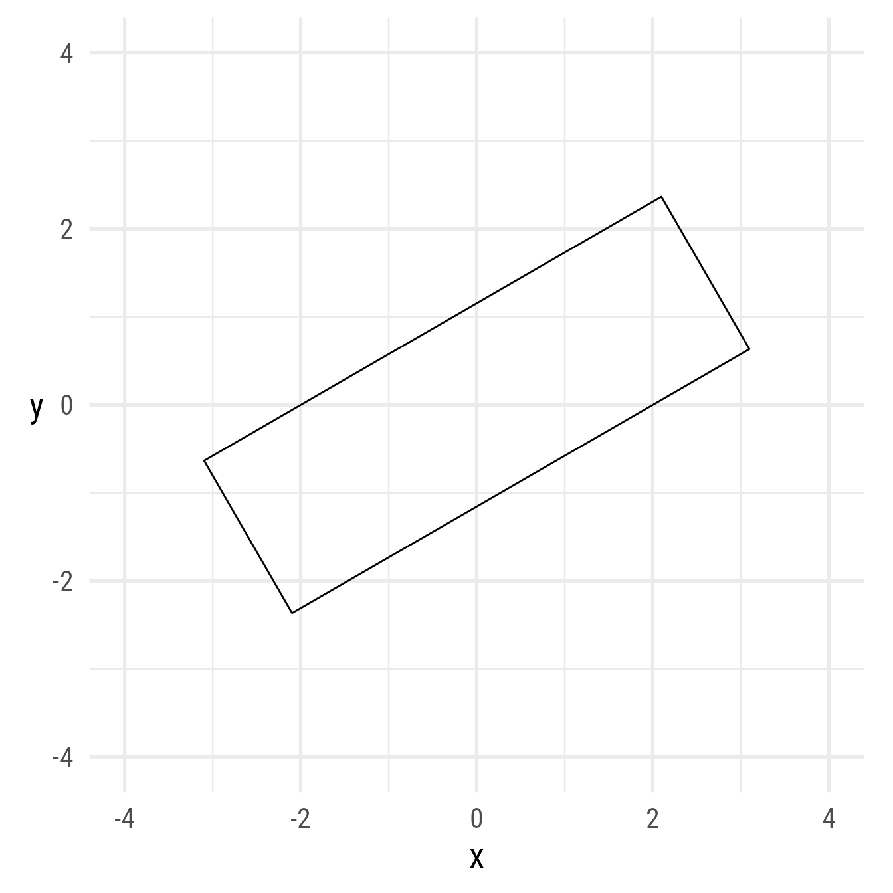

Figure 11: A rectangle rotated by 30°

Many angles can be specified at once:

``` r

# Angles
th <- degree(seq(0, 355, 5))
# Radius of middle space
r_middle <- sqrt(2)
# Rectangle width
w <- 4 - r_middle

ggplot() +
  coord_equal(
    xlim = c(-4, 4),
    ylim = c(-4, 4)) +
  ob_rectangle(
    center = ob_polar(theta = th, r = w / 2 + r_middle),
    width = w,
    height = .15,
    angle = th,
    color = NA,
    fill = hcl(th@degree)
  )
```

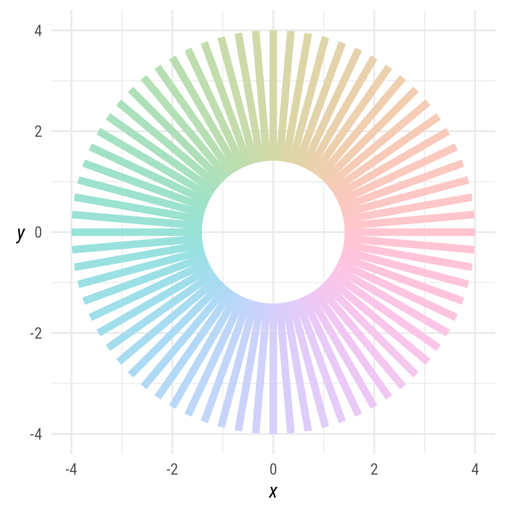

Figure 12: Many rotated rectangles
