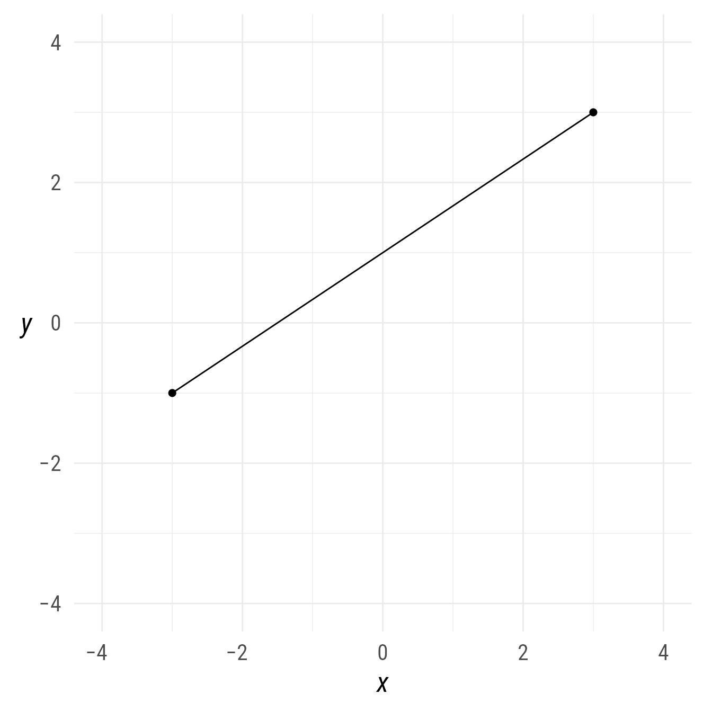
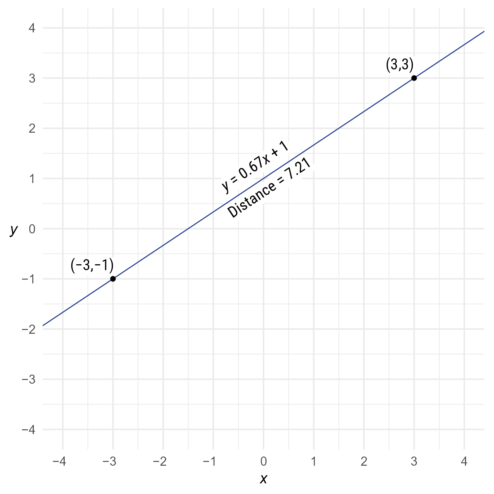
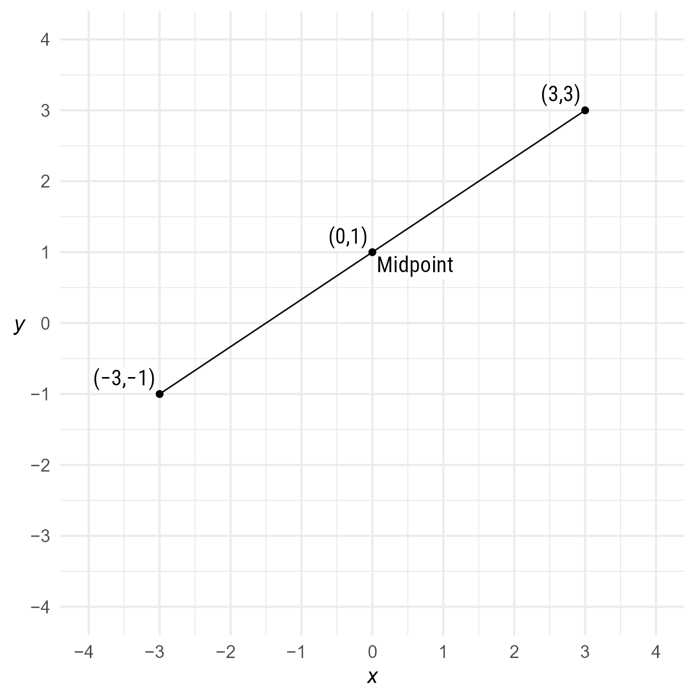
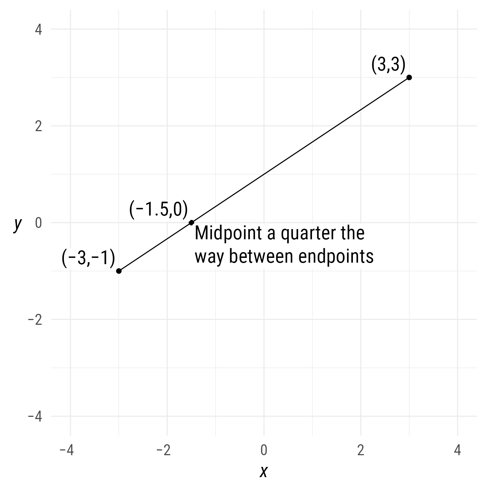
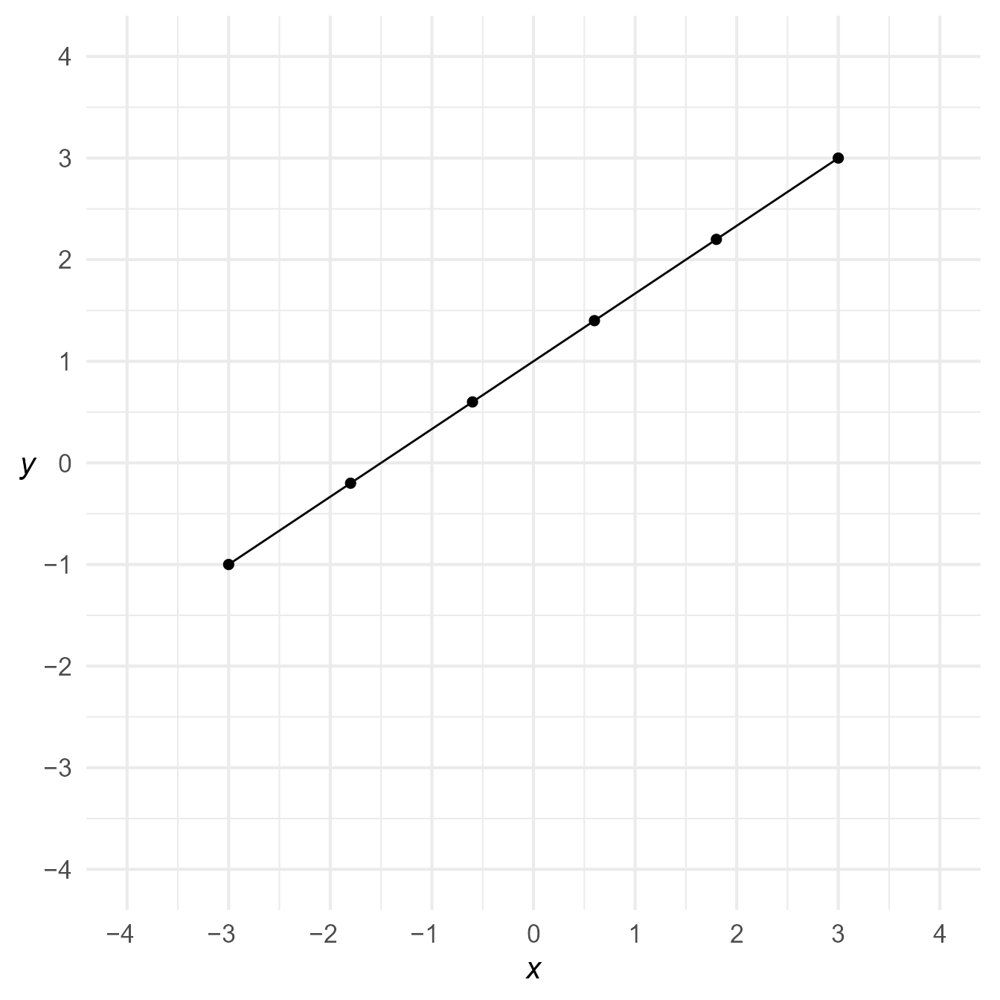
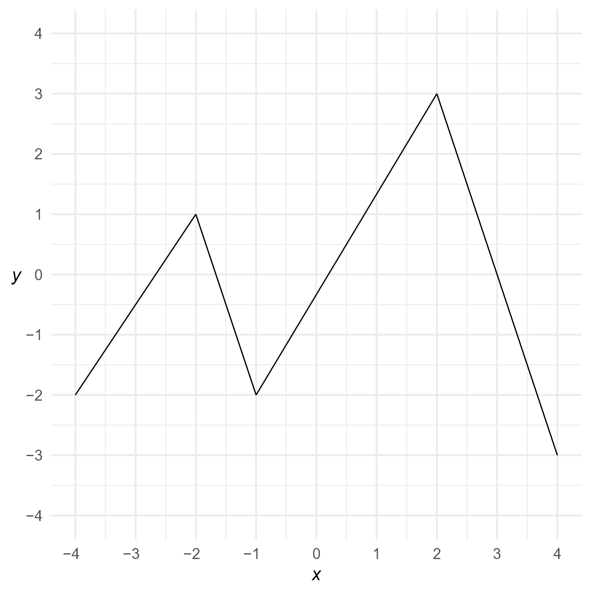

# Segments

## Setup

### Packages

``` r

library(ggdiagram)
library(ggplot2)
library(dplyr)
#> 
#> Attaching package: 'dplyr'
#> The following objects are masked from 'package:stats':
#> 
#>     filter, lag
#> The following objects are masked from 'package:base':
#> 
#>     intersect, setdiff, setequal, union
library(ggtext)
library(ggarrow)
library(arrowheadr)
```

### Base Plot

To avoid repetitive code, we make a base plot:

``` r

my_font <- "Roboto Condensed"
my_font_size <- 20
my_point_size <- 2

# my_colors <- viridis::viridis(2, begin = .25, end = .5)
my_colors <- c("#3B528B", "#21908C")

theme_set(
  theme_minimal(base_size = my_font_size, base_family = my_font) +
    theme(axis.title.y = element_text(angle = 0, vjust = 0.5))
)

bp <- ggdiagram(
  font_family = my_font,
  font_size = my_font_size,
  point_size = my_point_size,
  linewidth = .5,
  theme_function = theme_minimal,
  axis.title.x =  element_text(face = "italic"),
  axis.title.y = element_text(
    face = "italic",
    angle = 0,
    hjust = .5,
    vjust = .5
  )
) +
  scale_x_continuous(labels = signs_centered, limits = c(-4, 4)) +
  scale_y_continuous(labels = signs::signs, limits = c(-4, 4))
```

## Specifying a segment

A segment is a portion of a line between two points.

``` r

p1 <- ob_point(-3, -1)
p2 <- ob_point(3, 3)
s1 <- ob_segment(p1, p2)
```

``` r

bp + s1 + p1 + p2
```



Figure 1: Plotting a segment and its endpoints

## Features of a segment

### Distance between points

``` r

s1@distance
#> [1] 7.211103
```

Alternately:

``` r

distance(s1)
#> [1] 7.211103
```

### Line passing through the segment

The line that passes through the segment contains information about the
segment, such as its slope, intercept, or angle.

To access the line that passes between both points:

``` r

s1@line
#> 
#> ── <ob_line>
#> # A tibble: 1 × 6
#>   slope intercept xintercept     a     b     c
#>   <dbl>     <dbl>      <dbl> <dbl> <dbl> <dbl>
#> 1 0.667         1       -1.5    -4     6    -6
s1@line@slope
#> [1] 0.6666667
s1@line@intercept
#> [1] 1
s1@line@angle
#> [1] "34°"
```

Code

``` r

bp +
  s1@line |> set_props(color = "royalblue4") +
  s1@midpoint(position = c(0, 1))@label(
    polar_just = ob_polar(s1@line@angle + degree(90), 1.5),
    plot_point = TRUE) +
  ob_label(c(equation(s1@line),
             paste0("Distance = ",
                    round(s1@distance, 2))),
           center = midpoint(s1),
           vjust = c(-.2, 1.1),
           angle = s1@line@angle)
```



Figure 2: Line passing through segment

### Midpoints

By default, the `midpoint` function’s `position` argument is .5, which
finds the point halfway between the point of a segment:

``` r

s1@midpoint()
#> 
#> ── <ob_point>
#> # A tibble: 1 × 2
#>       x     y
#>   <dbl> <dbl>
#> 1     0     1
```

Code

``` r

bp +
  s1 +
  s1@midpoint()@label("Midpoint", hjust = 0, vjust = 1) +
  s1@midpoint(c(0, .5, 1))@label(
    plot_point = TRUE,
    hjust = 1,
    vjust = 0)
```



Figure 3: Midpoint of a segment

To find the midpoint 25% of the distance between the endpoints of
segment:

``` r

s1@midpoint(position = .25)
#> 
#> ── <ob_point>
#> # A tibble: 1 × 2
#>       x     y
#>   <dbl> <dbl>
#> 1  -1.5     0
```

Code

``` r

bp +
  s1 +
  {p25 <- s1@midpoint(.25)} +
  p25@label(
    label = c(
      p25@auto_label,
      "Midpoint a quarter the<br>way between endpoints"
    ),
    vjust = c(0, 1),
    hjust = c(1, 0)
  ) +
  s1@midpoint(c(0, 1))@label(plot_point = TRUE,
                             hjust = 1,
                             vjust = 0)
```



Figure 4: Midpoint

Multiple midpoints can be specified:

``` r

bp +
  s1 +
    s1@midpoint(seq(0, 1, .2))
```



Figure 5: Selecting multiple midpoints

A quick way to get the endpoints of a segment is to specify “midpoints”
at positions 0 and 1:

``` r

bp +
  s1 +
  s1@midpoint(c(0, 1))
```


Figure 6: Selecting a segment’s endpoints via the `midpoint` property.

## Segment chains

If a point object with multiple points is placed in the `p1` slot but
the `p2` slot is left empty, a series of segments chained together will
be created.

``` r

bp +
  ob_segment(
    ob_point(x = c(-4, -2, -1, 2, 4),
             y = c(-2, 1, -2, 3, -3)))
```



Figure 7: Chained segments
