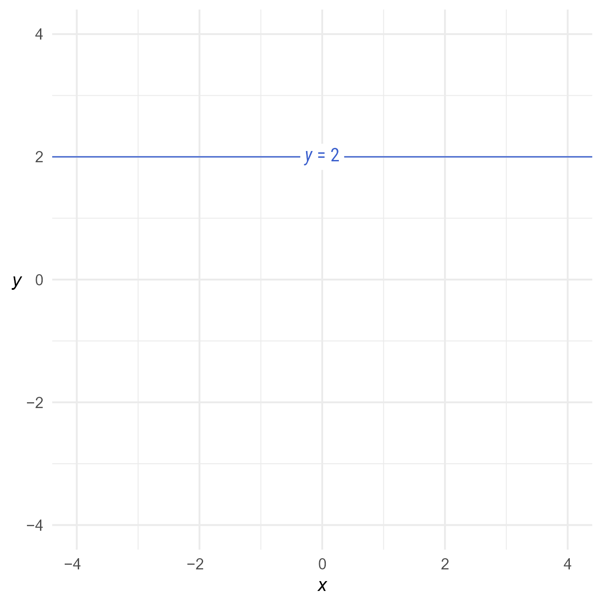
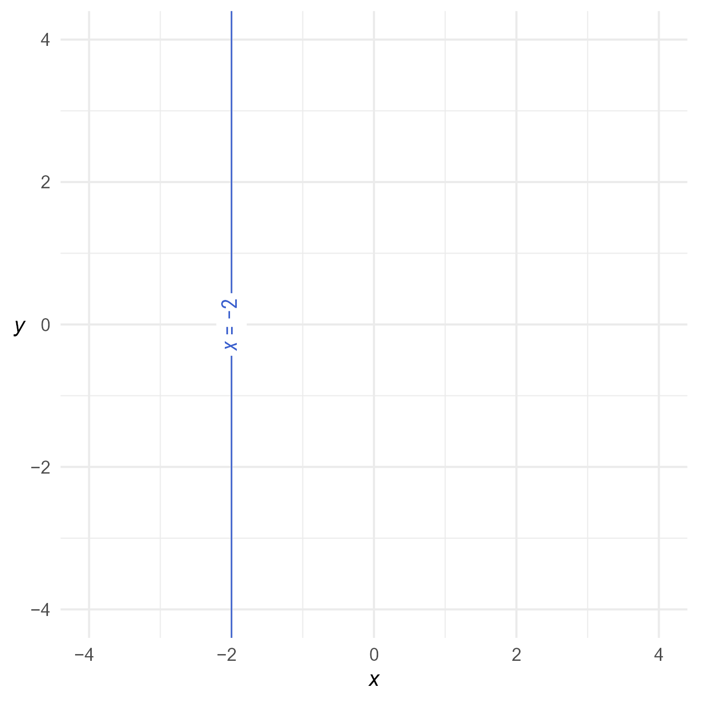
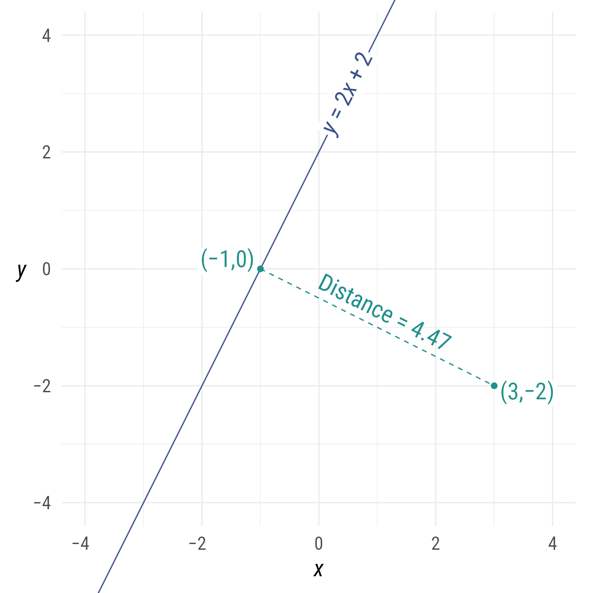

# Setup

## Packages


::: {.cell}

```{.r .cell-code}
library(ggdiagram)
library(ggplot2)
library(dplyr)
library(ggtext)
library(ggarrow)
```
:::


## Base Plot

To avoid repetitive code, we set defaults and make a base plot:


::: {.cell}

```{.r .cell-code}
my_font <- "Roboto Condensed"
my_font_size <- 20
my_point_size <- 2
my_arrowhead <- arrowheadr::arrow_head_deltoid(d = 2.3, n = 100)

# my_colors <- viridis::viridis(2, begin = .25, end = .5)
my_colors <- c("#3B528B", "#21908C")

theme_set(
  theme_minimal(
    base_size = my_font_size,
    base_family = my_font) +
    theme(axis.title.y = element_text(angle = 0, vjust = 0.5)))

bp <- ggdiagram(
  font_family = my_font,
  font_size = my_font_size,
  point_size = my_point_size,
  linewidth = .5,
  theme_function = theme_minimal,
  axis.title.x =  element_text(face = "italic"),
  axis.title.y = element_text(
    face = "italic",
    angle = 0,
    hjust = .5,
    vjust = .5)) +
  scale_x_continuous(labels = signs_centered,
                     limits = c(-4, 4)) +
  scale_y_continuous(labels = signs::signs,
                     limits = c(-4, 4))

```
:::


# Making Lines

Lines can be constructed from a slope and an intercept:


::: {.cell}

```{.r .cell-code}
l <- ob_line(slope = 2, intercept = 1, color = my_colors[1])
l
#> <ggdiagram::ob_line>
#> @ slope     : num 2
#> @ intercept : num 1
#> @ xintercept: num -0.5
```
:::

::: {.cell}

```{.r .cell-code  code-fold="true"}
bp +
  l +
  l@point_at_y(0)@label(l@equation, angle = l@angle)
```

::: {.cell-output-display}
{#fig-slopeintercept width=672}
:::
:::


Because the default slope is 0, a horizontal ob_line can be set with just the intercept:


::: {.cell}

```{.r .cell-code}
h <- ob_line(intercept = 2, color = my_colors[1])
h
#> <ggdiagram::ob_line>
#> @ slope     : num 0
#> @ intercept : num 2
#> @ xintercept: num -Inf
```
:::

::: {.cell}

```{.r .cell-code  code-fold="true"}
bp + 
  h + 
  h@point_at_x(0)@label(h@equation)
```

::: {.cell-output-display}
{#fig-horitonal width=672}
:::
:::


A vertical line can be set with the x-intercept:


::: {.cell}

```{.r .cell-code}
v <- ob_line(xintercept = -2, color = my_colors[1])
v
#> <ggdiagram::ob_line>
#> @ slope     : num -Inf
#> @ intercept : num -Inf
#> @ xintercept: num -2
```
:::

::: {.cell}

```{.r .cell-code  code-fold="true"}
bp + 
  v + 
  v@point_at_y(0)@label(equation(v), angle = v@angle * -1)

```

::: {.cell-output-display}
{#fig-v width=672}
:::
:::


Any line---horizontal, vertical, or sloped---can be constructed from the coefficients of the general form of a line:

$$
ax+by+c=0
$$


::: {.cell}

```{.r .cell-code}
l_123 <- ob_line(a = 1, b = 2, c = 3, color = my_colors[1])
```
:::

::: {.cell}

```{.r .cell-code  code-fold="true"}
bp +
  l_123 +
  l_123@point_at_x(
    x = 0)@label(
      equation(l_123, type = "general"), 
      angle = l_123@angle)
```

::: {.cell-output-display}
{#fig-ablcline_plot width=672}
:::
:::


With respect to the general form, the slope is equal to $-\frac{a}{b}$, the y-intercept is equal to $-\frac{c}{b}$, and the x-intercept is equal to $-\frac{c}{a}$

# Methods

## Projections and Distances

A point can be "projected" onto a line. Imagine shining a light on the point in a direction perpendicular to the line. The point's shadow on the line would be the shortest distance between the line and the point.


::: {.cell}

```{.r .cell-code}
p <- ob_point(3,-2, color = my_colors[2])
l <- ob_line(slope = 2, intercept = 2, color = my_colors[1])
# Point p projected onto line l
p_projected <- projection(p, l)

# Alternately:
l@projection(p)
#> <ggdiagram::ob_point>
#> @ x: num -1
#> @ y: num 0
#> Other props: alpha, color, fill, shape, size, stroke, auto_label,
#>              bounding_box, centroid, length, r, theta, style,
#>              tibble, xy, geom, label, place, aesthetics
```
:::


The shortest distance from a point to a line can be calculated.


::: {.cell}

```{.r .cell-code}
# distance from point p to line l
distance(p, l)
#> [1] 4.472136

# Equivalently:
ob_segment(p, l@projection(p))@distance
#> [1] 4.472136
```
:::

::: {.cell}

```{.r .cell-code  code-fold="true"}
bp +
  l +
  l@point_at_x(.5)@label(
    label = l@equation, 
    angle = l@angle) +
  {s_projected <- ob_segment(
      p1 = l@projection(p),
      p2 = p,
      linetype = "dashed",
      label = paste0("Distance = ", 
                     distance(l@projection(p), p) |>
                       round(digits = 2) |>
                       as.character()))} + 
  s_projected@midpoint(c(0, 1))@label(
    polar_just = degree(s_projected@line@angle) + c(180, 0),
    plot_point = TRUE)  

```

::: {.cell-output-display}
{#fig-point_line width=672}
:::
:::

